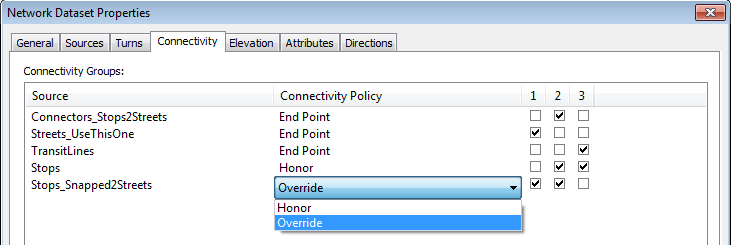

# Add GTFS to a Network Dataset Troubleshooting Guide

Created by Melinda Morang, Esri  
Contact: <mmorang@esri.com>

Copyright 2018 Esri  
Licensed under the Apache License, Version 2.0 (the "License"); you may not use this file except in compliance with the License.  You may obtain a copy of the License at <http://www.apache.org/licenses/LICENSE-2.0>.  Unless required by applicable law or agreed to in writing, software distributed under the License is distributed on an "AS IS" BASIS, WITHOUT WARRANTIES OR CONDITIONS OF ANY KIND, either express or implied.  See the License for the specific language governing permissions and limitations under the License.

## Common problems
This document describes some common problems encountered by users of *Add GTFS to a Network Dataset*, and how to solve them.

+ Registering / installing the tools
  - [I can't register/install the transit evaluator](#Registration)
+ Creating the network
  - [I tried to run one of the tools in the Add GTFS to a Network Dataset toolbox, but it said it was missing a script reference.](#MissingScript)
  - [I tried to run one of the tools in the Add GTFS to a Network Dataset toolbox, but it failed with a bunch of error messages like "ImportError".](#MessedUpArcpy)
  - [A tool failed with "ExecuteError: ERROR 999999: Error executing function. Failed to execute (CreateFeatureclass)."](#CorruptGDB)
  - [When I'm setting up the evaluators for my transit travel time cost attribute, "TransitEvaluator" doesn't appear in the drop-down list of evaluator types](#DropDown)
  - [When I built my network, I got build errors.](#BuildErrors)
  - [The Get Network EIDs tool failed with a message saying "Error obtaining network EIDs. Exception from HRESULT: 0x80040216".](#HRESULT)
+ Doing analysis / using the network
  - [I got an FDO error when I tried to open my network dataset or add it to the map](#FDO)
  - [During schedule caching, I got an error that said "unable to open database file"](#noDatabase)
  - [During schedule caching, I got an error that said "All EIDs were null in the transit schedule table. Please run Get Network EIDs."](#noEIDs)
  - [My analysis never uses the transit lines. It only uses the streets.](#NoTransitLines)
  - [My Service Areas have ugly spikes around the transit lines](#Exclude)
+ Other
  - [I upgraded ArcMap to a new version, and now Add GTFS to a Network Dataset.tbx and Transit Analysis Tools.tbx are no longer in ArcToolbox](#ArcMapUpgrade)
  - [The Network Identify tool always shows a cost of -1 for TransitLines edges in my network](#NetworkIdentify)

## I can't register/install the transit evaluator

If you encounter any problems running AddGTFStoaNetworkDataset_Installer.exe, click the "Show Details" button to view messages.  If some messages are cut off, you can right-click in the message window and choose "Copy Details To Clipboard" and paste the full message list into a text editor.  If the messages do not give you sufficient information to resolve the issue, please contact me and send me the full message window text.

AddGTFStoaNetworkDataset_Installer.exe was newly added to Add GTFS to a Network Dataset in version 0.6.  Previous versions used the Install.bat file, and the procedure frequently let to problems that were usually specific to the installer's computer and security settings.  I'm leaving the following tips here from the old Install.bat method in case they are still relevant in some cases, but AddGTFStoaNetworkDataset_Installer.exe should for the most part have eliminated them.
- Don't try to register the transit evaluator on a network drive or on the Desktop.  Make sure the Add GTFS to a Network Dataset files and folders are all on a local drive on your machine, and also don't put it on the Desktop.
- Check your ArcGIS install path.  Open the Install.bat file (right-click it and click Edit).  Make sure the path on your computer to the file called ESRIRegAsm.exe matches what's written in the file.  If it doesn't, modify the file, try running Install.bat again, and see if that makes it work.
- If you get the error message "Registration failed. Could not load file or assembly...Operation is not supported," your computer might have blocked the TransitEvaluator.dll file as a security risk because it came from another computer.  In the EvaluatorFiles folder, right click TransitEvaluator.dll and click Properties.  If there is an Unblock button at the bottom click it, and then try running Install.bat again.  You might also need to unblock all the other .dll files in this folder and its subfolders.
- If you get an error saying "Registration failed. Could not write to disk", you probably need to run the .bat file as an administrator.  Right click on Install.bat and choose "Run as Administrator".  If it fails again and says it can't find the specified path to the .dll file, open the .bat file for editing and change the "%CD%" in the .dll path to the correct path on your machine.

## I tried to run one of the tools in the Add GTFS to a Network Dataset toolbox, but it said it was missing a script reference.
The *Add GTFS to a Network Dataset* toolbox files (with the .tbx extensions and the red toolbox icon) have associated python script files (with the .py extensions in the scripts folder).  If you move the toolbox files without moving the associated scripts folder with them, then they will no longer be able to find the scripts, and the tools won't work.  Make sure if you want to move the Add GTFS to a Network Dataset files to a new location that you move the entire folder together and don't separate the files.  Additionally, make sure to uninstall the transit evaluator before you move it, and reinstall it in its new location.

## I tried to run one of the tools in the Add GTFS to a Network Dataset toolbox, but it failed with a bunch of error messages like "ImportError".
If the tool failed with an ImportError that says something like "Failed to import sqlite3", ArcMap's python installation might be messed up.  This frequently happens when people have installed Anaconda after installing ArcMap.

Please test your python installation using the following steps:

1. Open ArcMap.
2. Open the [python window](http://desktop.arcgis.com/en/arcmap/latest/analyze/executing-tools/what-is-the-python-window-.htm#ESRI_SECTION1_276E292B80D2439DB179ED9B3B6B63E7).
3. In the python window, type "arcpy.GetInstallInfo()" (without the quotation marks), and click Enter.  This should return some information about your ArcMap installation.  If it returns an error, then something is probably wrong with your ArcMap installation and its reference to python.
4.  If the above works, try typing "import sqlite3" (without the quotation marks).  This should succeed and do nothing.

If one of the steps above fails, it's likely that ArcMap's reference to python is messed up.  You can try reinstalling ArcMap, talking to your systems administrator, or calling [Esri Tech Support](http://support.esri.com/).

## A tool failed with "ExecuteError: ERROR 999999: Error executing function. Failed to execute (CreateFeatureclass)."
This failure is usually a symptom that the geodatabase has gotten corrupted somehow.  Delete your geodatabase, create a new one, and try running the tool again.

## When I'm setting up the evaluators for my transit travel time cost attribute, "TransitEvaluator" doesn't appear in the drop-down list of evaluator types
First, make sure your cost attribute has units of Minutes.  TransitEvaluator will only appear in the list of choices if the attribute has units of Minutes.

If your cost attribute units are correct, then the transit evaluator probably didn't register (install) correctly on your machine.  Make sure you followed the instructions in the user's guide exactly for registering transitevaluator.dll on your system.  If you have problems registering it, please consult the [I can't register/install the transit evaluator](#Registration) section of this Troubleshooting Guide.

If ArcMap is open when you register the transit evaluator, you will need to close and re-open it in order to refresh it.

## When I built my network, I got build errors.

When you build your network dataset, you may get build errors.  Some you can safely ignore, but others you must address in order for your network to work successfully.

### Stop and connector geometry errors

The following build errors are associated with the geometry of your stops and connector features:
- SourceName: Connectors_Stops2Streets, ObjectID: 241, Geometry is empty.
- SourceName: Connectors_Stops2Streets, ObjectID: 4644, The edge feature is too small to participate in snapping and may not be connected to other features.
- SourceName: Stops_Snapped2Streets, ObjectID: 9202, Standalone user-defined junction is detected.
- SourceName: Stops, ObjectID: 9220, Standalone user-defined junction is detected.

These errors typically occur when your transit stops are far away from your streets.  It may occur because part of your transit system lies outside the area covered by your street data.  Or, it may occur for individual stops that are too far off the side of the road to have snapped to the streets (perhaps in a parking lot or shopping center that isn't represented in your street data).  The stops affected by these build errors will not be properly connected to the streets in your network; travelers will not be able to reach them from the streets.  However, the rest of your network should still function normally.  It's up to you to assess what caused the problem and whether or not you need to fix it.

The Step 2 tool (*Generate Stop-Street Connectors*) makes a copy of your transit stops and snaps them to the closest street feature, as long as the street feature lies within the distance specified in the "Maximum distance from streets that stops might appear" parameter.  If it cannot find a street within that cutoff distance, it will leave the snapped version of the stop in the same location as the original stop.  Consequently, when it generates the connector line between the stop and the snapped stop, the connector will have 0 length, and this causes a build error.  If you re-run Step 2 with a larger cutoff value, you might be able to eliminate a lot your build errors.

You could also manually edit the Stops_Snapped2Streets and Connectors_Stops2Streets features, moving the snapped stop to the exact location where you want it to connect to the streets.  If you do this, you MUST add a vertex on the street feature in the location where you snap the stop or else the network still will not connect at that location.

Another less common cause of build errors like these is that the stop was already directly on top of a street, and so the snapped stop did not move.  Manual editing is the only way to fix this.

### "Invalid hierarchical value" errors

If your network dataset has a Hierarchy attribute, you might get a large number of build errors like this:
- SourceName: Connectors_Stops2Streets, ObjectID: 1, Invalid hierarchical value.

Your network dataset will not work properly if you don't resolve these issues.  At the time of schedule caching, you'll get a message saying that EID values were missing, even if you successfully ran the Get EIDs tool.

Hierarchy is a network property meant to speed up calculations of nationwide, large-scale analysis problems.  Hierarchy is not helpful for pedestrian analysis.  If you get build errors like this, you should go to the Attributes tab in the network dataset properties and delete the Hierarchy attribute.  Then, re-build your network dataset and re-run the Get EIDs tool.

### Other build errors

If you got build errors other than the ones listed above, refer to the [ArcGIS documentation](http://desktop.arcgis.com/en/arcmap/latest/extensions/network-analyst/editing-network-datasets-ways-to-edit-the-network-dataset.htm) for ways to edit your network dataset.

## The Get Network EIDs tool failed with a message saying "Error obtaining network EIDs. Exception from HRESULT: 0x80040216".
This means that your network dataset or one of the associated files has a schema lock on it, likely because you added it to the map or tried to edit it.  Try closing ArcMap, reopening a blank map, and running the tool again prior to adding any layers to the map.  Alternatively, you can run the tool from ArcCatalog.

Note: Try this solution if you receive any HRESULT code.  Other HRESULT numbers might be indicative of the same problem.

## I got an FDO error when I tried to open my network dataset.
This means that the transit evaluator is not currently registered on the machine you are using.  You need to register the transit evaluator as described in the User's Guide.  You will have to register the transit evaluator on any machine where you intend to use your transit network dataset.

If you try to open or delete your transit network datasets on a machine without the GTFS transit evaluator registered, you will get an error message saying "Failed to edit the selected object(s). The item does not have a definition. FDO error -2147212634".

## During schedule caching, I got an error that said "unable to open database file".
The error message might also include "Error: Transit schedule caching failure for Transit Evaluator. Error message: Unable to cache transit schedules."

You might see this error if the network dataset is stored on a shared network drive instead of the local machine.  The solution is to move your network to a local drive.

## During schedule caching, I got an error that said "All EIDs were null in the transit schedule table. Please run Get Network EIDs."
The most straightforward cause of this error is that you simply forgot to run the [Get Network EIDs tool](https://github.com/Esri/public-transit-tools/blob/master/add-GTFS-to-a-network-dataset/UsersGuide.md#Step7) after building (or re-building) your network dataset.  If this is the case, just run that tool and try again.

If you still see this error after successfully running the Get Network EIDs tool, it's possible that your network dataset was never successfully built, probably due to unresolved [build errors](#BuildErrors).  A likely culprit is that you have a [Hierarchy attribute](#Hierarchy) that is generating a large number of errors.

## My analysis never uses the transit lines. It only uses the streets.
There are many reasons why the results of your analysis might fail to use the transit lines and only use the streets.

**You forgot to set a time of day and day of week / date for your analysis**
The transit lines will only be used if you set a time of day and day of week or date for your analysis.

**You set an incorrect day of week or date for your analysis**
There are two valid ways to construct GTFS schedules.  Transit agencies can use the calendar.txt file to indicate a date range that service is available and designate which service_ids run on each day of the week.  They can use the calendar_dates.txt file to indicate special exceptions to the regular schedule, such as for holidays.  Alternatively, transit authority can exclusively use the calendar_dates.txt file, treating service as a special "exception" for every day.

If your transit agency uses this second method, you cannot select a generic weekday for your analysis.  You will have to enter a specific date, and that date must be a date during the time period your GTFS data covers.  Additionally, your network's travel time attribute must have a parameter called "Use Specific Dates", and that parameter must be set to True.  See the User's Guide for further instructions.

If, on the other hand, your transit agency uses the calendar.txt file and you still wish to use specific dates rather than generic weekdays for your analysis, you must still select a date that falls within the ranges listed in the calendar.txt file, and you must still have a parameter called "Use Specific Dates" that is set to True.

**Your network connectivity is incorrect**
Make sure your network connectivity is set up according to the instructions in the User's Guide.  The most common mistake is to forget to switch the Stops_Snapped2Streets source to a connectivity policy of "Override".  If it is still set to "End Point", then your connector lines will not actually be connected to the street features, and it will be impossible for travelers to actually access the transit lines from the streets.  If this was your problem, make sure to rebuild the network dataset after switching your connectivity to Override.  Then, rerun the *Get Network EIDs* tool to refresh the EIDs (which may change during the rebuild).

It's easy to check whether your network features are correctly connected to one another.  Zoom in to one of your transit lines. Use the Network Identify tool (on the Network Analyst toolbar) to click on the connector line (Connectors_Stops2Streets) that connects the street with the transit line.  When you use Network Identify, it will give you a list of the other edges that are connected to it.  When you click on the items in this list, it should highlight them in the map.  Make sure the adjacent street feature shows up as connected to your connector line.

**Your cost attribute incorrectly calculates the travel time on your streets**
If you set up the travel time attribute incorrectly for your streets, it may just appear to be drastically more efficient to travel on the streets than on the transit lines.  For instance, you may have accidentally set the impedance along all your street features to 0, or perhaps your streets are using driving time instead of walking time.  Or, you may have used the wrong units of measurement when converting your street lengths to a walking time.  If your street features are in units of feet, you need to convert your desired miles per hour walk speed to feet per minute and divide the street length by this number.

**There just isn't any useful transit service for the area or time of day you chose**
Your transit network might actually be working fine.  In places where transit service is infrequent, it might simply be faster to walk.  Try running the analysis for several different times of day or for an area that is located near many transit lines.  Try using the debugging technique described below.

**None of the above**
Here is a technique for debugging your transit network in detail.  The idea is to try to force a Route to use a transit line and in doing so reveal any underlying issues with the network or your analysis settings.
- Choose a feature in the TransitLines feature class.  Any one will do.
- Create a Route network analysis layer.
- Draw in two stops (Route layer stops, not transit stops) using the Create Network Location Tool from the Network Analyst toolbar.  Put these stops near the streets on either end of the TransitLines feature you chose.  Make sure to place the first stop near the beginning of the line and the second stop near the end, according to the transit line's direction of travel.
- Use the Select tool to select the TransitLines feature you're working with.
- Use the *Transit Identify* tool (in the Transit Analysis Tools toolbox) to find the times of day and days of week your chosen transit line has service.  See the Transit Analysis Tools User's Guide for instructions on using the *Transit Identify* tool.
- In your Route analysis settings, set the time of day and day of week to be just before one of the times when the line has service so that the transit line ought to be the quickest way to travel between your two points.
- Solve the Route and see if it uses the transit line.  If not, adjust the time by a minute or two and try again.  If it doesn't, something is still wrong with your network or your analysis settings, and you should revisit the suggestions above or contact me for help.

## My Service Areas have ugly spikes around the transit lines
If you are solving a Service Area analysis, you need to prevent service areas from being drawn around transit lines.  The service area polygons should only be drawn around streets since pedestrians can't exit the transit vehicle partway between stops.  To do this, open the layer properties and go to the Polygon Generation tab.  In the bottom left corner, click to exclude TransitLines and Connectors_Stops2Streets (or whatever is most appropriate for your network).

## I upgraded ArcMap to a new version, and now Add GTFS to a Network Dataset.tbx and Transit Analysis Tools.tbx are no longer in ArcToolbox

Ideally, before uninstalling ArcMap, you should uninstall Add GTFS to a Network Dataset using AddGTFStoaNetworkDataset_Uninstall.exe in the AddGTFStoaNetworkDataset folder in the location where your original installer was located, or find the "Add GTFS to a Network Dataset" entry in the Windows Programs and Features dialog.

If you forgot to do that, and installed a new version of ArcMap, then Add GTFS to a Network Dataset.tbx and Transit Analysis Tools.tbx will be missing from ArcToolbox, although your network datasets will probably still work.

This problem is easy to solve.  Just uninstall Add GTFS to a Network Dataset and reinstall it.  If you can't find the original installer on your machine, you can [download the latest version](http://www.arcgis.com/home/item.html?id=0fa52a75d9ba4abcad6b88bb6285fae1) from ArcGIS Online.

## The Network Identify tool always shows a cost of -1 for TransitLines edges in my network
This is the correct behavior.  Because TransitEvaluator is a custom evaluator, the Network Identify tool does not know how to use it to determine the impedance of your TransitLines edges.  Furthermore, the impedance of those edges is not static; the time it takes to traverse them depends on the time of day and the transit schedules.  The Network Identify tool is not time-aware.  Because of these limitations, the Network Identify tool always lists -1 as the impedance for the TransitLines edges in your network.  It does not mean that your network is broken.

If you are concerned that your transit lines are never being used or that your analysis results are incorrect, please consult the [My analysis never uses the transit lines. It only uses the streets.](#NoTransitLines) section of this Troubleshooting Guide.
