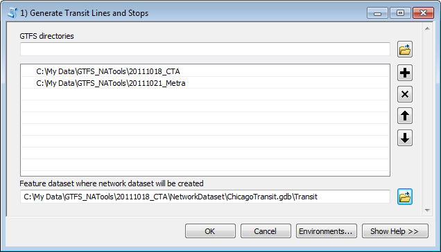
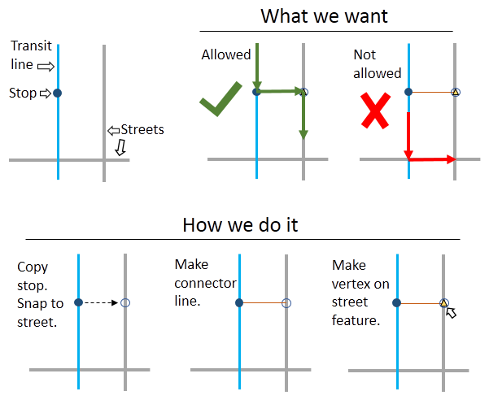
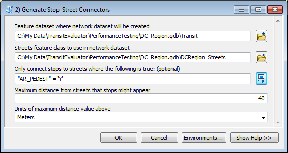
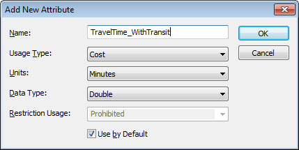
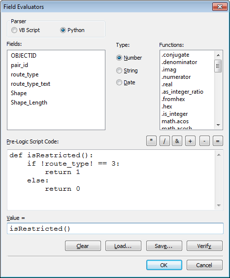
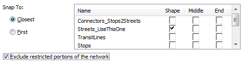
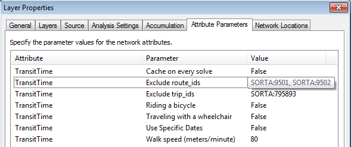

#Add GTFS to a Network Dataset User's Guide

Created by Melinda Morang, Esri  
Contact: <mmorang@esri.com>

Copyright 2017 Esri  
Licensed under the Apache License, Version 2.0 (the "License"); you may not use this file except in compliance with the License.  You may obtain a copy of the License at <http://www.apache.org/licenses/LICENSE-2.0>.  Unless required by applicable law or agreed to in writing, software distributed under the License is distributed on an "AS IS" BASIS, WITHOUT WARRANTIES OR CONDITIONS OF ANY KIND, either express or implied.  See the License for the specific language governing permissions and limitations under the License.

##What this tool does
*Add GTFS to a Network Dataset* allows you to put GTFS public transit data into an ArcGIS network dataset so you can run schedule-aware analyses using the Network Analyst tools, like Service Area, OD Cost Matrix, and Location-Allocation.

After using these tools to set up your network dataset, you can use Network Analyst to perform transit/pedestrian accessibility analyses, make decisions about where to locate new facilities, find populations underserved by transit or particular types of facilities, or visualize the areas reachable from your business at different times of day. You can also publish services in ArcGIS Server that use your network dataset.

##Software requirements
* ArcGIS 10.1 or higher with a Desktop Standard (ArcEditor) license. (You can still use it if you have a Desktop Basic license, but you will have to find an alternate method for one of the pre-processing tools.) This tool does not work in ArcGIS Pro yet.
* Network Analyst extension.
* The necessary privileges to install something on your computer.

##Data requirements
* Street data for the area covered by your transit system, preferably data including pedestrian attributes.  If you need help preparing high-quality street data for your network, please review [this tutorial](http://support.esri.com/en/technical-article/000012743).
* A valid GTFS dataset. If your GTFS dataset has blank values for arrival_time and departure_time in stop_times.txt, you will not be able to run this tool. You can download and use the [Interpolate Blank Stop Times](http://www.arcgis.com/home/item.html?id=040da6b55503489b90fa51eea6483932) tool to estimate blank arrival_time and departure_time values for your dataset if you still want to use it.

## If you have never used Network Analyst before
Network Analyst is a powerful and complex ArcGIS extension.  The procedure described in this document and the analyses you will likely want to run when you have completed it involve advanced Network Analyst functionality.  If you have never used Network Analyst before or need a refresher, please work through the [Network Analyst online tutorials](http://desktop.arcgis.com/en/arcmap/latest/extensions/network-analyst/about-the-network-analyst-tutorial-exercises.htm) before attempting to use *Add GTFS to a Network Dataset*.

## Workflow

In order to use GTFS routes, stops, and schedules in a network dataset, you must do the following steps, which are explained in further detail in this document:

1. [Download and install the tools] (#Step1)
2. [Acquire your data and prepare your feature dataset] (#Step2)
3. [Generate feature classes for transit lines and stops and a SQL database of the schedules] (#Step3)
4. [Create connector features between the transit lines/stops and your other data] (#Step4)
5. [Create your network dataset using correct connectivity groups and configure your network attributes] (#Step5)
6. [Finalize your transit network using the Get Network EIDs tool] (#Step6)
7. [Choose the correct analysis settings] (#Step7)

## 1) Download and install the tools

Download *Add GTFS to a Network Dataset*.  It will be a zip file.  Unzip the file and put it in a permanent location on your machine where you won't lose it.  Do not save the unzipped tool folder on a network drive, the Desktop, or any other special reserved Windows folders (like C:\Program Files) because this could cause problems later.

The unzipped file contains an installer, AddGTFStoaNetworkDataset_Installer.exe.  Double-click this to run it.  The installation should proceed quickly, and it should say "Completed" when finished.  If you encounter any problems, click the "Show Details" button to view messages.  If some messages are cut off, you can right-click in the message window and choose "Copy Details To Clipboard" and paste the full message list into a text editor.

The installation process does the following:
- "Registers" a special transit evaluator with ArcGIS.  This will allow your network dataset to query the GTFS schedules when determining travel time through the network.
- Adds "Add GTFS to a network dataset.tbx" and "Transit Analysis Tools.tbx" to ArcToolbox.
- Copies relevant files to the folder where ArcGIS is installed on your machine.
- Places the tool documentation and an uninstaller into a folder in the same location as the installer.  Do not delete the uninstaller or you won't be able to uninstall the tools.

If you wish to uninstall the tools (for example, if you're upgrading to a newer version of the tools or upgrading ArcMap), use AddGTFStoaNetworkDataset_Uninstall.exe in the AddGTFStoaNetworkDataset folder in the location where your original installer was located, or find the "Add GTFS to a Network Dataset" entry in the Windows Programs and Features dialog.

*Note: If you create a network dataset that uses the GTFS transit evaluator and then uninstall the GTFS transit evaluator, you will not be able to use or delete the network dataset from your machine unless you reinstall the GTFS transit evaluator.  Similarly, a network dataset created on a machine with the GTFS transit evaluator installed will not work on a different machine that does not have the GTFS transit evaluator installed.  If you try to open or delete one of these network datasets on a machine without the GTFS transit evaluator, you will get an error message saying "Failed to edit the selected object(s). The item does not have a definition. FDO error -2147212634".*

## 2) Acquire your data and prepare your feature dataset

First, acquire the GTFS data you plan to use.
* Obtain the GTFS data for the transit authority (or authorities) you wish to analyze.  Get GTFS data directly from your transit agency or download it from one of several sites that collects GTFS datasets from around the world, such as [Transitland](https://transit.land/feed-registry/) or [Transitfeeds](http://transitfeeds.com/).  You may use more than one GTFS dataset if you want (e.g., for two different agencies operating in the same city).
* Unzip the GTFS data into a folder of your choice.

GTFS datasets that use calendar.txt, calendar_dates.txt, and/or frequencies.txt for their schedules are supported.

Note: Some GTFS datasets give specific arrival_times and departure_times only for designated time points in the network, leaving the times for intermediate stops blank.  Although this is a valid way to write a GTFS dataset, *Add GTFS to a Network Dataset* requires an explicit stop time for every stop visit.  If your GTFS dataset has blank stop times, you will not be able to use it in your network dataset.  The *1) Generate Transit Lines and Stops* tool will check your data and give you an error message if it has blank stop times.  You can download and use the [Interpolate Blank Stop Times] (http://www.arcgis.com/home/item.html?id=040da6b55503489b90fa51eea6483932) tool to estimate stop time values for your dataset if you still want to use it.

Once you have obtained GTFS data, acquire a streets or sidewalks feature class for your area of interest and any other data you wish to include in your network.  You should, at minimum, have a streets feature class.  If you try to create a network dataset using only transit lines, the pedestrians will have no way to walk between transit stops and their origins or destinations or to walk between nearby stops for transfers.

Finally, create a file geodatabase and feature dataset where you will put your new network dataset.
If you are unfamiliar with the procedure for creating file geodatabases or feature datasets, please review the documentation:  
- [Creating a file geodatabase](http://desktop.arcgis.com/en/arcmap/latest/manage-data/geodatabases/create-file-geodatabase.htm)  
- [Creating a feature dataset](http://desktop.arcgis.com/en/arcmap/latest/manage-data/feature-datasets/creating-mole-data-in-arccatalog-creating-a-featur.htm)

Do not create your geodatabase on a shared network drive because the transit evaluator will not work.  Put the geodatabase on a local drive on your machine.  Additionally, do not try to create more than one network dataset in the same geodatabase.  Create a separate geodatabase for each network.

## 3) Generate feature classes for transit lines and stops and a SQL database of the schedules

In the *Add GTFS to network dataset* toolbox, run the tool called *1) Generate Transit Lines and Stops*.  This tool will take several minutes to run for a large dataset.

###Inputs
* **GTFS directories**: Select the directory or directories where your GTFS data is stored.  You may select as many GTFS datasets as you wish to include in your network dataset.
* **Feature dataset where network dataset will be created**: Indicate the location of the feature dataset where your network dataset will be created.

###Outputs
* **Stops**: Points feature class containing your transit stops.  Stop IDs have the GTFS directory prepended to them.  If you used multiple GTFS datasets, the stops from all of them will be included in this feature class.  This feature class will be located in the feature dataset you selected as input.
* **TransitLines**: Lines feature class containing your transit lines.  A line has been created between each pair of stops that is directly connected by a transit trip (ie, has no other stops between them).  In cases where two stops are directly connected by multiple modes, such as both bus and tram, a separate line will be created for each mode.  The lines do not correspond to the actual route taken by the transit vehicles.  They are simply straight lines between connected stops.  This feature class will be located in the feature dataset you selected as input.
* **GTFS.sql**: SQL database containing processed GTFS data.  This database is located in the geodatabase that houses the feature dataset you selected and will be used for further preprocessing.  You shouldn't need to look at this for anything, but don't delete it because it will be used by the network dataset during analysis.

*Note: If you receive an error message saying "GTFS dataset contains empty values for arrival_time or departure_time in stop_times.txt.  Although the GTFS spec allows empty values for these fields, this toolbox requires exact time values for all stops.  You will not be able to use this dataset for your analysis.", you might still be able to use the GTFS dataset by estimating the arrival_time and departure_time values using the [Interpolate Blank Stop Times](http://www.arcgis.com/home/item.html?id=040da6b55503489b90fa51eea6483932) tool.*

## 4) Create connector features between the transit lines/stops and your other data

A well-constructed network dataset requires connectivity between the source features: streets, transit lines, stops, etc.  Two streets that do not touch one another will not be connected in the network, and travelers will not be able to travel directly between these two streets.  A street and a transit line in different connectivity groups will only connect at the points you specify when you set up your network.

When you create your network dataset, you want your pedestrians to be able to travel between the streets and the transit lines, but you only want them to be able to transition between streets and transit lines at the locations of stops.  Pedestrians can only enter and exit the bus/train at stops (or designated station entrances).  They cannot jump off halfway between stops and start walking on the street to get to their destination.  Later, you will set up connectivity groups in your network to model the correct behavior.  But first, you must create connector lines to ensure that the GTFS stops connect to both the transit lines and the streets.

The GTFS stops probably do not fall directly on top of your streets data (or sidewalks, etc).  Consequently, you should make some small connector lines that bridge the gap between the stops and the nearest street.  Create a lines feature class of connectors, keeping in mind the following:
* Connector lines should attach to the streets in the location where pedestrians will enter the transit system – the street location of the bus stop or the entrance to an underground or inside station.
* If your GTFS data uses parent stations, child stops should connect to the parent station, and the parent station should connect to the street, either directly or via designated station entrances.
* Connector lines can be used in the network dataset to apply a time delay for boarding and/or getting off the transit vehicles.
* Sometimes street data contains information about whether or not a street is traversable by pedestrians.  If it does, you want to make sure your stop does not get connected to a non-traversable street because then pedestrians will never be able to use that stop.
* When you create your network dataset, the network won't connect overlapping lines unless they overlap at a vertex or endpoint of both lines.  Consequently, when you create connector lines between the stops and the nearby streets, you will also need to generate vertices or endpoints on your street features to ensure that the streets actually connect with the connector lines.

For a simple way to generate connector lines, you can use the included tool called *2) Generate Stop-Street Connectors*.  However, this tool assumes you have a standard GTFS dataset and a single streets feature class.  If you have more complex data (e.g., multiple street or sidewalk datasets), you might want to invent your own method for connecting your streets and stops.

This is what the *Generate Stop-Street Connectors* tool does:
* First, this tool creates a copy of your stops and [snaps](http://desktop.arcgis.com/en/arcmap/latest/tools/editing-toolbox/snap.htm) them to your street features.  Each snapped stop will land at the closest point of the closest street feature, as long as it falls within a particular distance of that street.  If you entered a SQL expression, the tool will first use this expression to [select](http://desktop.arcgis.com/en/arcmap/latest/tools/analysis-toolbox/select.htm) street features by attributes so that stops will only be snapped to streets that fit this criteria.
* Next, the tool [generates a line feature](http://desktop.arcgis.com/en/arcmap/latest/tools/data-management-toolbox/points-to-line.htm) connecting the true location of each stop and its snapped counterpart.
* If your GTFS data uses parent stations, the parent stations are snapped to the streets using the method described above.  Child stops of the parent station are not snapped to the streets.  Instead, a connector line is created between the child stop and the parent station.  Consequently, the child stop is connected to the streets only through the parent station.
* If your GTFS stops.txt file includes station entrances designated by location_type=2, the station entrances will be snapped to the streets, and a line will be generated between the parent station and each station entrance.  It is assumed that the station entrances are the only places where pedestrians can enter their respective parent stations.
* Next, the tool creates a "wheelchair_boarding" field to indicate whether or not the stop is wheelchair accessible.  The values used in this field are derived from the wheelchair_boarding field in the [GTFS stops.txt file] (https://github.com/google/transit/blob/master/gtfs/spec/en/reference.md#stopstxt).  If the stop has a parent station and has a wheelchair_boarding value of 0, the tool populates the field based on the wheelchair_boarding value for the parent station.
* Finally, the tool [creates vertices](http://desktop.arcgis.com/en/desktop/latest/tools/data-management-toolbox/integrate.htm) in the street features at the locations of the snapped stops.  These vertices are necessary for establishing connectivity when you create your network dataset.

Note: In order to run the *2) Generate Stop-Street Connectors* tool, you must have the Desktop Standard (ArcEditor) or Desktop Advanced (ArcInfo) license.  If you have only the Desktop Basic (ArcView) license, you must find an alternate method to connect your streets and your transit stops because the Snap tool is not available.

###Inputs
* **Feature dataset where network dataset will be created**: Indicate the location of the feature dataset where your network dataset will be created.
* **Streets feature class to use in the network dataset**: Select the streets (or sidewalks) feature class you will use in your network dataset that you want your stops to be connected to.  If you need help preparing high-quality street data for your network, please review [this tutorial](http://support.esri.com/en/technical-article/000012743).
* **Only connect stops to streets where the following is true: (optional)**: If your streets contain fields indicating if features are traversable by pedestrians, you can use the SQL Query Builder to create an expression to select only those features here.  For example, if your data contains a field called "AR_PEDEST" which has a value of "Y" if pedestrians are allowed and "N" if they aren't, your expression should read "AR_PEDEST" = 'Y'.  When the tool snaps the transit stops to your street features, it will use only those street features that allow pedestrians.  If, later, you create a restriction attribute on your network dataset using this field in your street data, this step ensures that no stops will be located on restricted portions of the network. 
* **Maximum distance from streets that stops might appear**: Your GTFS stops are unlikely to be directly on top of your street features.  Enter the maximum distance from your streets that your stops are likely to be, in meters or feet.  This simply serves to limit the search distance and speed up the run time of the tool.  If you find yourself getting a lot of build errors when you build your network, try rerunning this step with a larger distance here.
* **Units of maximum distance value above**: Indicate whether the distance you entered above is in meters or feet.

###Outputs
* **Stops_Snapped2Streets**: Points feature class containing your transit stops snapped to the closest streets.  This feature class will be located in the feature dataset you selected as input.
* **Connectors_Stops2Streets**: Lines feature class containing connector lines between your streets and your GTFS transit stops. This feature class will be located in the feature dataset you selected as input.
* **Streets_UseThisOne**: A copy of the streets feature class you selected as input, modified to have vertices at the locations of your snapped GTFS stops.  This is the streets feature class you should use in your network dataset instead of your original streets feature class.

## 5) Create your network dataset using correct connectivity groups and configure your network attributes

Now you are ready to create your network dataset.  If you have never created a network dataset, please review the ['Creating a multimodal network dataset'](http://desktop.arcgis.com/en/arcmap/latest/extensions/network-analyst/exercise-2-creating-a-multimodal-network-dataset.htm) tutorial in the ArcGIS Help before proceeding.

Look in your feature dataset.  If you have any other feature classes you would like to include in your network dataset that are not currently in the feature dataset, you should add them now.

Create a new network dataset in your feature dataset.  Right-click the feature dataset in the Catalog window, click New, and click Network Dataset.  Note: If you have not enabled your Network Analyst license, the New Network Dataset option will not be available.  Enable your Network Analyst license in the Customize toolbar.

Give your network dataset a name, and click Next.

Choose the feature classes from your feature dataset that you will include in your network dataset.  You should check, at minimum, all of the following: Connectors_Stops2Streets, Streets_UseThisOne, TransitLines, Stops, Stops_Snapped2Streets

If you have additional feature classes you want to include or if you used a different method for creating connectors between your transit network and your streets, you should select whatever feature classes are appropriate.

On the next page, choose whether or not you want to model turns.  The transit network does not use turns, but you can choose to do so if you have turn feature classes or want to use global turns in your street data.

On the next page, click the Connectivity button.  You need to set up your connectivity groups to tell the network how pedestrians are allowed to travel between the different source features (streets, transit lines, etc.).  If you are unfamiliar with network connectivity concepts, please review the [Understanding connectivity](http://desktop.arcgis.com/en/arcmap/latest/extensions/network-analyst/understanding-connectivity.htm) page in the ArcGIS documentation.  You should tailor your connectivity groups to your own data, but you can use the following instructions as a guide for how to do it.
* Create three connectivity group columns. Group 1 is for your streets, Group 2 is for your stop-street connectors, and Group 3 is for your transit lines.  It is essential that the transit lines and streets reside in different connectivity groups because pedestrians can only change between the transit system and the streets network at stops.
* Check and uncheck boxes as necessary so that your street features are only checked for Group 1, your connector features are only checked for Group 2, and your transit features are only checked for Group 3.
* Check and uncheck boxes so that Stops_Snapped2Streets resides in two groups: Group 1 and Group 2.  This makes the snapped stop points junctions between the street features and the connector lines.
* Check and uncheck boxes so that Stops resides in two groups: Group 2 and Group 3.  This makes the stop points junctions between the transit lines and the connector lines.
* Leave the Connectivity Policy for TransitLines and Connectors_Stops2Streets as "End Point" because these features should not connect to each other anywhere except endpoints.  Choose either "End Point" or "Any Vertex" for Streets_UseThisOne, depending on what is most appropriate for your particular streets network.  "End Point" is probably the correct setting.
* Leave the Connectivity Policy for Stops as "Honor" because Stops should only connect to transit lines and connectors at endpoints.
* If you used the *Generate Stop-Street Connectors* tool or some other method that created vertices in your street features at the locations of snapped stops, change the Connectivity Policy for Stops_Snapped2Streets to "Override".  This allows the snapped stops to connect to the street feature vertices even if the street feature connectivity is set to End Point.

After you have finished setting up your connectivity groups, click OK and then click Next to set up your elevation information.  The transit network does not contain elevation information.  If you wish to model elevation of your other source features, you may choose to do so.  Otherwise, choose None.

Now you are ready to set up the network dataset's attributes.  You will create a travel time cost attribute that uses a special evaluator to read and interpret the transit schedules.  An evaluator tells ArcGIS how to calculate the traversal time across elements in the network dataset when solving a Network Analyst problem.  The TransitEvaluator.dll file you installed is a special evaluator that can read GTFS schedule data to determine the travel time along transit lines based on the transit schedules and the time of day.  The next few paragraphs will guide you through the process of setting up a travel time cost attribute that uses the transit evaluator.  If you don't know what a network attribute is or want to better understand how cost, restriction, and other attributes work, you should review the [Understanding network attributes](http://desktop.arcgis.com/en/arcmap/latest/extensions/network-analyst/understanding-network-attributes.htm) page before proceeding.

To create a travel time cost attribute that uses the GTFS transit evaluator, do the following:
* Click Add to create a new attribute.
* Give the new attribute a name, set the Usage Type to Cost, the Units to Minutes, and the Data Type to Double.  You will probably want this to be the default cost attribute, so check the box that says Use by Default.

* Now you need to tell the network dataset how to determine the travel time for each different source feature class, in each direction.  Click the new attribute in your list of attributes and click the "Evaluators" button.  If you are uncertain of what an evaluator is or how they work, please review the [Types of evaluators used by a network](http://desktop.arcgis.com/en/arcmap/latest/extensions/network-analyst/types-of-evaluators-used-by-a-network.htm) page before proceeding.

* For your streets, it's up to you how to determine travel time.  If your data already contains a field for pedestrian walk time, you can use that field.  Otherwise, you will probably want to reference the length of the feature and convert to time by assuming a walk speed (as I have done in the example shown in the image: 80.4672 is 3 miles per hour converted to meters per minute to match my data's coordinate system).  Be sure to use the correct units for your input data.  You could also define an attribute parameter for walk speed so the user can change it without rebuilding the network.  If you decide to add a walk speed parameter, please review the [Using parameters with network attributes](http://desktop.arcgis.com/en/arcmap/latest/extensions/network-analyst/using-parameters-with-network-attributes.htm) page.

* For Connectors_Stops2Streets: You can set these equal to a constant of 0 if you do not want traveling between streets and transit lines to invoke any time penalty.  However, you can use these features to simulate a time delay for boarding or exiting a vehicle.  For example, if you want it to take 30 seconds to board a vehicle, you could set the To-From direction equal to a constant of 0.5.  You could leave the From-To direction at 0 if you don't want to invoke a delay for exiting a vehicle.  Note that From-To indicates the direction traveling from the stops to the streets, and vice-versa for the To-From direction.  *Note: If you've done something fancy with your stop-street connections, you can ignore the instructions above and do whatever you think most appropriate.  For instance, you could use a field in your feature class to indicate specific walk times between the station entrance and the stop point (the platform).  Also note that if you have stops connected to parent stations, and you use a simple constant to model boarding or exiting time, this constant will be applied twice for these stops because the stop is connected to the parent station, and the parent station is connected to the street.*

* For the TransitLines, you need to use the special GTFS transit evaluator you installed earlier.  This evaluator queries the GTFS transit schedules to figure out how long it takes to travel on your transit lines at the time of day of your analysis.  In the Type field for TransitLines From-To, click to get a drop-down.  There should be an entry in the drop-down list that says "Transit Evaluator".  Select this value.

* Because transit trips occur in only one direction along each transit line in this network, you should set the TransitLines To-From direction entry equal to a constant of -1.  This tells the network that traversal is not allowed in the backwards direction.

Now that you have created your travel time attribute, you have the option to add parameters to it to enhance your analysis.  To create a parameter, return to the window where you can create new attributes, select your travel time attribute from the list and click the Parameters button on the right.  Click Add to add a new parameter.  If you are unfamiliar with parameters or need a refresher, please review the [Using parameters with network attributes](http://desktop.arcgis.com/en/arcmap/latest/extensions/network-analyst/using-parameters-with-network-attributes.htm) page.  Here are some parameters you might want to add to your transit travel time attribute:

* **Use Specific Dates**: If you want to run analyses using a specific date rather than a generic weekday (for example, Tuesday, April 9, 2013, rather than just "Tuesday"), you must have this parameter, and it must be set to True.  When you create this parameter, give it the name "Use Specific Dates".  It must have exactly this name, or it will not work.  Give it a type of Boolean, and set the default value to either True or False, whichever you prefer.  If you give it a default value of True, the default behavior will be to use the specific date you select in your analysis settings.  If you give it a default value of False, the default value will be to ignore the specific date and use only the weekday you specify in the analysis settings.  You will be able to override the default behavior in the analysis settings later. If your GTFS data does not use a calendar.txt file (i.e., only has a calendar_dates.txt files), you should set the default value to True.  Generic weekday analyses will not work with these datasets.  If you do not create this parameter, the transit evaluator's default behavior is to not use specific dates.
* **Walk speed**: As mentioned above, you might want to add a pedestrian walk speed parameter to help you calculate the travel time along your street features.  If you add a walk speed parameter, you can give it any name and units you want.  Just make sure you adjust your street features' evaluators correctly to use this parameter.  Unlike the other parameters mentioned here, this one is not used internally by the transit evaluator.  It's up to you to configure this one correctly with your other evaluators.
* **Riding a bicycle**: If you want to perform analyses for travelers riding bicycles, and your GTFS data uses the bikes_allowed field in trips.txt, create a Boolean parameter called "Riding a bicycle".  When this parameter is set to True, the transit evaluator will ignore trips that don't allow bicycles and return the best results using only trips that do allow bicycles (or trips that have no data either way).  If you plan to perform analyses for travelers riding bicycles, make sure you correctly configure the evaluators for your street features as well to account for bicycle travel speed.  You might want to create separate pedestrian travel time and bicyclist travel time attributes if you plan to analyze both.
* **Traveling with a wheelchair**: If you want to perform analyses for travelers with wheelchairs, and your GTFS data uses the wheelchair_accessible field in trips.txt, create a Boolean parameter called "Traveling with a wheelchair".  When this parameter is set to True, the transit evaluator will ignore trips that can't accommodate wheelchairs and return the best results using only trips that do allow wheelchairs (or trips that have no data either way).  If you plan to perform analyses for travelers with wheelchairs, make sure you correctly configure the evaluators for your street features as well to account for the generally slower travel speeds of people with wheelchairs.  A walk speed parameter, as described above, might be helpful for this type of analysis.  Additionally, if your stops.txt file contains a wheelchair_boarding field, you need to create a separate restriction attribute for wheelchair travel, as described [later](#WheelchairRestriction).
* **Exclude route_ids or Exclude trip_ids**: If you would like the option to "turn off" service for particular routes or trips temporarily in your analysis, you can add a parameter called "Exclude route_ids" (for routes) or "Exclude trip_ids" (for trips).  These parameters must have exactly these names, and they must be type "String".  Entering GTFS trip_id or route_id values for these parameters will allow you see how changing transit service affects your analysis, without having to rebuild the entire network dataset.  More details about using these parameters are described [later](#ExcludeRoutes).
* **Cache on every solve**: The transit evaluator caches the transit schedules into memory the first time you solve an analysis after opening ArcMap.  It is done only on the first solve because it can be time consuming.  However, in special applications where you are manually updating your transit schedules, you might want the schedules to cache on every solve.  If you want to do this, create a Boolean parameter called "Cache on every solve".  To understand caching behavior better, read the [description of caching](#Caching) toward the end of this document.

When you're finished with your travel time attribute, review your other network attributes.  You should not use a hierarchy attribute, since the transit network does not use hierarchy, and hierarchy is not helpful for pedestrian analysis.  If a hierarchy attribute was automatically created, you can delete it.  If you have a length or distance attribute, note that the length of the TransitLines features is arbitrary because it does not correspond to the actual route taken by the transit vehicle.  Similarly, the length of the stop-street connector lines is arbitrary.  They simply represent the connection between the street and the stop.  You can assign a constant evaluator to these feature classes.  You can set them equal to -1 if you want to be sure that transit lines and connectors are never used when an analysis with this network is solved using this length or distance attribute.

Before continuing, you may also set up any network restriction attributes you like. The TransitLines feature class contains fields indicating the GTFS route_type, or mode, such as bus, subway/metro, tram, etc.  You can create restriction attributes to prohibit riders from traveling on particular modes.

For example, to prohibit riders from traveling on buses, create a new restriction attribute.  In the Evaluators dialog for that restriction attribute, use a Field evaluator for TransitLines in the From-To direction and click the button on the right showing a finger pointing at a piece of paper.  The image on the right shows how you can set up your restriction to prohibit travel on buses.  The "route_type" field uses numerical codes from the GTFS data.  An explanation of the codes is in the [GTFS specification document] (https://github.com/google/transit/blob/master/gtfs/spec/en/reference.md#routestxt).

If you plan to perform analyses for travelers in wheelchairs and your stops.txt file contains a wheelchair_boarding field, you need to create a restriction attribute to prevent these travelers from using inaccessible stops.  Create a new restriction attribute (for example, "Traveling with a wheelchair"), and for the Connectors_Stops2Streets features, use a field evaluator to determine whether or not the stop should be restricted.  The "wheelchair boarding" field values follow the GTFS specification.  A value of "1" indicates that the stop is wheelchair accessible; a value of "2" indicates that the stop is not wheelchair accessible; a value of "0" indicates that there is no information for this stop.   If your street or sidewalk data has information about wheelchair accessibility, you can configure that here as well.  Remember to create a "Traveling in a wheelchair" parameter on your travel time attribute as described [above](#WheelchairParameter) if you want inaccessible GTFS trips to be restricted as well. This restriction only handles the stops.

When you're done setting up your attributes and parameters, continue on to the next page.  On the next page, choose No for driving directions.  We currently do not support directions on a GTFS transit network.

If you're using ArcGIS 10.3 or higher, you will be given an option on the next page to build a service area index.  If you are planning to make service areas, building a service area index is a good idea, as the index makes service area generation faster and the resulting service areas nicer-looking.

Finally, review your settings and click finish.

When the box pops up, choose to Build the network dataset now.  If there are build errors, please check the Troubleshooting Guide.

## 6) Finalize your transit network using the Get Network EIDs tool

The special GTFS transit evaluator references a SQL database containing your GTFS transit schedule data.  This database is created and processed when you run the *1) Generate Transit Lines and Stops* tool.  However, the database needs one further piece of information, a list of network EIDs, which can only be added after the network dataset has been created and built.  Consequently, you need to run one further tool before your network dataset is ready to use, *3) Get Network EIDs*.  *Warning: every time you rebuild your network dataset, you will have to re-run this tool because the network EIDs might change.*

Note: Occasionally, *3) Get Network EIDs* will fail with a message saying "Error obtaining network EIDs. Exception from HRESULT: 0x80040216".  This means that your network dataset or one of the associated files has a schema lock on it, likely because you added it to the map or tried to edit it.  Try closing ArcMap, reopening a blank map, and running the tool again prior to adding any layers to the map.  Alternatively, you can run the tool from ArcCatalog.

The input for this tool is just your network dataset.  There is no output.  It simply updates the SQL database associated with your network.

##7) Choose the correct analysis settings

Congratulations!  Your network dataset is ready to use with the standard Network Analyst tools in ArcGIS and the supplemental tools in [Transit Analysis Tools.tbx](./TransitAnalysisTools_UsersGuide.html).  If you are new to ArcGIS Network Analyst or need a refresher, please review the [Network Analyst tutorials](http://desktop.arcgis.com/en/arcmap/latest/extensions/network-analyst/about-the-network-analyst-tutorial-exercises.htm) before proceeding.

Recall that the basic workflow for running network analyses is as follows:

1. Make your network analysis layer (Service Area, OD Cost Matrix, Closest Facility, etc.)
2. Update the analysis layer properties as needed
3. Add locations (facilities, stops, origins, destinations, etc.) to your analysis layer
4. Solve your analysis layer

Please keep in mind the following tips when running analyses using your transit network dataset:

###Network locations

Before adding or creating any inputs to your network analysis layer, such as stops, facilities, origins, or destinations, you need to indicate that these inputs should not locate directly on transit lines or stop-street connectors.  In fact, you only want points to locate along the streets, since pedestrians can only access the transit lines through the stops.  To do this, open the layer properties and go to the Network Locations tab.  In the box at the bottom, uncheck everything except your streets source feature.  You can now add your input points.

If you have any restrictions on your network and want to use them for your analysis, be sure to check the "Exclude restricted portions of the network" box to prevent your points from ending upon restricted streets.  In order for this to work properly, you need to check your restrictions in the Analysis Settings tab before you load your Locations (Facilities, Stops, etc.).

###Time of day

Before running your analysis, make sure to tell it to run at a particular time of day.  Transit lines will be ignored if you run your analysis without a time of day.  Time is under the Analysis Settings tab in the layer properties.

Note that the results of your analysis will be heavily dependent on the time of day. An analysis run at 8:00 AM might have a very different solution than one run at 8:01 AM if the traveler has just missed the bus.  A demonstration of this can be seen in [this video](https://youtu.be/tTSd6qJlans) (if you like this video, instructions to make one like it are in the [Transit Analysis Tools user's guide](./TransitAnalysisTools_UsersGuide.html#TimeLapse)).

###Specific vs. generic dates

If you want to run your analysis for a generic day of the week, such as Tuesday, click the Day of Week radio button and choose the day from the drop-down list.  Additionally, if you have included a "Use Specific Dates" parameter, make sure it is set to False.  To do this, go to the Attribute Parameters tab in the Layer Properties and adjust the "Use Specific Dates" parameter as needed.  Note: If you select Day of Week but leave the "Use Specific Dates" parameter as True, the analysis will run for the next calendar date that day of week falls on.  If today is Monday, April 8, 2013, and I select Tuesday and leave "Use Specific Dates" as True, my analysis will be specifically for Tuesday, April 9, 2013.  This might cause you problems if Tuesday, April 9, 2013 is outside the date range of your GTFS dataset or if there are holiday or other schedule changes for that day.

If, on the other hand, you want to run your analysis for a specific date, click the "Specific Date" radio button and enter the date.  Additionally, make sure that you have created a "Use Specific Dates" parameter and that it is set to True.  To do this, go to the Attribute Parameters tab in the Layer Properties and adjust the "Use Specific Dates" parameter as needed.  Note: If you enter a specific date but leave the "Use Specific Dates" parameter as False, the analysis will ignore the date you entered and simply use the day of the week that date falls on.

A note on GTFS data containing non-overlapping date ranges: The GTFS calendar.txt file contains date ranges indicating the range of dates when service runs.  Some GTFS datasets have entries in this table with date ranges that do not overlap one another.  For example, one service_id in the table might be used for trips occurring in the spring, and a different one might be for trips occurring during the summer.  Additionally, if you use multiple GTFS datasets in your network, the date ranges might be different between the two datasets. You can get more information about service_ids and date ranges in the [GTFS specification document] (https://github.com/google/transit/blob/master/gtfs/spec/en/reference.md#calendartxt).  If your data contains non-overlapping date ranges, you will have received a warning message when you ran the *1) Generate Transit Lines and Stops* tool.  *If you try to run analyses for generic weekdays using this data, you could get inaccurate results.*  When you choose not to use specific dates, the date ranges will be ignored, which could cause the GTFS transit evaluator to over-count the number of trips available.  If you have non-overlapping date ranges in your data, make sure you understand how your data is constructed and how it might affect your analysis.

###Excluding sources in service area polygon generation

If you are solving a Service Area analysis, you need to prevent service areas from being drawn around transit lines.  The service area polygons should only be drawn around streets since pedestrians can't exit the transit vehicle partway between stops.  To do this, open the layer properties and go to the Polygon Generation tab.  In the bottom left corner, click to exclude TransitLines and Connectors_Stops2Streets (or whatever is most appropriate for your network).

###Analysis for travelers with wheelchairs

GTFS data contains some optional fields designating which stops and trips are wheelchair accessible (wheelchair_boarding in stops.txt and wheelchair_accessible in trips.txt).  If these fields are present in your GTFS data, you can perform analyses for travelers with wheelchairs by correctly configuring your network dataset and analysis settings.

If your stops.txt file contains the wheelchair_boarding field, you should create a network restriction for pedestrians in wheelchairs as described [above](#WheelchairRestriction) and make sure this restriction is checked on for your analysis.

If your trips.txt file contains the wheelchair_accessible field, you should create a parameter on your transit travel time attribute called "Traveling with a wheelchair" as described [above](#WheelchairParameter) and make sure this parameter is set to True for your analysis.

Finally, make sure that your travel time attribute is configured to correctly calculate the travel time along your street features.  You might want to assume a slower travel speed for travelers in wheelchairs.

###Analysis for travelers riding bicycles

GTFS data contains an optional field designating which trips allow bicycles (bikes_allowed in trips.txt).  If this field is present in your GTFS data, you can perform analyses for travelers with bicycles by correctly configuring your network dataset and analysis settings.

If your trips.txt file contains the bikes_allowed field, you should create a parameter on your transit travel time attribute called "Riding a bicycle" as described [above](#BicycleParameter) and make sure this parameter is set to True for your analysis.

Additionally, make sure that your travel time attribute is configured to correctly calculate the travel time along your street features.  You will probably want to assume a faster travel speed for travelers riding bicycles than you would for travelers who are walking.

###Excluding specific routes or trips

If you wish to assess the impact of cutting transit service, you can "turn off" specific GTFS routes and/or trips in your analysis without rebuilding your network dataset.  For instance, if you want to assess whether a neighborhood experiences a significant decrease in access to grocery stores if you eliminate a particular bus line, you could run your analysis with the existing schedules and then re-run it after temporarily turning off that bus line.

To do this, you first need to create the appropriate parameters on your transit travel time attribute.  If you plan to exclude GTFS routes (an entire bus or train line), create an attribute called "Exclude route_ids".  If you plan to exclude specific GTFS trips (an instance of a bus or train traveling on a bus/train line at a particular time of day), create an attribute called "Exclude trip_ids".  The procedure for creating these parameters is described [above](#ExcludeParameter).

The value for these parameters can be a list of one or more GTFS route_ids or trip_ids, which you can look up in your original GTFS text files.  You can also use the Transit Identify tool (in the Transit Analysis Tools toolbox included with the Add GTFS to a Network Dataset download) to determine which routes and trips serve a particular network transit line.

The route_id and trip_id values must additionally include a prefix indicating which GTFS dataset they are from (because a network containing data from multiple GTFS datasets may have some routes or trips with the same route_id or trip_id).  In the image shown here, my GTFS dataset was in a folder called "SORTA" (which stands for "Southwest Ohio Regional Transit Authority", in case you're curious), and I am excluding route_id 9501 and route_id 9502, and trip_id 795893.  If you can't remember what your GTFS data's folder name is/was, the quickest way to figure out the correct prefix is to use the *Transit Identify* tool.

If you wish to exclude multiple routes or trips, enter them in a list separated by a comma and a space, as shown in the image here.

###Caching the transit schedules

Each time you solve a network analysis for the first time with this network dataset in a new map or in a geoprocessing model or script tool, it will have to initialize the GTFS transit evaluator.  It has to read in and process the transit schedules.  This process will take a minute or two, depending on the size of your transit network.  Please be patient.  This only happens on the first solve.  Subsequent solves will be quick.  Caching might also occur the first time you update your Network Location settings in the analysis layer properties.  If caching occurs here, it will not need to re-cache on the first solve.

If you are performing a complex analysis in which you want to modify your transit data between solves (for example, you are testing the effects of adding an extra trip and are directly modifying the SQL database of GTFS data), you might need the transit evaluator to re-cache the schedules prior to each solve.  Otherwise, it will not read in the changes you made to your transit schedules.  You can override the normal caching behavior by adding a parameter called "Cache on every solve", as described [above](#CacheParameter).

###If you forgot to run Get Network EIDs

Note: If you forgot to run to tool *3) Get Network EIDs*, you will receive an error message when the evaluator caches saying "FAILURE: All EIDs were null in the transit schedule table.  Please run the tool to generate EIDs".  Just go back and run *3) Get Network EIDs*.

##Using your network dataset with ArcGIS Server

If you want to use your network dataset and the custom GTFS transit evaluator with ArcGIS Server, you must install TransitEvaluator.dll on the machine hosting the service.  Furthermore, you must register the dll using the 64-bit Server registration utility.  The registration you did when you ran the Install.bat file is not sufficient.

To register TransitEvaluator.dll in server, open a command window as an administrator.  Type the following command:
"C:\Program Files\Common Files\ArcGIS\bin\ESRIRegAsm.exe" "[path to location where you saved the Add GTFS to a Network Dataset files]\EvaluatorFiles\TransitEvaluator.dll" /p:Server

Note: The transit evaluator will *not* work with ArcGIS Server on Linux.  It only works with Windows Server.

If you are hosting a service using your transit-enabled network dataset, and you copy the service's data to the server, you must additionally copy the GTFS.sql file located in the geodatabase where your network dataset is stored.  Without this SQL database, the transit evaluator will not run, and ArcGIS does not automatically copy it along with the geodatabase (it leaves it behind).

##Using your network dataset with 64-bit Background Geoprocessing

If you have ArcGIS Desktop and the 64-bit background geoprocessing extension, you must go through a special registration procedure to make TransitEvaluator.dll work with the 64-bit background geoprocessing.  Follow the procedure [outlined in this article](http://support.esri.com/en/knowledgebase/techarticles/detail/40735).

###Limitations and weaknesses

Although these tools represent a significant step forward in transit analysis capabilities in ArcGIS, there are several limitations you should be aware of:
* There is currently no way to separate walking portions and riding portions of the pedestrian's trip through the network.  Travelers might be willing to travel for one hour, but they might not be willing to walk more than a quarter of a mile.  This behavior cannot currently be modeled.
* The evaluator does not track which transit trips the traveler has used.  It simply chooses the minimum possible travel time across a transit line segment at a given time of day, without regard to the number of transfers being made.
* Although you can solve point-to-point routing problems using the GTFS transit evaluator, we currently do not have a way to generate text directions for those routes for a trip planner.
* Sometimes information about fares is included in the GTFS data.  We do not currently use this data and consequently cannot calculate the fare for a route in this network.

###Disclaimer

These tools are exploratory prototypes designed to help Esri further its development of useful and high-quality public transit analysis tools.  If you encounter bugs or other problems or you simply have ideas or suggestions, please contact us and let us know!

Because these are prototype tools and have not been extensively tested, we cannot guarantee that the results of your analyses will be accurate.  Please keep this in mind if you plan to use your analyses your research or publications. You are welcome to contact us to discuss questions or concerns or if you would like more detailed information about how the tools work.
