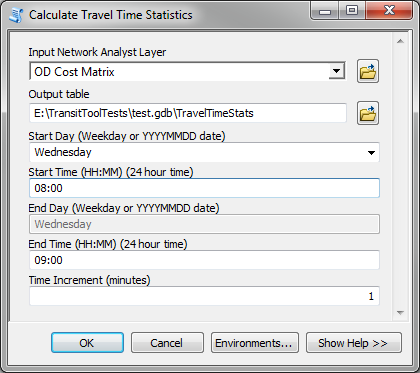
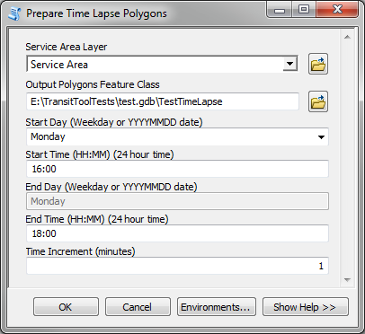
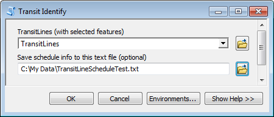

# Transit Analysis Tools User's Guide

Created by Melinda Morang, Esri  

Copyright 2018 Esri  
Licensed under the Apache License, Version 2.0 (the "License"); you may not use this file except in compliance with the License.  You may obtain a copy of the License at <http://www.apache.org/licenses/LICENSE-2.0>.  Unless required by applicable law or agreed to in writing, software distributed under the License is distributed on an "AS IS" BASIS, WITHOUT WARRANTIES OR CONDITIONS OF ANY KIND, either express or implied.  See the License for the specific language governing permissions and limitations under the License.

## What are the Transit Analysis Tools?
These instructions explain how to use the supplemental Transit Analysis Tools with the transit network dataset you created using Add GTFS to a Network Dataset.  These tools, located in the Transit Analysis Tools.tbx toolbox, are designed to help you explore your data and understand the results of network analysis using transit.
- [Calculate Accessibility Matrix](#AccessibilityMatrix)
- [Calculate Travel Time Statistics](#Stats)
- [Copy Traversed Source Features (with Transit)](#CopyTraversed)
- [Prepare Time Lapse Polygons](#TimeLapse)
- [Transit Identify](#TransitIdentify)

## Calculate Accessibility Matrix
We often want to analyze "accessibility" in a city, how much access people or places have to certain types of facilities or opportunities.  For example, we might want to know how many jobs people in different neighborhoods of a city have access to within a reasonable commute time.  The *Calculate Accessibility Matrix* tool can help you calculate some measures of accessibility.  Given a set of origins and destinations, this tool counts the number and percentage of destinations reachable from each origin by transit and walking within a travel time limit.  The number of reachable destinations can be weighted based on a field, such as the number of jobs available at each destination. 

The results of analyses performed using your GTFS-enabled network dataset can vary greatly depending upon the time of day used as the start time for your analysis.  An analysis run at 8:00 AM might have a very different solution than one run at 8:01 AM.  A given origin might have access to a given destination at 8:00 AM but not at 8:01 AM if, by starting at 8:01 AM, the traveler has just missed the bus.

The *Calculate Accessibility Matrix* tool attempts to account for the dynamic nature of transit schedules by solving an Origin-Destination Cost Matrix analysis for multiple times of day and summarizing the results.  The user specifies a time window, and the tool will run the analysis for each minute within the time window.  In addition to counting the total number of destinations reachable at least once during the time window, the tool output also shows the number of destinations reachable at least 10%, 20%, ...90% of start times during the time window.  More detail on the tool output is available below.

Running this tool involves three steps:

1. Prepare your Origin and Destination data
2. Prepare an Origin-Destination Cost Matrix layer to use as input to the tool
3. Run the *Calculate Accessibility Matrix* tool

### 1. Prepare your Origin and Destination data

Your origins and destinations must be point feature classes.  If, for example, you are using census blocks as destinations, please first calculate the centroids of the census block polygons to use as input to the tool.  You can use the [Feature to Point](http://desktop.arcgis.com/en/arcmap/latest/tools/data-management-toolbox/feature-to-point.htm) tool to do this.

### 2. Prepare an Origin-Destination Cost Matrix layer to use as input to the tool

After creating your GTFS-enabled network dataset using the *Add GTFS to a Network Dataset* toolbox, [create an Origin-Destination (OD) Cost Matrix](http://desktop.arcgis.com/en/arcmap/latest/extensions/network-analyst/exercise-5-calculating-service-area-and-creating-an-od-cost-matrix.htm) network analysis layer in the map, and configure the layer with the [correct analysis settings](./AddGTFStoND_UsersGuide.html#Step7).  You do not need to set a time of day for your analysis because you will choose the time window when you run the *Calculate Accessibility Matrix* tool.

In addition to the settings above, you should **set a travel time limit**.  The tool will count the number of destinations reachable within this travel time limit, like 30 minutes or 60 minutes.  To do this, in the OD Cost Matrix layer properties, on the Analysis Settings tab, enter the travel time limit in minutes in the "Default Cutoff Value" box.

You do not need to add any Origins or Destinations to your OD Cost Matrix layer at this point.  The *Calculate Accessibility Matrix* tool will add them for you.  However, if you want to add them just for testing purposes, you can do that.  They will be overwritten when you run the tool.

You can also [save your OD Cost Matrix layer as a .lyr file](http://desktop.arcgis.com/en/arcmap/latest/tools/data-management-toolbox/save-to-layer-file.htm) to use as input for the tool.  This will be particularly useful is you want to run this tool in a python script outside of ArcMap.

### 3. Run the *Calculate Accessibility Matrix* tool
Once your origin and destination feature classes and your OD Cost Matrix layer are prepared, run the *Calculate Accessibility Matrix* tool to calculate measures of accessibility.  Fields with these accessibility measures will be added to your input origins table.

#### Inputs
* **OD Cost Matrix Layer**: An OD Cost Matrix layer in your map or saved as a .lyr file (see previous section on how to set this up).
* **Origins**: A point feature class representing the locations you want to calculate accessibility measures for.  For example, your origins might be census block centroids or the centroids of individual parcels.
* **Destinations**: A point feature class representing the destinations your origins will travel to.  For example, if you want to measure your origins' level of accessibility to jobs, your Destinations could be the locations of employment centers.
* **Destinations Weight Field**:  Optionally, choose a field from your Destinations table that will be used as a weight.  For example, if your destinations represent employment centers, the weight field could be the number of jobs available at each point. Only integer and double fields can be used for the weight field.  If you do not choose a weight field, each destination will be counted as 1.
* **Start Day (Weekday or YYYYMMDD date)**: Day of the week or YYYYMMDD date for the first start time of your analysis.  Whether you use a generic weekday or a specific date should depend on the format of your GTFS data.  Please review the [Specific vs. generic dates section](./AddGTFStoND_UsersGuide.html#Dates) in the User's Guide.
* **Start Time (HH:MM) (24 hour time)**: The lower end of the time window you wish to analyze.  Must be in HH:MM format (24-hour time).  For example, 2 AM is 02:00, and 2 PM is 14:00.
* **End Day (Weekday or YYYYMMDD date)**: If you're using a generic weekday for Start Day, you must use the same day for End Day.  If you want to run an analysis spanning multiple days, choose specific YYYYMMDD dates for both Start Day and End Day.
* **End Time (HH:MM) (24 hour time)**: The upper end of the time window you wish to analyze.  Must be in HH:MM format (24-hour time).  The End Time is inclusive, meaning that a analysis will be performed for the time of day you enter here.
* **Time Increment (minutes)**: Increment the OD Cost Matrix's time of day by this amount between solves.  For example, for a Time Increment of 1 minute, the OD Cost Matrix will be solved for 10:00, 10:01, 10:02, etc.  A Time Increment of 2 minutes would calculate the OD Cost Matrix for 10:00, 10:02, 10:04, etc.

#### Outputs
This tool does not produce a new output.  Instead, it adds the following fields to your input Origins table:
- *TotalDests*
- *PercDests*
- *DsAL10Perc*, *DsAL20Perc*, ..., *DsAL90Perc*
- *PsAL10Perc*, *PsAL20Perc*, ..., *PsAL90Perc*

These fields are explained fully below.

**TotalDests**: The total number of destinations reachable by this origin within the time limit at least once during the time window.

For example, if Origin 1 can reach Destination A within 30 minutes at any time of day but can only reach Destination B within 30 minutes if the travel starts at exactly 10:03 AM, Destination A and Destination B still each contribute equally to TotalDests.  Both are considered "reachable" even though one is arguably more easily reached than the other.

If you did not use a weight field, each reachable destination adds 1 to TotalDests, so Destination A and Destination B would sum to contribute 2.  Or, if you *did* use a weight field, each reachable destination will contribute the numerical value in the weight field.  If Destination A has 200 jobs and Destination B has 300 jobs, they would sum together to contribute 500 to TotalDests.

**PercDests**: The percentage of all destinations reachable by this origin within the time limit.  This is TotalDests divided by the total weighted number of destinations that were included in the analysis.

**DsAL10Perc**, **DsAL20Perc**, ..., **DsAL90Perc**: These fields represent the total number of destinations reachable by this origin within the time limit at least x% of start times within the time window, where 'x' is the number in the field name (10, 20, ..., 90).  Together, these fields allow you to understand the *frequency* of access the origins have to destinations.

For example, suppose you ran your analysis with a time window of 8:00 to 8:59 with 1-minute increments, so the OD Cost Matrix was calculated for 60 different start times.  Suppose Destination A is right next to Origin 1 and is consequently easily reachable in a short amount of time.  It doesn't matter what time you start traveling from Origin 1; you can always get to Destination A.  Origin 1 can reach Destination A within the time limit for all 60 start times analyzed, or 100% of start times.  Consequently, Destination A's weight contributes to the totals reported in *DsAL10Perc*, *DsAL20Perc*, all the way up to *DsAL90Perc* because 100% is greater than 10%, 20%, ..., 90%.

Suppose that Destination B is farther away and can only be reached from Origin 1 by taking a bus that doesn't run very often.  A traveler starting at Origin 1 only has a few opportunities to reach Destination B within the travel time limit.  Let's say that Destination B was only reached within the time limit for 9 of the 60 start times, or 15% of start times.  Destination B's weight will only contribute to the total in *DsAL10Perc* because 15% is greater than 10%, but it is not greater than 20% (or 30%, 40%, ..., 90%).

So, for our weighted example above, for Origin 1, the *DsAL10Perc* field will have a value of 500 because it includes the 200 jobs from Destination A and the 300 jobs from Destination B.  However, the *DsAL20Perc*, *DsAL30Perc*, etc. fields will all have a value of 200 (from Destination A) because Destination B is not reachable often enough to contribute its jobs to these higher percentage fields.

If you care about a bare minimum of access, use the *TotalDests* field.  If you care about quality of access, compare the value of *TotalDests* with, say, *DsAL90Perc*, and note that the total number of destinations reachable more than 90% of the time is much lower.

**PsAL10Perc**, **PsAL20Perc**, ..., **PsAL90Perc**:  These are companion fields to *DsAL10Perc*, *DsAL20Perc*, etc. and have the same relationship that *PercDests* does to *TotalDests*.  For example, *PsAL10Perc* is *DsAL10Perc* divided by the total weighted number of destinations that were included in the analysis.

#### Tool performance
OD Cost Matrices with many origins and destinations may take a long time to solve, and since this tool solves the analysis once per start time within the time limit, this tool could take a very long time to complete.  If you want to solve a really massive problem, this tool might not be the most efficient way to do it.  Please contact me, and I can share some code samples for using multiprocessing to solve these analyses in parallel.

Note that when this tool runs, if the input OD Cost Matrix layer and the network it references are in the map, these layers might re-draw over and over again, which impacts tool performance.  Before running the tool, turn off the layers in the map to prevent the re-draw behavior.

## Calculate Travel Time Statistics
The time it takes to travel between one location and other by public transit varies throughout the day depending on the transit schedule.  This tool calculates some simple statistics about the total transit travel time between locations over a time window and writes the output to a table.

For each origin-destination pair in an OD Cost Matrix layer or each route in a Route layer, the tool calculates:
- Minimum travel time
- Maximum travel time
- Mean travel time

You can also choose to save a feature class containing the combined network analysis output for the entire time window. 

Running this tool involves two steps:

1. Prepare an OD Cost Matrix or Route layer in the map
2. Run the *Calculate Travel Time Statistics* tool

### 1. Prepare an OD Cost Matrix or Route layer in the map

After creating your GTFS-enabled network dataset using the *Add GTFS to a Network Dataset* toolbox, [create an OD Cost Matrix](http://desktop.arcgis.com/en/arcmap/latest/extensions/network-analyst/exercise-5-calculating-service-area-and-creating-an-od-cost-matrix.htm) or [Route](http://desktop.arcgis.com/en/arcmap/latest/extensions/network-analyst/exercise-3-finding-the-best-route-using-a-network-dataset.htm) network analysis layer in the map for the origins and destinations or route stops you want to analyze, and configure the layer with the [correct analysis settings](./AddGTFStoND_UsersGuide.html#Step7).  Solve it for a few different times of day to make sure it works and that you get the results you want.

The *Calculate Travel Time Statistics* tool does not use the geometry of the solved network analysis layers when calculating statistics.  To improve tool performance, set the Output Shape Type setting to "None".

You can also [save your network analysis layer as a .lyr file](http://desktop.arcgis.com/en/arcmap/latest/tools/data-management-toolbox/save-to-layer-file.htm) to use as input for the tool.  This will be particularly useful is you want to run this tool in a python script outside of ArcMap.

### 2. Run the *Calculate Travel Time Statistics* tool
Once your network analysis layer is prepared, run the *Calculate Travel Time Statistics* tool to solve the layer for a range of start times over a time window.  The tool will calculate statistics about the travel time across the time window and save the results to a table and optionally save the combined network analysis output for each time slice to a feature class.

#### Inputs
* **Input Network Analyst Layer**: A ready-to-solve OD Cost Matrix or Route layer in your map or saved as a .lyr file (see previous section on how to set this up).
* **Output table**: A geodatabase table that will be the output of this tool, which will contain the travel time statistics.
* **Start Day (Weekday or YYYYMMDD date)**: Day of the week or YYYYMMDD date for the first start time of your analysis.  Whether you use a generic weekday or a specific date should depend on the format of your GTFS data.  Please review the [Specific vs. generic dates section](./AddGTFStoND_UsersGuide.html#Dates) in the User's Guide.
* **Start Time (HH:MM) (24 hour time)**: The lower end of the time window you wish to analyze.  Must be in HH:MM format (24-hour time).  For example, 2 AM is 02:00, and 2 PM is 14:00.
* **End Day (Weekday or YYYYMMDD date)**: If you're using a generic weekday for Start Day, you must use the same day for End Day.  If you want to run an analysis spanning multiple days, choose specific YYYYMMDD dates for both Start Day and End Day.
* **End Time (HH:MM) (24 hour time)**: The upper end of the time window you wish to analyze.  Must be in HH:MM format (24-hour time).  The End Time is inclusive, meaning that a network analysis result will be included for the time of day you enter here.
* **Time Increment (minutes)**: Increment the network analysis layer's time of day by this amount between solves.  For example, for a Time Increment of 1 minute, the output would include results for 10:00, 10:01, 10:02, etc.  A Time Increment of 2 minutes would generate results for 10:00, 10:02, 10:04, etc.
* **Save combined network analysis results**: You can choose whether to save the network analysis layer's output sublayer (Lines for OD Cost Matrix, Routes for Route) for each time slice into a single combined feature class. Using this option slows the tool's performance.
* **Output combined network analysis results**: If you have chosen to save the combined network analysis results, specify the path to an output feature class to store the results.  A file geodatabase feature class is highly recommended, since the output may contain a large number of rows.

#### Outputs
The resulting geodatabase table will contain one row per origin-destination pair (for an OD Cost Matrix layer) or route name (for a Route layer) in the solved network analysis layer.  The OriginID and DestinationID or the route Name fields are included for reference.  The following summary statistics fields are included:
- **Min_[transit travel time impedance attribute name]**: The minimum travel time during the time window
- **Max_[transit travel time impedance attribute name]**: The maximum travel time during the time window
- **Mean_[transit travel time impedance attribute name]**: The mean travel time during the time window

The **NumTimes** field in the output table indicates the number of iterations that were used to calculate the statistics for this route or origin-destination pair.  In general, this number should be equivalent to the total number if time of day iterations; however it could be less if the route or origin-destination pair was not included in the output for a particular time of day.  This is an indication that you should review your network analysis layer configuration and consider carefully whether the resulting statistics are reliable.

If your input is an OD Cost Matrix layer, use caution when setting a default cutoff or the number of destinations to find, as these parameters may cause the output of the *Calculate Travel Time Statistics* to be inaccurate. Suppose your OD Cost Matrix layer uses a default cutoff of 30 minutes. At some times of day, the travel time between an origin and a destination may exceed 30 minutes, so the travel time between this origin and destination will not be reported. These cases will not be included in the statistics calculated in the output of this tool.  In this case, the minimum travel time value should be correct, but the maximum and mean may not.

Suppose your OD Cost Matrix layer uses a "Destinations To Find" count of 5. This means that the travel time for only the 5 closest destinations to each origin will be reported in the OD Cost Matrix output.  Because the travel time between each origin and destination changes throughout the day, the closest destinations may be different at different times of day, so the statistics reported for each origin-destination pair in the output of this tool may be inaccurate.  For example, for Origin 1, Destination 3 might be one of the five closest destinations at 8:00, but at 8:01, it is not.  Destination 7 is closer.  Consequently, the calculated statistics will include the travel time from Origin 1 to Destination 3 at 8:00 but not 8:01, and it will include the travel time from Origin 1 to Destination 7 at 8:01 but not 8:00.  Because of this confusion, using the "Destinations To Find" setting with this tool is not recommended.

If you have chosen to save the combined network analysis results an output feature class will be created.  This feature class will contain all the rows from the network analysis layer's output sublayer for each time slice in your time window with an additional **TimeOfDay** field indicating the time slice that produced the row.  This table could get very large, particularly for OD Cost Matrix.

#### Tool performance
Network analysis layers with large numbers of input features (origins, destinations, stops, etc.) may take a long time to solve, and since this tool solves the analysis once per start time within the time limit, this tool could take a very long time to complete.

Note that when this tool runs, if the input OD Cost Matrix layer and the network it references are in the map, these layers might re-draw over and over again, which impacts tool performance.  Before running the tool, turn off the layers in the map to prevent the re-draw behavior.

The tool will run slower if you have chosen to save the combined network analysis results.

## Copy Traversed Source Features (with Transit)
The ArcGIS Network Analyst tool *Copy Traversed Source Features* produces feature classes showing the network edges, junctions, and turns that were traversed when solving a network analysis layer.  It shows the actual network features that were used.  The *Copy Traversed Source Features (with Transit)* tool is an extension of the ArcGIS tool designed for use with transit network datasets.  It adds GTFS transit information to the traversal result produced by the ArcGIS *Copy Traversed Source Features* tool.  GTFS stop information is added to the output Junctions. GTFS route information, trip_id, arrive and depart time and stop names, and the transit time and wait time are added to the output Edges for each transit leg.  An additional feature class is produced containing only the transit edges.

Learn more about the original [Copy Traversed Source Features](http://desktop.arcgis.com/en/arcmap/latest/tools/network-analyst-toolbox/copy-traversed-source-features.htm) tool and the [output](http://desktop.arcgis.com/en/arcmap/latest/tools/network-analyst-toolbox/copy-traversed-source-features-output.htm) from that tool in the ArcGIS documentation.

### Inputs
* **Input Network Analysis Layer**: The network analysis layer created using your transit network dataset for which you want to produce the traversal result. At this time, only network analysis layers of type Route and Closest Facility are supported.
* **Output Location**: A file geodatabase where the output feature classes will be written.
* **Edge Feature Class Name**: The name for the output Edge feature class.  This feature class will show the network edges (streets, connector lines, transit lines, etc.) that were traversed and will include GTFS information for all transit lines.
* **Junction Feature Class Name**: The name for the output Junctions feature class.  This feature class will show the network junctions (including GTFS stops) that were traversed and will include GTFS stop information.
* **Turn Table Name**: The name for the output Turns table. This table will show any network Turns that were traversed.
* **Transit Edge Feature Class Name**: The name for the output Transit Edge feature class.  This feature class will show the transit edges that were traversed and will include GTFS information for all the transit lines.

### Outputs
All output will be created in the file geodatabase you specified in the tool inputs.
* **[Edge Feature Class Name]**: This feature class shows the network edges (streets, connector lines, transit lines, etc.) that were traversed in the Route.  GTFS information for all transit lines is included.  The edges are sorted in the order traversed.
* **[Junction Feature Class Name]**: This feature class shows the network junctions (including GTFS stops) that were traversed.  GTFS stop information is included for all GTFS stops.
* **[Turn Table Name]**: This table shows any network Turns that were traversed.  If your network did not use Turns, this table will be empty.
* **[Transit Edge Feature Class Name]**: This feature class is a subset of the Edge feature class and contains only the transit edges lines that were traversed, including the GTFS information

### Notes about the Edge output
* The edges are sorted first by the Network Analyst RouteID (if there is more than one Route in your input layer), and second by the order traversed.
* The wait_time and transit_time fields are given in units of minutes and rounded to two decimal places.
* The trip_id, agency_id, route_id, from_stop_id, and to_stop_id fields have the GTFS data folder name prepended to the original ID values.  This is in order to distinguish the IDs when multiple GTFS datasets have been used in the network dataset.
* When Network Analyst solves a Route, the network edge features traversed by that Route can be determined.  However, this traversal result does not contain any information about the actual GTFS trip associated with the transit line that was traversed.  The *Copy Traversed Source Features (with Transit)* tool first calculates the traversal result and then subsequently adds the GTFS information based on the ID of the edge and the time of day it was traversed.  It is conceivable, though unlikely, that there may be more than one trip that traverses the same edge at the same time.  In these cases, both trips will be written to the Edges feature class, even though in reality the passenger could have only used one of the trips.
* If you are calculating the traversal result from a Closest Facility layer and you are using the time of day as an end time rather than a start time, a wait time will be shown for the last transit leg in each set of transit legs rather than at the beginning.  The solver essentially searches the network in reverse to find the optimal path so the traveler can arrive at the destination at exactly the time you specify, and it assumes they leave their origin at exactly the right time.  Consequently, there is no wait time at the beginning of the transit leg, but a wait time may be applied at the end so they reach their destination at the correct time.
* If your Network Analysis layer was solved using "Today" as the Day of Week instead of a specific weekday, you might not get correct transit information if you run this tool on a different day of the week from the day of week when your layer was solved.  The tool will output a warning.

## Prepare Time Lapse Polygons
The results of analyses performed using your GTFS-enabled network dataset can vary greatly depending upon the time of day used as the start time for your analysis.  An analysis run at 8:00 AM might have a very different solution than one run at 8:01 AM if the traveler has just missed the bus.

A demonstration of this time dependency can be seen in [this video](https://youtu.be/tTSd6qJlans).  The video is a time lapse showing the area reachable within 15 minutes of travel time by walking and public transit from a point in Atlanta. Because the available transit service changes throughout the day, the area reachable changes significantly depending on the time of day you leave on your journey. For this video, I incremented the start time in one-minute intervals for each minute between 10:00 AM and 11:00 AM on a typical weekday and put the results in a time lapse.

The *Prepare Time Lapse Polygons* tool will help you to make a video like this of your own.  This involves three steps:

1. Prepare a Service Area layer in the map
2. Run the *Prepare Time Lapse Polygons* tool
3. Create your time lapse video from the resulting polygon feature class in ArcMap or ArcGIS Pro.

### 1. Prepare a Service Area layer in the map

After creating your GTFS-enabled network dataset using the *Add GTFS to a Network Dataset* toolbox, [create a Service Area](http://desktop.arcgis.com/en/arcmap/latest/extensions/network-analyst/exercise-5-calculating-service-area-and-creating-an-od-cost-matrix.htm) network analysis layer in the map for the facility or facilities you want to analyze, and configure the layer with the [correct analysis settings](./AddGTFStoND_UsersGuide.html#Step7).  Solve it for a few different times of day to make sure it works and that you get the results you want.

You can also [save your Service Area layer as a .lyr file](http://desktop.arcgis.com/en/arcmap/latest/tools/data-management-toolbox/save-to-layer-file.htm) to use as input for the tool.  This will be particularly useful is you want to run this tool in a python script outside of ArcMap.

### 2. Run the *Prepare Time Lapse Polygons* tool
Once your Service Area layer is prepared, run the *Prepare Time Lapse Polygons* tool to solve the service area for a range of start times and save the output polygons to a feature class.  You can use this feature class to make a time lapse video.

#### Inputs
* **Service Area Layer**: A ready-to-solve Service Area layer in your map or saved as a .lyr file (see previous section on how to set this up).
* **Output Polygons Feature Class**: A feature class that will be the output of this tool, which you will use to create your time lapse video.
* **Start Day (Weekday or YYYYMMDD date)**: Day of the week or YYYYMMDD date for the first start time of your analysis.  Whether you use a generic weekday or a specific date should depend on the format of your GTFS data.  Please review the [Specific vs. generic dates section](./AddGTFStoND_UsersGuide.html#Dates) in the User's Guide.
* **Start Time (HH:MM) (24 hour time)**: The lower end of the time window you wish to analyze.  Must be in HH:MM format (24-hour time).  For example, 2 AM is 02:00, and 2 PM is 14:00.
* **End Day (Weekday or YYYYMMDD date)**: If you're using a generic weekday for Start Day, you must use the same day for End Day.  If you want to run an analysis spanning multiple days, choose specific YYYYMMDD dates for both Start Day and End Day.
* **End Time (HH:MM) (24 hour time)**: The upper end of the time window you wish to analyze.  Must be in HH:MM format (24-hour time).  The End Time is inclusive, meaning that a Service Area polygon will be included in the results for the time of day you enter here.
* **Time Increment (minutes)**: Increment the Service Area's time of day by this amount between solves.  For example, for a Time Increment of 1 minute, the results may include a Service Area polygon for 10:00, 10:01, 10:02, etc.  A Time Increment of 2 minutes would generate Service Area polygons for 10:00, 10:02, 10:04, etc.

#### Outputs
The resulting polygons feature class will contain one row per Service Area per time of day solved when running the tool.  The feature class will contain a field called TimeOfDay indicating the traveler's start time.

If you used a generic weekday instead of a specific date, the date portion of the TimeOfDay field will show dates in 1899 or 1900.  This is "correct", in that these are special reserved dates used by ArcGIS Network Analyst to indicate generic weekdays.

### 3. Create your time lapse video
Once you have generated your polygons feature class, you can use it to create a time lapse video in either ArcMap or ArcGIS Pro.

#### ArcMap
First, enable time on the output polygons layer.  Open the layer properties, go to the Time tab, and chose "Enable time on this layer".  Adjust the settings as shown in the screenshot.  Make sure to set the Time Step Interval to the number of minutes you used when you ran the *Prepare Time Lapse Polygons* tool.

After you have done this, you can follow the steps in the ArcMap documentation for [exporting a time visualization to a video](http://desktop.arcgis.com/en/arcmap/latest/map/time/exporting-a-time-visualization-to-a-video.htm).  For some help using the Time Slider to prepare your video, check out [this documentation](http://desktop.arcgis.com/en/arcmap/latest/map/time/using-the-time-slider.htm).

#### ArcGIS Pro
Although you cannot use ArcGIS Pro to create your GTFS-enabled network dataset or run analyses with it, you can use the feature class created with the *Prepare Time Lapse Polygons* tool make your time lapse video in ArcGIS Pro.  Please check out the [ArcGIS Pro documentation](https://pro.arcgis.com/en/pro-app/help/mapping/animation/animate-through-time.htm) for how to do this.

## Transit Identify
The *Transit Identify* tool is a network debugging utility that will print the transit schedule for the selected transit line in the network.  If you make a selection on the TransitLines feature class that participates in your network dataset, the *Transit Identify* tool will print a list of the times of day and days of week the selected line feature is traveled across.

You can use this information when testing that your network is working correctly.  For instance, if you suspect that the transit lines are ever being used in your analysis and you want to make sure your network connectivity is correct, you can use this tool to help you check the behavior of your network.

### Debugging procedure
* Select any transit line.
* Create a Route layer.
* Place two stops on the street features on either end of the selected transit line.
* Run Transit Identify to find a time of day and day of week when the selected transit line is used.
* Set your Route's time of day to correspond with the time of day when you know the transit line is used.  You should set the time of day to a minute or two before the transit trip starts to account for a small amount of walking time from the origin point to the transit stop.
* Solve the Route layer.  If the resulting route uses the transit line as expected, your network is working correctly. 

This tool is *not* meant to be used to extract schedule information from the entire network; consequently, the tool will only run if the number of selected features is 5 or fewer.

### Inputs
* **TransitLines (with selected features)**: The only valid input for this tool is a feature layer of your TransitLines feature class with 1-5 transit line features selected.  In other words, you should add your TransitLines feature class to the map, select up to five transit lines manually or using Select by Attributes or Select by Location, and use the TransitLines map layer as the input.
* **Save schedule info to this text file (optional)**: The schedule information for the selected transit lines will be printed to the ArcMap geoprocessing dialog.  If you would like to additionally save that information to a text file for easier reading or future reference, you may optionally indicate a text file path here.

### Outputs
* **\[Text file\] (optional)**: A text file containing the schedule information for the selected transit line(s).

## Questions or problems?
Check the [Troubleshooting Guide](https://github.com/Esri/public-transit-tools/blob/master/add-GTFS-to-a-network-dataset/TroubleshootingGuide.md).  If you're still having trouble, search for answers and post questions in our [GeoNet group](https://community.esri.com/community/arcgis-for-public-transit).