# Better Bus Buffers User's Guide

Created by Melinda Morang, Esri  

Contributors:
David Wasserman, Fehr & Peers

Copyright 2020 Esri  
Licensed under the Apache License, Version 2.0 (the "License"); you may not use this file except in compliance with the License.  You may obtain a copy of the License at <http://www.apache.org/licenses/LICENSE-2.0>.  Unless required by applicable law or agreed to in writing, software distributed under the License is distributed on an "AS IS" BASIS, WITHOUT WARRANTIES OR CONDITIONS OF ANY KIND, either express or implied.  See the License for the specific language governing permissions and limitations under the License.

## What this tool does
BetterBusBuffers is a toolset to help you quantitatively measure access to public transit in your city.  The tools use GTFS public transit data and ArcGIS to count the number of transit trips available during a time window for areas within your city, point locations within your city, along specific corridors, or at the transit stops themselves.

## Overview of the BetterBusBuffers tools
The *[Preprocess GTFS](#PreprocessGTFS)* tool converts your GTFS dataset(s) into a SQL database.  This SQL database is used as input for all the other BetterBusBuffers tools.  You should run this tool first.

The *[Count Trips for Individual Route](#CountTripsForIndividualRoute)* toolset allows you to examine individual routes in your system in detail.  It generates a feature class of transit stops associated with the route you select as well as polygon service areas around the stops, and it calculates the number of visits, frequency, max wait time, and average headway for each stop during a time window.

The *[Count Trips in Polygon Buffers around Stops](#CountTripsInPolygonBuffersAroundStops)* toolset generates polygon service areas around all the stops in your transit system and counts the number of transit trips available in those areas during a time window.  The output is a transit coverage map that can be color-coded by the frequency of available service.

The *[Count Trips on Lines](#CountTripsOnLines)* toolset counts the number of transit trips that travel along corridors between stops during a time window. The output is a lines feature class that can by symbolized to emphasize high-frequency corridors and connections.

The *[Count Trips at Points](#CountTripsAtPoints)* tool counts the number of transit trips available within a designated distance of specific point locations during a time window.  The output is a copy of the input point locations with fields indicating the number of transit trips available within a short walk during a time window.

The *[Count Trips at Points Online](#CountTripsAtPointsOnline)* does the same thing as the *Count Trips at Points* tool, but it uses the ArcGIS Online Origin-Destination Cost Matrix service so that you don't need your own network datasets or a Network Analyst license.

The *[Count Trips at Stops](#CountTripsAtStops)* tool counts the number of transit trips that visit the stops in your transit system during a time window.  The output is a feature class of your GTFS stops with fields indicating the number of transit trips that visit those stops.

The *[Count Trips at Stops by Route and Direction](#CountTripsAtStopsRouteDir)* tool counts the number of transit trips that visit the stops in your transit system during a time window.  In contrast to *Count Trips at Stops*, this tool does not combine trips from different routes or directions of travel. Instead, if a stop is used by multiple routes and/or directions, the stop will be duplicated in the output.

The *[Count High Frequency Routes at Stops](#CountHighFrequencyRoutesAtStops)* tool counts the number of routes at each stop that meet a desired headway threshold. The output is a feature class of your GTFS stops with fields indicating trip and headway statistics along with a count of the number of routes at the stop that has headways of a desired threshold or shorter.

Detailed instructions for each of these tools is given later in this document.

## Software requirements
* ArcGIS 10.2 or higher with a Desktop Basic (ArcView) license, or ArcGIS Pro 1.2 or higher.
* The *Count High Frequency Routes at Stops* tool requires ArcGIS 10.4 or higher or ArcGIS Pro 1.2 or higher.
* You need the Desktop Advanced (ArcInfo) license in order to run the *Count Trips in Polygon Buffers around Stops* tool.
* All tools except *Count Trips at Stops*, *Count Trips at Stops by Route and Direction*, *Count Trips at Points Online*, *Count High Frequency Routes at Stops*, and those in the *Count Trips on Lines* toolset require the Network Analyst extension.
* For the *Count Trips at Points Online* tool, an ArcGIS Online account with routing privileges and sufficient credits for your analysis.

## Data requirements
* A valid GTFS dataset.  If your GTFS dataset has blank values for arrival_time and departure_time in stop_times.txt, you will not be able to run this tool.  You can download and use the [Interpolate Blank Stop Times](http://www.arcgis.com/home/item.html?id=040da6b55503489b90fa51eea6483932) tool to estimate blank arrival_time and departure_time values for your dataset if you still want to use it in BetterBusBuffers.
* For some functionality, a network dataset with street data for your area of interest.  You should *not* use a network dataset created with the Add GTFS to a Network Dataset toolset.  BetterBusBuffers will handle the GTFS data separately, so it should not be included within the network dataset itself.
* For the *Count Trips at Points* and *Count Trips at Points Online* tools, a feature class of your points of interest.

## Getting started
- Download the tool and save it anywhere on your computer.
- Unzip the file you downloaded.  The unzipped package contains a .pyt toolbox file, a set of python scripts needed to run the toolbox, and a copy of this user's guide.
- No installation is necessary.  You can run the tool from ArcCatalog, ArcMap, or ArcGIS Pro.  In any of those products, just navigate to the folder containing the .pyt file, and it should show up as a toolbox with tools you can run.  You can also add the tool to ArcToolbox to make it easier to find later.
- *Warning: If you wish to move the toolbox to a different location on your computer, make sure you move the entire folder, not just the toolbox file.  Otherwise the toolbox will become disconnected from the scripts, and the tools will not run.*

## Workflow
1. After preparing the toolbox and your data, run the *Preprocess GTFS* tool. The output for this tool will serve as input for all the other tools in the toolbox.
2. Run whichever other tools you are interested in.  Details about how to run these tools are below.

## Running *Preprocess GTFS*

### What this tool does
The *Preprocess GTFS* tool converts your GTFS dataset(s) into a SQL database.  This SQL database is used as input for all the other BetterBusBuffers tool.  You should run this tool first.  You only need to run this tool once for any GTFS dataset or set of datasets you wish to analyze.

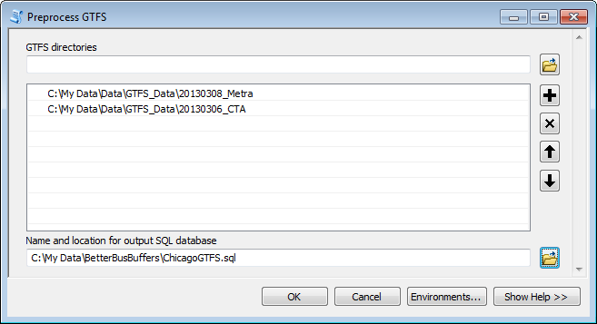

### Inputs
- **GTFS directories**:  The *folder(s)* containing your (unzipped) GTFS .txt files.  You can select multiple GTFS datasets to analyze simultaneously.
- **Name and location for output SQL database**:  The tool will generate a SQL database with the name and location you specify here.  You can give it any name you want, and use a ".sql" expression.  You will use this file as input for the other BetterBusBuffers tools.

### Outputs
- **[Your designated output filename]**: A SQL database containing your GTFS data that is required as input for the BetterBusBuffers tools.

### Troubleshooting & potential pitfalls
* The tool takes forever to run: For a small transit network, this tool should run quickly.  For a very large transit network, it may take 20 or 30 minutes to run.  If everything is working correctly, the following conditions will cause the tool to run slower:
  * Very large transit datasets or a large number of input datasets will be slow.
  * The tool will run slower if you are writing to and from a network drive.
* My stop_times.txt file has blank entries for arrival_time and/or departure_time:  Some GTFS datasets give specific arrival_times and departure_times only for designated time points in the network, leaving the times for intermediate stops blank.  Although this is a valid way to write a GTFS file, BetterBusBuffers requires an explicit stop time for every stop visit.  You will not be able to use this GTFS dataset as is for your analysis.  You can download and use the [Interpolate Blank Stop Times](http://www.arcgis.com/home/item.html?id=040da6b55503489b90fa51eea6483932) tool to estimate blank arrival_time and departure_time values in order to use BetterBusBuffers.
* I got a warning message saying I had non-overlapping date ranges: This is because of the way your GTFS data has constructed its calendar.txt file, or because your GTFS datasets (if you have multiple datasets) do not cover the same date ranges.
  * Read the [GTFS calendar.txt specification](https://github.com/google/transit/blob/master/gtfs/spec/en/reference.md#calendartxt) to make sure you understand how calendar.txt works.
  * Open the calendar.txt file in each dataset you are using and make sure you understand how the date ranges work. 
  * Check the start and end dates for each row.  If you received a warning message, then your data contains date ranges that do not overlap (ie, the start date of at least one service_id is later than the end date of at least one other service_id).  If you have non-overlapping date ranges in your file, it can cause problems when you run the tool.  The tool will count all trips that occur on the day of the week you select, even if those trips occur in non-overlapping date ranges.  Effectively, it will be double-counting trips that should not be double-counted.
  * If you determine that your non-overlapping date ranges will cause problems, trying running your analysis for a specific date instead of a generic weekday.  Select a date that falls within one of the date ranges listed in calendar.txt.  You might also want to check your calendar_dates.txt file to see if there are any service exceptions present for the date you have chosen.
  * Alternatively, if you do not wish to use a specific date for your analysis, you can make a copy of your calendar.txt file and modify the data in the file to remove the non-overlapping date ranges.  For example, if your file has a set of service_ids for the summer months and a set for the winter months, and you're interested in analyzing the summer months, delete all the rows with date ranges for the winter months.  Make sure your cleaned up file is still called calendar.txt so the tool recognizes it.
  * If you are analyzing multiple GTFS datasets at a time, and the datasets have non-overlapping date ranges, you will get the same error as you will if service_ids in one dataset have non-overlapping date ranges.  The date range problem is less of an issue (or not an issue at all) if it occurs in different datasets, but you should double-check anyway to make sure you understand your data.

Still having problems?  Search for answers and post questions in our [GeoNet group](https://community.esri.com/community/arcgis-for-public-transit).

## Running *Count Trips for Individual Route*

### What this tool does
The *Count Trips for Individual Route* tool finds the stops used by a particular route in your system, generates polygon service areas around those stops, and calculates some statistics about the number of trips that visit those stops during a time window.  The output is a feature class of stops and a feature class showing the area served by the route, along with fields indicating the number, frequency, max wait time, and average headway for that route during the time window you select.

### Workflow
This tool contains two parts.  Step 1 need only be run once for a given route and buffer size (for example, Route 10x and 0.25 miles).  Step 1 creates the stops and service area feature classes.  Step 2 uses those feature classes as input.  In Step 2, you select the time window you wish to analyze, and the results are added to the feature classes.  Re-run Step 2 for each time window you wish to analyze.

### Step 1 – Preprocess Route Buffers
This tool requires a Network Analyst license.

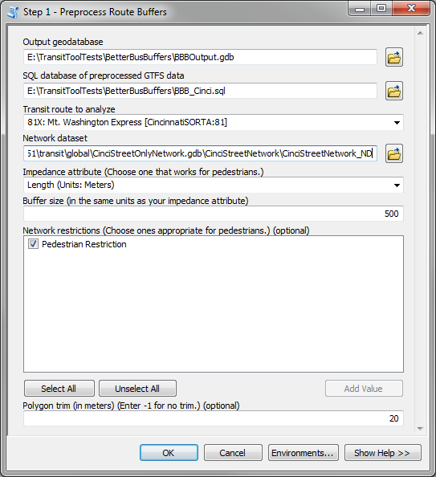

### Inputs
* **Output geodatabase**:  Select a file geodatabase into which the output feature classes generated by this tool will be saved. It must be a file geodatabase, not a folder or personal geodatabase.
* **SQL database of preprocessed GTFS data**: The SQL database you created in the *Preprocess GTFS* tool.
* **Transit route to analyze**: Select the route from your GTFS data that you want to analyze.  The drop-down list will be populated after you have selected your SQL database. The list entries are formatted as follows: "route_short_name: route_long_name [GTFSFolder:route_id]"
* **Network dataset**: A network dataset of streets, sidewalks, etc., covering the area of your analysis. The network dataset should be suitable for modeling walking pedestrians.  You should *not* use a network dataset created with the Add GTFS to a Network Dataset toolset because BetterBusBuffers will handle the GTFS data separately.
* **Impedance attribute (Choose one that works for pedestrians.)**: The cost attribute from your network dataset which you will use to calculate the maximum distance or time your pedestrians can walk between the points you are analyzing and the nearby transit stops.  Unless you have a pedestrian travel time attribute in your network dataset, choose an impedance attribute with units of distance.
* **Buffer size (in the same units as your impedance attribute)**: Choose the size of the buffers to generate around your transit stops.  This MUST be in the same units as the impedance attribute you select.  For example, if you want your buffers to show a quarter mile walking distance around stops, choose an impedance attribute in units of miles and enter "0.25."  If your network dataset has a pedestrian walk time attribute and you want your buffers to show a 10 minute walk time, select the pedestrian walk time impedance attribute and enter "10."
* **Network restrictions (optional)**: List of possible restrictions from your network dataset that you can choose to impose.  For example, checking the restriction "Avoid Toll Roads" prevents your pedestrians from walking on toll roads.  The available restrictions vary depending on your network dataset, and the list is dynamically loaded from the network dataset you select.  Choose the restrictions that are the most sensible for pedestrians.
* **Polygon trim (in meters) (Enter -1 for no trim.) (optional)**: Specify a polygon trim value in meters for your service areas.  The periphery of the service areas will be trimmed to the specified distance.  Using trim cleans up the polygons and helps avoid weird spikes and blobs.  A trim of about 20 meters is sensible for pedestrians.  However, using a trim slows down service area generation.  If you do not want to use trim, enter a value of -1.

### Outputs
All output files are written to a file geodatabase with the name and output directory you selected.
* **Stops\_[route\_short\_name]\_[direction\_id]**:  A point feature class showing the stops served by the route you selected for your analysis, in the direction indicated.  The route\_short\_name (generally the route number) is appended to the filename.  Some route numbers cover trips going in both directions (northbound and southbound, inbound and outbound, etc.), so a separate feature class will be generated for each direction present in the GTFS data and represented by the direction\_id (either a 1 or a 0) appended to the filenames.  If the route contains only one direction, the direction\_id will not be appended.
* **Buffers\_[route\_short\_name]\_[direction\_id]**:  A polygon feature class showing the area served by each stop in the Stops feature class within the walk distance you specified.

### Step 2 – Count Trips for Route

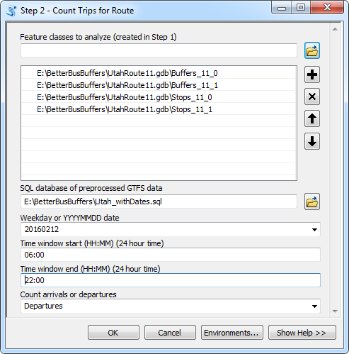

### Inputs
* **Feature classes to analyze (created in Step 1)**:  The feature classes produced when you ran Step 1.  You can select any number of the Stops or Buffers you created in Step 1.  You can combine feature classes of different routes.
* **SQL database of preprocessed GTFS data**: The SQL database you created in the *Preprocess GTFS* tool. This must be the same SQL database you used in Step 1 of this tool.
* **Weekday or YYYYMMDD date**:  Choose the day you wish to consider.  You can select a generic weekday, such as Tuesday, and all trips running on a typical Tuesday (as defined in your GTFS calendar.txt file) will be counted.  You cannot use a generic weekday if your GTFS data does not have a calendar.txt file.  Alternatively, you can enter a specific date in YYYYMMDD format, such as 20160212 for February 12, 2016.  All trips running on that specific date, as defined in your GTFS dataset's calendar.txt and calendar_dates.txt file, will be counted.  Specific dates are useful if you want to analyze a holiday, if your calendar.txt file has non-overlapping date ranges, or if your GTFS dataset does not have a calendar.txt file.
* **Time window start (HH:MM) (24-hour time)**:  The lower end of the time window you wish to analyze.  Must be in HH:MM format (24-hour time).  For example, 2am is 02:00, and 2pm is 14:00.
* **Time window end (HH:MM) (24-hour time)**:  The upper end of the time window you wish to analyze.  Must be in HH:MM format (24-hour time).  For example, 2am is 02:00, and 2pm is 14:00.  If you wish to analyze a time window spanning midnight, you can use times greater than 23:59.  For instance, a time window of 11pm to 1am should have a start time of 23:00 and an end time of 25:00.
* **Count arrivals or departures**: Indicate whether you want to count the number of arrivals at the stop during the time window or the number of departures from the stop.

### Outputs
* **[Input feature classes]**:  This tool simply adds fields to your input feature classes.  No new output is generated.

### Understanding the output
This tool produces a polygon buffers around each transit stop used by the route you selected to analyze.  These polygons will often overlap. This is normal.  The Stops and Buffers feature classes both contain information from the stops.txt GTFS file for each stop.  They also contain the route_id and direction_id (which should be the same for all features in a single feature class).  Step 2 adds the following fields to your feature classes:
* **NumTrips**:  The number of unique transit trips associated with this route that visit this stop during the time window.  Only trips with the route_id you selected are counted. If trips from other routes also use this stop, they will not be counted.
* **NumTripsPerHr**: The average number of trips per hour at this stop during the time window.  This number is calculated by dividing NumTrips by the length of the time window.
* **MaxWaitTime**: The maximum time, in minutes, between consecutive transit trip arrivals or departures during your time window.  This is the maximum amount of time during which there are no trips with this route_id available at this stop.  A MaxWaitTime of <Null> indicates that the MaxWaitTime could not be calculated for one of the following reasons:
  - There were fewer than two transit trips available within the time window.
  - The time between the start of the time window and the first trip or the last trip and the end of the time window was greater than the largest time between trips.
* **AvgHeadway**: The average time, in minutes, between consecutive transit trip arrivals or departures during your time window.  Note that if the actual headway along your route changes during your time window, the average headway might not reflect the actual headway at any particular time of day.  Choose your time window carefully and be wary of the average headway value listed here. An AvgHeadway of \<Null\> indicates that the AvgHeadway could not be calculated because there were fewer than two transit trips available within the time window.

## Running *Count Trips in Polygon Buffers around Stops*

### What this tool does
The *Count Trips in Polygon Buffers around Stops* tool generates polygon service areas around the stops in your transit system and counts the number of transit trips available in those areas during a time window.  The output is a transit coverage map that can be color-coded by the number of available trips in order to highlight the transit frequency in different parts of your city.

### Workflow
This tool contains two parts.  Step 1 need only be run once for a given geography and buffer size (for example, Chicago and 0.25 miles).  Step 1 simply creates some feature classes to be referenced by Step 2.  Step 1 can take a very long time to run.  In Step 2, which generally runs quicly, you select the time window you wish to analyze and generate the useful output.  Re-run Step 2 for each time window you wish to analyze.

### Step 1 – Preprocess Buffers
This tool requires the Desktop Advanced (ArcInfo) license and a Network Analyst license.

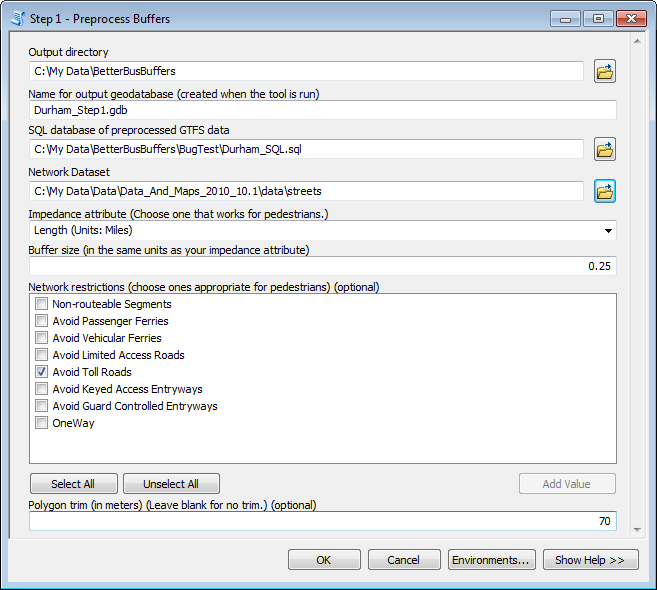

### Inputs
* **Output directory**:  Select a folder into which the output geodatabase generated by this tool will be saved.
* **Name for output geodatabase (created when the tool is run)**:  All the Step 1 output will be saved inside this geodatabase. You cannot overwrite an existing geodatabase. The geodatabase name may not contain special characters. The ".gdb" extension is optional.
* **SQL database of preprocessed GTFS data**: The SQL database you created in the *Preprocess GTFS* tool.
* **Network dataset**: A network dataset of streets, sidewalks, etc., covering the area of your analysis. The network dataset should be suitable for modeling walking pedestrians.  You should *not* use a network dataset created with the Add GTFS to a Network Dataset toolset because BetterBusBuffers will handle the GTFS data separately.
* **Impedance attribute (Choose one that works for pedestrians.)**: The cost attribute from your network dataset which you will use to calculate the maximum distance or time your pedestrians can walk between the points you are analyzing and the nearby transit stops.  Unless you have a pedestrian travel time attribute in your network dataset, choose an impedance attribute with units of distance.
* **Buffer size (in the same units as your impedance attribute)**: Choose the size of the buffers to generate around your transit stops.  This MUST be in the same units as the impedance attribute you select.  For example, if you want your buffers to show a quarter mile walking distance around stops, choose an impedance attribute in units of miles and enter "0.25."  If your network dataset has a pedestrian walk time attribute and you want your buffers to show a 10 minute walk time, select the pedestrian walk time impedance attribute and enter "10." A larger buffer size will significantly increase the time it takes to run Step 1.
* **Network restrictions (choose ones appropriate for pedestrians.) (optional)**: List of possible restrictions from your network dataset that you can choose to impose.  For example, checking the restriction "Avoid Toll Roads" prevents your pedestrians from walking on toll roads.  The available restrictions vary depending on your network dataset, and the list is dynamically loaded from the streets network you select.  Choose the restrictions that are the most sensible for pedestrians.
* **Polygon trim (in meters) (Enter -1 for no trim.) (optional)**: Specify a polygon trim value in meters for your service areas.  The periphery of the service areas will be trimmed to the specified distance.  Using trim cleans up the polygons and helps avoid weird spikes and blobs.  A trim of about 20 meters is sensible for pedestrians.  However, using a trim slows down service area generation.  If you do not want to use trim, enter a value of -1.

### Outputs
All output files are written to a file geodatabase with the name and output directory you selected.
* **Step1_Stops**:  A feature class version of the stops.txt GTFS file.  This is just a points layer of your transit stops that you can look at if you want to.
* **Step1_FlatPolys**:  The service area polygon buffers for your entire network, broken up into pieces to eliminate overlaps.  This is a template for your Step 2 output.  Step 2 fills this file with the number of trips during your time window.  You do not need to look at this template file for anything.
* **Step1_GTFS.sql**: A copy of the SQL database created in the *Preprocess GTFS* tool, with another table added.  This database is referenced in Step 2.

### Step 2 – Count Trips in Buffers

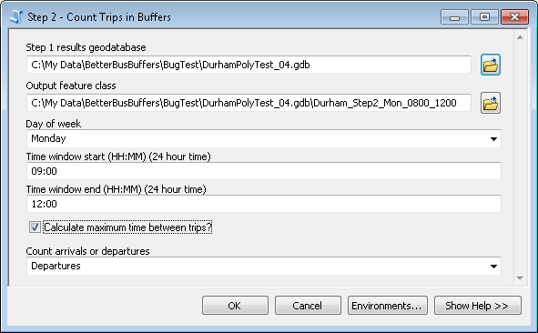

### Inputs
* **Step 1 results geodatabase**:  The geodatabase produced when you ran Step 1.  This geodatabase must contain the following files: Step1_GTFS.sql; Step1_FlatPolys.
* **Output feature class**:  The name and location for your final polygon output.  A feature class in a file geodatabase is highly recommended instead of a shapefile.
* **Weekday or YYYYMMDD date**:  Choose the day you wish to consider.  You can select a generic weekday, such as Tuesday, and all trips running on a typical Tuesday (as defined in your GTFS calendar.txt file) will be counted.  You cannot use a generic weekday if your GTFS data does not have a calendar.txt file.  Alternatively, you can enter a specific date in YYYYMMDD format, such as 20160212 for February 12, 2016.  All trips running on that specific date, as defined in your GTFS dataset's calendar.txt and calendar_dates.txt file, will be counted.  Specific dates are useful if you want to analyze a holiday, if your calendar.txt file has non-overlapping date ranges, or if your GTFS dataset does not have a calendar.txt file.
* **Time window start (HH:MM) (24-hour time)**:  The lower end of the time window you wish to analyze.  Must be in HH:MM format (24-hour time).  For example, 2am is 02:00, and 2pm is 14:00.
* **Time window end (HH:MM) (24-hour time)**:  The upper end of the time window you wish to analyze.  Must be in HH:MM format (24-hour time).  For example, 2am is 02:00, and 2pm is 14:00.  If you wish to analyze a time window spanning midnight, you can use times greater than 23:59.  For instance, a time window of 11pm to 1am should have a start time of 23:00 and an end time of 25:00.
* **Count arrivals or departures**: Indicate whether you want to count the number of arrivals available during the time window or the number of departures.

### Outputs
* **[Output feature class]**:  A polygon feature class showing the area of your city that falls within the buffer distance of transit stops.  The polygon buffers have been broken up to eliminate overlapping polygons.  Please see "Understanding the Output" below for an explanation of the fields in this table.

### Understanding the output
This tool produces polygon buffers around the transit stops in your network in order to show the area covered by transit service.  However, often stops in the network are close enough together that their polygon buffers overlap.  In these cases, the tool breaks up the original, overlapping buffers so that the overlapping area has its own polygon.  This way, a separate trip count can be produced for the overlapping area, since that area has access to all the trips that visit each of the stops within range.  Because the overlapping areas are counted separately, the output from this tool will have a very large number of polygons, generally many more than the number of stops in your network.

This tool produces a polygon feature class containing the fields described below.  Note: The field names are shortened for shapefile output.
* **NumTrips**:  The total number of unique transit trips accessible from this area during the time window.  Trips from all accessible stops are counted.  For instance, if a particular area has 3 stops within one quarter mile, any trip visiting at least one of those stops during the time window is counted.  To avoid double-counting, if the same trip visits more than one of the stops accessible from that point, that trip is only counted once.
* **NumTripsPerHr**: The average number of unique transit trips per hour accessible during the time window.  This number is calculated by dividing NumTrips by the length of the time window.
* **NumStopsInRange**: The number of transit stops accessible to the polygon.
* **MaxWaitTime**: The maximum time, in minutes, between consecutive transit trip arrivals or departures during your time window.  This is the maximum amount of time during which there are no transit trips available at stops accessible to this area.  If the area has multiple stops within the buffer distance, trips at all stops are considered.  Consequently, the MaxWaitTime should not be confused with the trip headway at a particular stop.  The MaxWaitTime measures the maximum time between trips that visit any accessible stop.
A MaxWaitTime of \<Null\> (-1 for shapefile output) indicates that the MaxWaitTime could not be calculated for one of the following reasons:
  - There were fewer than two transit trips available within the time window.
  - The time between the start of the time window and the first trip or the last trip and the end of the time window was greater than the largest time between trips.

  When choosing symbology, make sure to check for values of \<Null\> or -1.

### Troubleshooting & potential pitfalls
* **The tool takes forever to run**: Step 2 should run quickly, so if it takes longer than a few minutes, something is probably wrong.
* **I got a warning message saying I had non-overlapping date ranges**: This is because of the way your GTFS data has constructed its calendar.txt file, or because your GTFS datasets (if you have multiple datasets) do not cover the same date ranges.  See the explanation of this problem in the *Preprocess GTFS* section.
* **"Maximum sample size reached" when changing symbology in the output feature class**:  If you have a very large output feature class, you might run into some problems changing the symbology.  On the symbology tab, if you set the symbology to "Quantities" and use NumTrips or NumTripsPerHr as the Value field, you might get a warning message that says "Maximum sample size reached.  Not all records are being used.  Use this sample or change maximum sample size."  This simply means that your output file is large and that the classification and color ramp aren't looking at all the values in your table, only a certain sample of them.  It's possible that it won't find the minimum or maximum value in your table and that the color ramp will not include those values.  This problem is easy to fix.  First open your attributes table and figure out how many rows are in your table.  Then, in the symbology window, click the "Classify..." button.  Click "Sampling..." Change the Maximum Sample Size to something larger than the number of entries in your table.
* **Polygon outlines are obscuring your color-coded polygons**:  On the Symbology tab, select one of the entries in your symbol menu.  Right click, and choose "Properties for All Symbols".  Under Outline Color, choose No Color.

Still having problems?  Search for answers and post questions in our [GeoNet group](https://community.esri.com/community/arcgis-for-public-transit).

## Running *Count Trips on Lines*

### What this tool does
The *Count Trips on Lines* tool counts the number of transit trips that travel along corridors between stops during a time window. The output is a lines feature class that can by symbolized to emphasize high-frequency corridors and connections.  You can choose whether you want to combine all routes along a particular corridor (make only one line representing all routes between the same pair of stops) or not (make a separate line for each separate GTFS route_id traveling between the same pair of stops).

The lines produced are simply straight lines between connected stops rather than the actual paths traveled by the transit vehicles as represented in shapes.txt.

### Workflow
This tool contains two parts.  Step 1 need only be run once for a given transit system.  It creates a template feature class of transit lines that is used as input to Step 2.  In Step 2, you select the time window you wish to analyze, and the results are added to a copy of the template feature class.  Re-run Step 2 for each time window you wish to analyze.

### Step 1 – Preprocess Lines

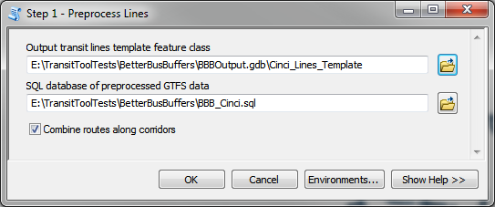

### Inputs
* **Output transit lines template feature class**:  Choose a location and filename for the template transit lines feature class that you will use as input to Step 2. It must be a feature class in a file geodatabase and not a shapefile.
* **SQL database of preprocessed GTFS data**: The SQL database you created in the *Preprocess GTFS* tool.
* **Combine routes along corridors**: Choose whether you want to combine all routes along a particular corridor (make only one line representing all routes between the same pair of stops) or not (make a separate line for each separate GTFS route_id traveling between the same pair of stops).

### Outputs

* **[Output feature class]**:  This lines feature class contains a straight line between each pair of connected stops in your GTFS dataset. They do not represent the actual paths traveled by the transit vehicles as represented in shapes.txt.  If the **Combine routes along corridors** parameter is true, then there will be only one line between each pair of connected stops.  If it is false, then there will be one line per unique route_id.  There may be multiple overlapping lines if multiple routes travel between the same pair of stops.

### Step 2 – Count Trips on Lines

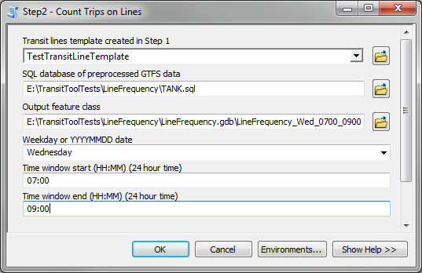

### Inputs
* **Transit lines template (created in Step 1)**:  The feature class produced when you ran Step 1.
* **SQL database of preprocessed GTFS data**: The SQL database you created in the *Preprocess GTFS* tool. This must be the same SQL database you used in Step 1 of this tool.
* **Output feature class**: Choose a location and filename for the tool output. It must be a feature class in a file geodatabase and not a shapefile.
* **Weekday or YYYYMMDD date**:  Choose the day you wish to consider.  You can select a generic weekday, such as Tuesday, and all trips running on a typical Tuesday (as defined in your GTFS calendar.txt file) will be counted.  You cannot use a generic weekday if your GTFS data does not have a calendar.txt file.  Alternatively, you can enter a specific date in YYYYMMDD format, such as 20160212 for February 12, 2016.  All trips running on that specific date, as defined in your GTFS dataset's calendar.txt and calendar_dates.txt file, will be counted.  Specific dates are useful if you want to analyze a holiday, if your calendar.txt file has non-overlapping date ranges, or if your GTFS dataset does not have a calendar.txt file.
* **Time window start (HH:MM) (24-hour time)**:  The lower end of the time window you wish to analyze.  Must be in HH:MM format (24-hour time).  For example, 2am is 02:00, and 2pm is 14:00.
* **Time window end (HH:MM) (24-hour time)**:  The upper end of the time window you wish to analyze.  Must be in HH:MM format (24-hour time).  For example, 2am is 02:00, and 2pm is 14:00.  If you wish to analyze a time window spanning midnight, you can use times greater than 23:59.  For instance, a time window of 11pm to 1am should have a start time of 23:00 and an end time of 25:00.

### Outputs
* **[Output feature class]**:  The output feature class is a copy of your input template feature class with fields appended, as described below.

### Understanding the output
This lines produced in Step 1 are simply straight lines between each pair of connected stops in your GTFS dataset. They do not represent the actual paths traveled by the transit vehicles as represented in shapes.txt.  If the **Combine routes along corridors** parameter is true, then there will be only one line between each pair of connected stops.  If it is false, then there will be one line per unique route_id.  There may be multiple overlapping lines if multiple routes travel between the same pair of stops.

Step 2 adds the following fields to your feature classes:
* **NumTrips**:  The number of transit trips that travel along this corridor during the time window.  Only trips that fall completely within the analysis time window are counted.  So, the trip will only be counted if both the departure_time from the first stop and the arrival_time at the second stop in this segment must fall within the time window.
* **NumTripsPerHr**: The average number of trips per hour at this stop during the time window.  This number is calculated by dividing NumTrips by the length of the time window.
* **MaxWaitTime**: The maximum time, in minutes, between consecutive transit trip arrivals or departures during your time window.  This is the maximum amount of time during which there are no trips with this route_id available at this stop.  A MaxWaitTime of <Null> indicates that the MaxWaitTime could not be calculated for one of the following reasons:
  - There were fewer than two transit trips available within the time window.
  - The time between the start of the time window and the first trip or the last trip and the end of the time window was greater than the largest time between trips.
* **AvgHeadway**: The average time, in minutes, between consecutive transit trips along the corridor during your time window.  Note that if the actual headway along your route changes during your time window, the average headway might not reflect the actual headway at any particular time of day.  Also, if you have chosen to combine all routes along a single corridor, the average headway does not reflect the actual headway of any individual route but rather the average time between vehicles serving that particular corridor.  Choose your time window carefully and be wary of the average headway value listed here. An AvgHeadway of \<Null\> indicates that the AvgHeadway could not be calculated because there were fewer than two transit trips available within the time window.

When displaying the results of Step 2 in the map, the "Graduated symbols" symbology type under "Quanitities" is helpful.  Symbolize corridors with more frequent service using wider, bolder lines.

## Running *Count Trips at Points*
This tool requires a Network Analyst license.

### What this tool does
The *Count Trips at Points* tool counts the number of transit trips available within a designated distance of specific point locations during a time window.  For example, you could use this tool to find the number of transit trips within a quarter mile walk of all the supermarkets in your city between 3pm and 5pm on a Monday.  The output shows the total number of trips, the average number of trips per hour, and the maximum time between available trips.  You can use the symbology settings of the resulting feature class to highlight the frequency of service for your points.  Note that the tool tells you nothing about the destination of the transit trips that serve the input points, only how many of them there are.

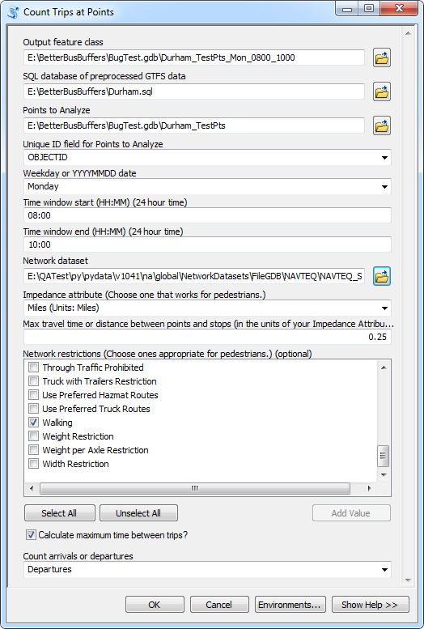

### Inputs
* **Output feature class**:  Choose a name and location for your output feature class, which will be a copy of your input points with extra fields for transit frequency.  A file geodatabase feature class is recommended instead of a shapefile.
* **SQL database of preprocessed GTFS data**: The SQL database you created in the Preprocess GTFS tool.
* **Points to Analyze**: A set of point features in your city you wish to analyze.  The tool calculates the frequency of transit service available to these points.
* **Unique ID field for Points to Analyze**: Field in your points layer that serves as a unique identifier.  The tool needs this in order to correctly keep track of the transit trips available to each point.
* **Weekday or YYYYMMDD date**:  Choose the day you wish to consider.  You can select a generic weekday, such as Tuesday, and all trips running on a typical Tuesday (as defined in your GTFS calendar.txt file) will be counted.  You cannot use a generic weekday if your GTFS data does not have a calendar.txt file.  Alternatively, you can enter a specific date in YYYYMMDD format, such as 20160212 for February 12, 2016.  All trips running on that specific date, as defined in your GTFS dataset's calendar.txt and calendar_dates.txt file, will be counted.  Specific dates are useful if you want to analyze a holiday, if your calendar.txt file has non-overlapping date ranges, or if your GTFS dataset does not have a calendar.txt file.
* **Time window start (HH:MM) (24-hour time)**:  The lower end of the time window you wish to analyze.  Must be in HH:MM format (24-hour time).  For example, 2am is 02:00, and 2pm is 14:00.
* **Time window end (HH:MM) (24-hour time)**:  The upper end of the time window you wish to analyze.  Must be in HH:MM format (24-hour time).  For example, 2am is 02:00, and 2pm is 14:00.  If you wish to analyze a time window spanning midnight, you can use times greater than 23:59.  For instance, a time window of 11pm to 1am should have a start time of 23:00 and an end time of 25:00.
* **Network dataset**: A network dataset of streets, sidewalks, etc., covering the area of your analysis. The network dataset should be suitable for modeling walking pedestrians.  You should *not* use a network dataset created with the Add GTFS to a Network Dataset toolset because BetterBusBuffers will handle the GTFS data separately.
* **Impedance attribute (Choose one that works for pedestrians.)**: The cost attribute from your network dataset which you will use to calculate the maximum distance or time your pedestrians can walk between the points you are analyzing and the nearby transit stops.  Unless you have a pedestrian travel time attribute in your network dataset, choose an impedance attribute with units of distance.
* **Max travel time or distance between points and stops (in the units of your impedance attribute)**: Choose the maximum time or distance your pedestrians can walk between the points you are analyzing and the transit stops.  This MUST be in the same units as the impedance attribute you select.  For example, if you want to limit pedestrian walk distance to a quarter of a mile, choose an impedance attribute in units of miles and enter "0.25."  If your network dataset has a pedestrian walk time attribute and you want to limit walk time to 10 minutes, select the pedestrian walk time impedance attribute and enter "10."
* **Network restrictions (Choose ones appropriate for pedestrians.) (optional)**: List of possible restrictions from your network dataset that you can choose to impose.  For example, checking the restriction "Avoid Toll Roads" prevents your pedestrians from walking on toll roads.   The available restrictions vary depending on your network dataset, and the list is dynamically loaded from the streets network you select.  Choose the restrictions that are the most sensible for pedestrians.
* **Count arrivals or departures**: Indicate whether you want to count the number of arrivals available during the time window or the number of departures.

### Outputs
* **[Output feature class]**:  This point feature class is simply a modified version of your input points, containing four new fields.  Please see "Understanding the Output" below for an explanation of the fields in this table.

### Understanding the output
This tool produces a points feature class containing the fields described below.  *Note: The field names are shortened for shapefile output.*
* **NumTrips**:  The total number of unique transit trips accessible within your buffer distance during the time window.  Trips from all accessible stops are counted.  For instance, if a particular point has 3 stops within one quarter mile, any trip visiting at least one of those stops during the time window is counted.  To avoid double-counting, if the same trip visits more than one of the stops accessible from that point, that trip is only counted once.
* **NumTripsPerHr**: The average number of unique transit trips per hour accessible within your buffer distance during the time window.  This number is calculated by dividing NumTrips by the length of the time window.
* **NumStopsInRange**: The number of transit stops accessible to the input point within your buffer distance.
* **MaxWaitTime**: The maximum time, in minutes, between consecutive transit trip arrivals or departures during your time window.  This is the maximum amount of time during which there are no transit trips available within your buffer distance.  If a point has multiple stops within the buffer distance, trips at all stops are considered.  Consequently, the MaxWaitTime should not be confused with the trip headway at a particular stop.  The MaxWaitTime measures the maximum time between trips that visit any accessible stop.
A MaxWaitTime of \<Null\> (or -1 for shapefile output) indicates that the MaxWaitTime could not be calculated for one of the following reasons:
  - There were fewer than two transit trips available within the time window.
  - The time between the start of the time window and the first trip or the last trip and the end of the time window was greater than the largest time between trips.

  When choosing symbology, make sure to check for values of \<Null\> or -1.

### Troubleshooting & potential pitfalls
* **The tool takes forever to run**: Under normal conditions, this tool should finish in under 10 minutes or so.  If everything is working correctly, the following conditions will cause the tool to run slower:
  - Very large time windows will take longer to process
  - Very large transit datasets will take longer to process.
  - A large number of input points will take longer to process.
  - The tool will run slower if you are writing to and from a network drive.
* **I got a warning message saying I had non-overlapping date ranges**: This is because of the way your GTFS data has constructed its calendar.txt file, or because your GTFS datasets (if you have multiple datasets) do not cover the same date ranges.  See the explanation of this problem in the [*Preprocess GTFS* section](#PreprocessGTFS).

Still having problems?  Search for answers and post questions in our [GeoNet group](https://community.esri.com/community/arcgis-for-public-transit).

## Running *Count Trips at Points Online*

### What this tool does
*Count Trips at Points Online* does the same thing as *[Count Trips at Points](#CountTripsAtPoints)*, but instead of using a network dataset to calculate the distance between your input points and nearby stops, it does this using the ArcGIS Online origin-destination cost matrix service.

ArcGIS Online's origin-destination cost matrix service is available for most parts of the world. If you are uncertain whether the service covers the geographic location served by your transit system, check the [ArcGIS Online Network Dataset Coverage map](http://www.arcgis.com/home/webmap/viewer.html?webmap=b7a893e8e1e04311bd925ea25cb8d7c7).

To use this tool, you must be [signed in to an ArcGIS Online account](http://desktop.arcgis.com/en/arcmap/latest/map/web-maps-and-services/signing-into-arcgis-online-in-arcgis-for-desktop.htm), or you must enter your ArcGIS Online username and password into the tool dialog.  Your ArcGIS Online account must have network service privileges and sufficient credits.  Talk to your organization's ArcGIS Online administrator if you need help checking or setting up your account.

This tool will calculate at maximum one route per origin-destination pair.  So, if you have 100 points of interest and 100 transit stops, the travel time or distance will be calculated between, at maximum, 100\*100=10000 origin-destination pairs.  However, the *Count Trips at Points Online* tool attempts to minimize the number of origin-destination calculations made by spatially chunking the problem, so the actual number of origin-destination pairs will probably be far less.

As of this writing, the "Origin Destination Cost Matrix" service costs 0.0005 credits per origin-destination pair.  If all 10000 origin-destination pairs from the example above were passed to the service, it would cost a total of 5 credits. Please refer to the [ArcGIS Online Service Credits Overview page](http://www.esri.com/software/arcgis/arcgisonline/credits) for more detailed and up-to-date information.

If you don't want to or can't use ArcGIS Online, use the *[Count Trips at Points](#CountTripsAtPoints)* tool instead.

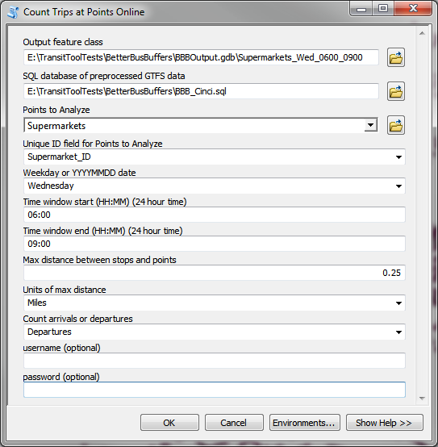

### Inputs
* **Output feature class**:  Choose a name and location for your output feature class, which will be a copy of your input points with extra fields for transit frequency.  A file geodatabase feature class is recommended.  Shapefiles are not allowed as output for this tool.
* **SQL database of preprocessed GTFS data**: The SQL database you created in the Preprocess GTFS tool.
* **Points to Analyze**: A set of point features in your city you wish to analyze.  The tool calculates the frequency of transit service available to these points.
* **Unique ID field for Points to Analyze**: Field in your points layer that serves as a unique identifier.  The tool needs this in order to correctly keep track of the transit trips available to each point.
* **Weekday or YYYYMMDD date**:  Choose the day you wish to consider.  You can select a generic weekday, such as Tuesday, and all trips running on a typical Tuesday (as defined in your GTFS calendar.txt file) will be counted.  You cannot use a generic weekday if your GTFS data does not have a calendar.txt file.  Alternatively, you can enter a specific date in YYYYMMDD format, such as 20160212 for February 12, 2016.  All trips running on that specific date, as defined in your GTFS dataset's calendar.txt and calendar_dates.txt file, will be counted.  Specific dates are useful if you want to analyze a holiday, if your calendar.txt file has non-overlapping date ranges, or if your GTFS dataset does not have a calendar.txt file.
* **Time window start (HH:MM) (24-hour time)**:  The lower end of the time window you wish to analyze.  Must be in HH:MM format (24-hour time).  For example, 2am is 02:00, and 2pm is 14:00.
* **Time window end (HH:MM) (24-hour time)**:  The upper end of the time window you wish to analyze.  Must be in HH:MM format (24-hour time).  For example, 2am is 02:00, and 2pm is 14:00.  If you wish to analyze a time window spanning midnight, you can use times greater than 23:59.  For instance, a time window of 11pm to 1am should have a start time of 23:00 and an end time of 25:00.
* **Max distance between stops and points**: Choose the distance your pedestrians can walk between the points you are analyzing and the transit stops.
* **Units of max distance**: Select the units of measurement (such as Kilometers or Miles) of the *Max distance between stops and points* parameter.
* **Count arrivals or departures**: Indicate whether you want to count the number of arrivals available during the time window or the number of departures.
* **username** and **password**: Your ArcGIS Online username and password.  If you are logged into ArcGIS Online through ArcMap or ArcGIS Pro, you do not need to enter your username and password.  Enter your username and password if you are not logged in or if you are running this tool through a standalone python script in ArcMap (ArcGIS Pro will be able to use the logged in account even from standalone python).

### Outputs
* **[Output feature class]**:  This point feature class is simply a modified version of your input points, containing four new fields.  Please see "Understanding the Output" below for an explanation of the fields in this table.

### Understanding the output
Please see the "Understanding the Output" section for the *[Count Trips at Points](#CountTripsAtPoints)* tool.  The output fields are the same.

### Troubleshooting & potential pitfalls
* **I got an error about not being able to connect to ArcGIS Online**: Make sure you are signed into your ArcGIS Online account through ArcMap or ArcGIS Pro or that you pass a valid ArcGIS Online username and password to the tool.  Your ArcGIS Online account must have network service privileges and sufficient credits.  Talk to your organization's ArcGIS Online administrator if you need help checking or setting up your account.
* **The tool takes forever to run**: This tool may take a significant amount of time to run for a large number of points.  The origin-destination cost matrix service limits the number of origins and destinations that may be used, so for large datasets, the input points and transit stops will be broken into chunks and passed as multiple calls to the service.  The tool will print regular progress reports.
* **I got a warning message saying I had non-overlapping date ranges**: This is because of the way your GTFS data has constructed its calendar.txt file, or because your GTFS datasets (if you have multiple datasets) do not cover the same date ranges.  See the explanation of this problem in the [*Preprocess GTFS* section](#PreprocessGTFS).

Still having problems?  Search for answers and post questions in our [GeoNet group](https://community.esri.com/community/arcgis-for-public-transit).

## Running *Count Trips at Stops*

### What this tool does
The *Count Trips at Stops* tool counts the number of transit trips that visit the stops in your network during a time window.  The output is a feature class of your GTFS stops with fields indicating the number of transit trips that visit those stops.  You can use the symbology settings of the resulting feature class to highlight the frequency of service for stops in your network.

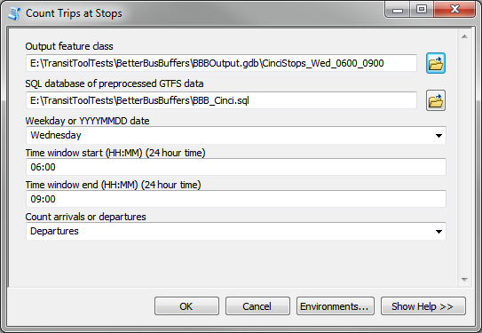

### Inputs
* **Output feature class**:  Choose a name and location for your output feature class, which will show information from your GTFS stops.txt file with extra fields for transit frequency.  A file geodatabase feature class is recommended instead of a shapefile.
* **SQL database of preprocessed GTFS data**: The SQL database you created in the *Preprocess GTFS* tool.
* **Weekday or YYYYMMDD date**:  Choose the day you wish to consider.  You can select a generic weekday, such as Tuesday, and all trips running on a typical Tuesday (as defined in your GTFS calendar.txt file) will be counted.  You cannot use a generic weekday if your GTFS data does not have a calendar.txt file.  Alternatively, you can enter a specific date in YYYYMMDD format, such as 20160212 for February 12, 2016.  All trips running on that specific date, as defined in your GTFS dataset's calendar.txt and calendar_dates.txt file, will be counted.  Specific dates are useful if you want to analyze a holiday, if your calendar.txt file has non-overlapping date ranges, or if your GTFS dataset does not have a calendar.txt file.
* **Time window start (HH:MM) (24-hour time)**:  The lower end of the time window you wish to analyze.  Must be in HH:MM format (24-hour time).  For example, 2am is 02:00, and 2pm is 14:00.
* **Time window end (HH:MM) (24-hour time)**:  The upper end of the time window you wish to analyze.  Must be in HH:MM format (24-hour time).  For example, 2am is 02:00, and 2pm is 14:00.  If you wish to analyze a time window spanning midnight, you can use times greater than 23:59.  For instance, a time window of 11pm to 1am should have a start time of 23:00 and an end time of 25:00.
* **Count arrivals or departures**: Indicate whether you want to count the number of arrivals at the stop during the time window or the number of departures from the stop.

### Outputs
* **[Output feature class]**:  This point feature class shows your GTFS stops.  The attributes table contains information from the stops.txt file and fields indicating the transit frequency at each stop.  Please see "Understanding the Output" below for an explanation of the fields in this table.

### Understanding the output
This tool produces a points feature class containing the fields described below.  *Note: The field names are shortened for shapefile output.*
* **stop_id**:  The unique stop_id from the GTFS stops.txt file.  The original stop_id now has the GTFS folder name prepended to it, in order to prevent problems when combining multiple GTFS datasets in the same analysis.
* **stop_code, stop_name, stop_desc, zone_id, stop_url, location_type, parent_station**:  Fields from the GTFS stops.txt file.  For an explanation of these fields, please review the [GTFS reference guide](https://github.com/google/transit/blob/master/gtfs/spec/en/reference.md#stopstxt).
* **NumTrips**:  The total number of transit trips that visit this stop during the time window.
* **NumTripsPerHr**: The average number of transit trips that visit this stop per hour during the time window.  This number is calculated by dividing NumTrips by the length of the time window.
* **MaxWaitTime**: The maximum time, in minutes, between consecutive transit trip arrivals or departures during your time window.  This is the maximum amount of time during which no trips visit this stop.
A MaxWaitTime of \<Null\> (or -1 for shapefile output) indicates that the MaxWaitTime could not be calculated for one of the following reasons:
  - There were fewer than two transit trips available within the time window.
  - The time between the start of the time window and the first trip or the last trip and the end of the time window was greater than the largest time between trips.

  When choosing symbology, make sure to check for values of \<Null\> or -1.

### Troubleshooting & potential pitfalls
* **The tool takes forever to run**: Under normal conditions, this tool should finish very quickly.  If everything is working correctly, the following conditions will cause the tool to run slower:
  - Very large time windows will take longer to process
  - Very large transit datasets will take longer to process.
  - The tool will run slower if you are writing to and from a network drive.
* **I got a warning message saying I had non-overlapping date ranges**: This is because of the way your GTFS data has constructed its calendar.txt file, or because your GTFS datasets (if you have multiple datasets) do not cover the same date ranges.  See the explanation of this problem in the [*Preprocess GTFS* section](#PreprocessGTFS).

Still having problems?  Search for answers and post questions in our [GeoNet group](https://community.esri.com/community/arcgis-for-public-transit).

## Running *Count Trips at Stops by Route and Direction*

### What this tool does
The *Count Trips at Stops by Route and Direction* tool counts the number of transit trips that visit the stops in your transit system during a time window.  In contrast to *Count Trips at Stops*, this tool does not combine trips from different routes or directions of travel. Instead, if a stop is used by multiple routes and/or directions, the stop will be duplicated in the output.

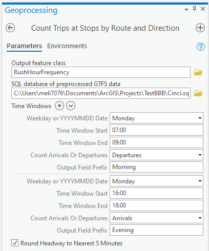

### Inputs
* **Output feature class**:  Choose a name and location for your output feature class.  It must be a feature class in a geodatabase and not a shapefile.
* **SQL database of preprocessed GTFS data**: The SQL database you created in the *Preprocess GTFS* tool.
* **Time Windows**: A value table (a list of lists) defining the time windows for which you want to calculate transit frequencies.  Each time window input includes:
  * **Weekday or YYYYMMDD date**:  Choose the day you wish to consider.  You can select a generic weekday, such as Tuesday, and all trips running on a typical Tuesday (as defined in your GTFS calendar.txt file) will be counted.  You cannot use a generic weekday if your GTFS data does not have a calendar.txt file.  Alternatively, you can enter a specific date in YYYYMMDD format, such as 20160212 for February 12, 2016.  All trips running on that specific date, as defined in your GTFS dataset's calendar.txt and calendar_dates.txt file, will be counted.  Specific dates are useful if you want to analyze a holiday, if your calendar.txt file has non-overlapping date ranges, or if your GTFS dataset does not have a calendar.txt file.
  * **Time Window Start**:  The lower end of the time window you wish to analyze.  Must be in HH:MM format (24-hour time).  For example, 2am is 02:00, and 2pm is 14:00.
  * **Time Window End**:  The upper end of the time window you wish to analyze.  Must be in HH:MM format (24-hour time).  For example, 2am is 02:00, and 2pm is 14:00.  If you wish to analyze a time window spanning midnight, you can use times greater than 23:59.  For instance, a time window of 11pm to 1am should have a start time of 23:00 and an end time of 25:00.
  * **Count Arrivals or Departures**: Indicate whether you want to count the number of arrivals at the stop during the time window or the number of departures from the stop.
  * **Output Field Prefix**: The field name prefix to use for this time window in the output table.
* **Round Headway to Nearest 5 Minutes**: Whether or not to round the calculated average headway values to the nearest 5 minutes (True) or leave them as is (False)

### Outputs
* **[Output feature class]**:  This point feature class shows your GTFS stops with some stops duplicated if they are used by multiple routes and directions of travel within the specified time windows.  The attributes table contains information from the stops.txt file and fields indicating the transit frequency at each stop for each time window.  Please see "Understanding the Output" below for an explanation of the fields in this table.

### Understanding the output
This tool produces a points feature class containing the fields described below.
* **stop_id**:  The unique stop_id from the GTFS stops.txt file.  The original stop_id now has the GTFS folder name prepended to it, in order to prevent problems when combining multiple GTFS datasets in the same analysis.
* **stop_code, stop_name, stop_desc, zone_id, stop_url, location_type, parent_station**:  Fields from the GTFS stops.txt file.  For an explanation of these fields, please review the [GTFS reference guide](https://github.com/google/transit/blob/master/gtfs/spec/en/reference.md#stopstxt).
* **route_id**: The GTFS route_id with which this table row is associated. This field will be \<Null\> if no routes visited the stop_id during any of the designated time windows.
* **direction_id**: The GTFS direction_id with which this table row is associated. This field will be \<Null\> if no routes visited the stop_id during any of the designated time windows.
* **[Output Field Prefix]_NumTrips**:  The total number of transit trips that visit this stop during the time window designated by the prefix.
* **[Output Field Prefix]_NumTripsPerHr**: The average number of transit trips that visit this stop per hour during the time window designated by the prefix.  This number is calculated by dividing NumTrips by the length of the time window.
* **[Output Field Prefix]_MaxWaitTime**: The maximum time, in minutes, between consecutive transit trip arrivals or departures during the time window designated by the prefix.  This is the maximum amount of time during which no trips visit this stop.
A MaxWaitTime of \<Null\> indicates that the MaxWaitTime could not be calculated for one of the following reasons:
  - There were fewer than two transit trips available within the time window.
  - The time between the start of the time window and the first trip or the last trip and the end of the time window was greater than the largest time between trips.

  When choosing symbology, make sure to check for values of \<Null\>.
* **[Output Field Prefix]_AvgHeadway**: The average headway, in minutes, between trips during the time window designated by the prefix. This field will be \<Null\> if the average headway could not be calculated, typically for the same reason that the MaxWaitTime field cannot be calculated.

The stop_id values in the output are not unique.  The combination of stop_id, route_id, and direction_id should be unique.

### Troubleshooting & potential pitfalls
* **I got a warning message saying I had non-overlapping date ranges**: This is because of the way your GTFS data has constructed its calendar.txt file, or because your GTFS datasets (if you have multiple datasets) do not cover the same date ranges.  See the explanation of this problem in the [*Preprocess GTFS* section](#PreprocessGTFS).

Still having problems?  Search for answers and post questions in our [GeoNet group](https://community.esri.com/community/arcgis-for-public-transit).

## Running *Count High Frequency Routes at Stops*

### What this tool does
The *Count High Frequency Routes at Stops* tool counts the number of routes at each stop that meet a desired headway threshold. The output is a feature class of your GTFS stops with fields indicating trip and headway statistics along with a count of the number of routes at the stop that have headways of a desired threshold or shorter.

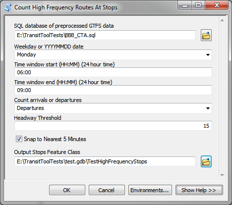

### Inputs

* **Output feature class**:  Choose a name and location for your output feature class, which will show information from your GTFS stops.txt file with extra fields for transit frequency.  A file geodatabase feature class is recommended instead of a shapefile.
* **SQL database of preprocessed GTFS data**: The SQL database you created in the *Preprocess GTFS* tool.
* **Weekday or YYYYMMDD date**:  Choose the day you wish to consider.  You can select a generic weekday, such as Tuesday, and all trips running on a typical Tuesday (as defined in your GTFS calendar.txt file) will be counted.  You cannot use a generic weekday if your GTFS data does not have a calendar.txt file.  Alternatively, you can enter a specific date in YYYYMMDD format, such as 20160212 for February 12, 2016.  All trips running on that specific date, as defined in your GTFS dataset's calendar.txt and calendar_dates.txt file, will be counted.  Specific dates are useful if you want to analyze a holiday, if your calendar.txt file has non-overlapping date ranges, or if your GTFS dataset does not have a calendar.txt file.
* **Time window start (HH:MM) (24-hour time)**:  The lower end of the time window you wish to analyze.  Must be in HH:MM format (24-hour time).  For example, 2am is 02:00, and 2pm is 14:00.
* **Time window end (HH:MM) (24-hour time)**:  The upper end of the time window you wish to analyze.  Must be in HH:MM format (24-hour time).  For example, 2am is 02:00, and 2pm is 14:00.  If you wish to analyze a time window spanning midnight, you can use times greater than 23:59.  For instance, a time window of 11pm to 1am should have a start time of 23:00 and an end time of 25:00.
* **Count arrivals or departures**: Indicate whether you want to count the number of arrivals at the stop during the time window or the number of departures from the stop.
* **Headway Threshold**: This is a headway threshold in minutes.  For each stop, the tool determines the number of routes visiting that stop that have an average time between buses that is less than or equal to this threshold. For example, if a stop is served by two routes with 10-minute headways and one route with a 30-minute headway, and the Headway Threshold is set to 15 minutes, the MtHdWyLim field will be set to 2 for that stop.  The two 10-minute headway routes count, but the 30-minute headway route does not. 
* **Snap to Nearest 5 Minutes**: Calculated headways will be snapped to the closest 5 minute interval. Sometimes GTFS calculated average headways can be headways such as 11 or 12 minutes rather than the expected 10 due to rounding or other scheduling artifacts. If this is checked, headways will be rounded to the nearest 5 minutes. For example, 11 minutes would become 10, 13 minutes would become 15. 

### Outputs
* **[Output feature class]**:  This point feature class shows your GTFS stops.  The attributes table contains information from the stops.txt file and fields indicating the transit frequency at each stop.  Please see "Understanding the Output" below for an explanation of the fields in this table.

### Understanding the output
This tool produces a points feature class containing the fields described below.  Note: The field names are shortened for shapefile output.
* **stop_id**:  The unique stop_id from the GTFS stops.txt file.  The original stop_id now has the GTFS folder name prepended to it, in order to prevent problems when combining multiple GTFS datasets in the same analysis.
* **stop_code, stop_name, stop_desc, zone_id, stop_url, location_type, parent_station**:  Fields from the GTFS stops.txt file.  For an explanation of these fields, please review the [GTFS reference guide](https://github.com/google/transit/blob/master/gtfs/spec/en/reference.md#stopstxt).
* **NumTrips**:  The total number of transit trips that visit this stop during the time window.
* **NumTripsPerHr**: The average number of transit trips that visit this stop per hour during the time window.  This number is calculated by dividing NumTrips by the length of the time window.
* **MaxWaitTime**: The maximum time, in minutes, between consecutive transit trip arrivals or departures during your time window.  This is the maximum amount of time during which no trips visit this stop.
A MaxWaitTime of \<Null\> (or -1 for shapefile output) indicates that the MaxWaitTime could not be calculated for one of the following reasons:
  - There were fewer than two transit trips available within the time window.
  - The time between the start of the time window and the first trip or the last trip and the end of the time window was greater than the largest time between trips.
* **rte_count**: This is simply the number of distinct routes that visit each stop. 
* **AvgHeadway**: This is a summary statistic of the headways for all routes that visit a particular stop. This returns the mean of all routes that visit a particular stop. It is an average of the calculated average headway for each route.  
* **MinHeadway**: This is a summary statistic of the headways for all routes that visit a particular stop. This returns the headway of the route with the shortest time between buses. 
* **MaxHeadway**: This is a summary statistic of the headways for all routes that visit a particular stop. This returns the headway of the route with the longest time between buses. 
* **MetHdWyLim**: This is the field that indicates how many routes that visit a particualr stop meet the specified headway threshold.

### Troubleshooting & potential pitfalls
* **The tool takes forever to run**: Under normal conditions, this tool should finish very quickly.  If everything is working correctly, the following conditions will cause the tool to run slower:
  - Very large time windows will take longer to process
  - Very large transit datasets will take longer to process.
  - This tool generally takes longer than the *Count Trips at Stops* tool. If you do not need headway statistics, use *Count Trips at Stops*.
  - The tool will run slower if you are writing to and from a network drive.
* This tool requires the python pandas package to be installed.  Pandas is included with the python installation for ArcGIS 10.4 and above and ArcGIS Pro.  It is not recommended to manually install pandas for older versions of ArcGIS because it will require an upgrade of the numpy package, which in turn could cause problems for tools and other dependencies within ArcGIS. 
* **I got a warning message saying I had non-overlapping date ranges**: This is because of the way your GTFS data has constructed its calendar.txt file, or because your GTFS datasets (if you have multiple datasets) do not cover the same date ranges.  See the explanation of this problem in the [*Preprocess GTFS* section](#PreprocessGTFS).

Still having problems?  Search for answers and post questions in our [GeoNet group](https://community.esri.com/community/arcgis-for-public-transit).

## Questions or problems?
Search for answers and post questions in our [GeoNet group](https://community.esri.com/community/arcgis-for-public-transit).