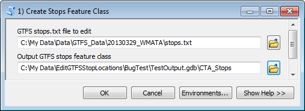

# Edit GTFS Stop Locations User's Guide

Created by Melinda Morang, Esri  

Copyright 2018 Esri  
Licensed under the Apache License, Version 2.0 (the "License"); you may not use this file except in compliance with the License.  You may obtain a copy of the License at <http://www.apache.org/licenses/LICENSE-2.0>.  Unless required by applicable law or agreed to in writing, software distributed under the License is distributed on an "AS IS" BASIS, WITHOUT WARRANTIES OR CONDITIONS OF ANY KIND, either express or implied.  See the License for the specific language governing permissions and limitations under the License.

## What this tool does
The Edit GTFS Stop Locations toolbox allows you to edit your GTFS stop locations in ArcMap.  It creates a feature class from your current GTFS stops.txt file so you can edit the stop locations and/or attributes using the ArcMap editing tools.  When you have finished editing your stops, the tool will generate a new GTFS stops.txt file that incorporates your changes.

## Software requirements
- ArcMap 10.1 or higher with a Desktop Basic (ArcView) license, or ArcGIS Pro.

## Data requirements
- To run this tool, all you need is a GTFS stops.txt file.

## Getting started
- Download the tool and save it anywhere on your computer.
- Unzip the file you downloaded.  The unzipped package contains a .tbx toolbox file, a folder of python scripts needed to run the toolbox, and a copy of this user's guide.
- No installation is necessary.  You can run the tool from ArcCatalog, ArcMap, or ArcGIS Pro.  In any of those products, just navigate to the folder containing the .tbx file, and it should show up as a toolbox with tools you can run.  You can also add the tool to ArcToolbox to make it easier to find later.
- *Warning: If you wish to move the toolbox to a different location on your computer, make sure you move the entire package (the .tbx file, the scripts folder, and the user's guide) together so that the toolbox does not become disconnected from the scripts.*

## Workflow
This tool has three steps:  

1. Run the tool called '1) Create Stops Feature Class' to create a feature class of your current GTFS stops.txt file.
2. Make whatever edits you need to make to your stop locations and/or attributes using the editing tools in ArcMap or ArcGIS Pro.
3. Run the tool called '2) Write New stops.txt File' to generate a new stops.txt file that incorporates your edits.

## Running *1) Create Stops Feature Class*

### Inputs
- **GTFS stops.txt file to edit**:  The stops.txt file you wish to edit
- **Output GTFS stops feature class**:  The feature class version of your GTFS stops that will be created. *Note: a file geodatabase feature class is recommended over a shapefile because shapefiles will truncate the longer field names to 10 characters.*

### Outputs
- **[Your designated output feature class]**: This feature class will be an exact copy of your stops.txt file and will display the stop locations on the map.

## Editing your stops in ArcMap or ArcGIS Pro
You can use the ArcMap or ArcGIS Pro editing tools to edit your stop locations and/or attributes.  Your workflow will be something like this:

### ArcMap

1. Start an editing session
2. Add basemaps or street data to your map so you can see where the stops currently fall and where they should be.
3. Use the Edit Tool to select and move stops to the desired locations.
4. Open the Attribute Table for your stops to edit fields.  You do NOT need to edit the stop_lat and stop_lon fields.  These will be updated automatically when you run '2) Write New stops.txt File'.  If you want to add a new field, you will have to stop editing first, add the field, and then start editing again to calculate the field values.
5. Save your edits
6. Stop the editing session

For detailed information on editing in ArcMap, read about editing in the [ArcMap Help](http://desktop.arcgis.com/en/arcmap/latest/manage-data/editing/what-is-editing-.htm).

### ArcGIS Pro

1. Click the Edit tab and use the tools on this tab to modify your stops feature class.
2. Edit the attributes of your feature class if desired.  Do not edit the stop_lat and stop_lon fields.
3. Click the Save Edits button.

For detailed information on editing in ArcGIS Pro, read about editing in the [ArcGIS Pro Help](http://pro.arcgis.com/en/pro-app/help/editing/overview-of-desktop-editing.htm).

## Running *2) Write New stops.txt File*

### Inputs
- **Stops feature class**:  The feature class you created in Step 1 and edited
- **Output GTFS stops.txt file**:  The updated GTFS stops.txt file you want to produce

### Outputs
- **[Your designated output stops.txt file]**: The new stops.txt file that incorporates the edits you made to the stop locations and attributes.  The stop_lon and stop_lat fields will be automatically updated with the new stop locations. *Note: If you used a shapefile for your stops feature class and you had field names longer than 10 characters that aren't part of the standard GTFS specification, these field names will be truncated to 10 characters in the resulting stops.txt file, and you will have to manually correct them.*

## Questions or problems?
Search for answers and post questions in our [GeoNet group](https://community.esri.com/community/arcgis-for-public-transit).