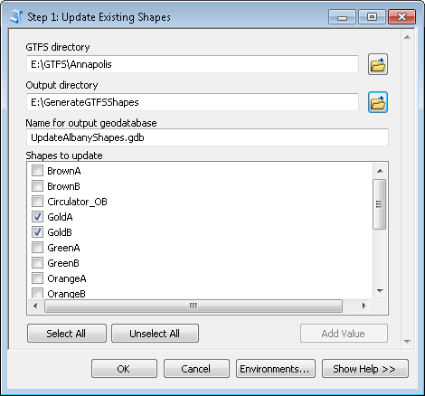
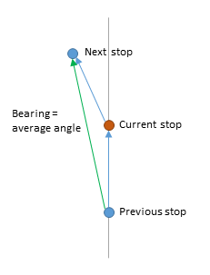
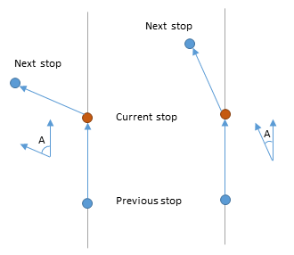

# Generate GTFS Shapes User's Guide

Created by Melinda Morang, Esri  

Copyright 2019 Esri  
Licensed under the Apache License, Version 2.0 (the "License"); you may not use this file except in compliance with the License.  You may obtain a copy of the License at <http://www.apache.org/licenses/LICENSE-2.0>.  Unless required by applicable law or agreed to in writing, software distributed under the License is distributed on an "AS IS" BASIS, WITHOUT WARRANTIES OR CONDITIONS OF ANY KIND, either express or implied.  See the License for the specific language governing permissions and limitations under the License.

## What this tool does
The optional GTFS shapes.txt file contains the actual on-street paths taken by transit vehicles in your system.  A good shapes.txt file is important in order for GTFS-based routing apps to display transit routes correctly on the map.  Read more about the shapes.txt file in the [GTFS reference doc](https://github.com/google/transit/blob/master/gtfs/spec/en/reference.md).

The Generate GTFS Shapes toolbox produces a new shapes.txt file for your GTFS dataset or allows you to edit an existing one.  The toolbox is targeted primarily toward transit agencies seeking to improve their GTFS datasets.

To create an entirely new shapes.txt file from scratch, you give the tool a valid, existing GTFS dataset, and the tool creates a new shape.txt file and updates the shape_id field in trips.txt and the shape_dist_traveled field in stop_times.txt.  Step 1 of the tool creates a feature class with good estimates for the on-street paths used in your transit system.  You can edit this feature class using your own knowledge in order to ensure that the correct paths are truly represented.  Then, you can use Step 2 of the tool to update your GTFS files to include this shape information.

To edit one or more existing shapes, you give the tool a valid, existing GTFS dataset with a shapes.txt file and choose the shape(s) you want to edit.  The chosen shapes will be drawn in the map, where you can edit them.  Then, you can use Step 2 of the tool to update your shapes.txt file and the relevant shape_dist_traveled field entries in stop_times.txt.

The tools will not overwrite any existing GTFS files.  You can choose the output location for the new files, and you can compare them with the old ones before manually replacing the old ones with the updated ones.

## Software requirements
* ArcGIS 10.3 or higher with a Desktop Basic (ArcView) license, or ArcGIS Pro 1.2 or higher. Results with the Network Analyst version of Step 1 will be best with ArcMap or with ArcGIS Pro 2.0 or higher.
* If you want to generate on-street route shapes (as opposed to straight lines connecting stops), you will need either a Network Analyst extension and a network dataset or an ArcGIS Online account with routing privileges and sufficient credits for your analysis.

## Data requirements
- A valid GTFS dataset.
- If you want to generate on-street route shapes (as opposed to straight lines connecting stops), you will need either a Network Analyst extension and a network dataset or an ArcGIS Online account with routing privileges and sufficient credits for your analysis.

## Getting started
- Download the tool and save it anywhere on your computer.
- Unzip the file you downloaded.  The unzipped package contains a .tbx toolbox file, a folder of python scripts needed to run the toolbox, and a copy of this user's guide.
- No installation is necessary.  You can run the tools from ArcCatalog, ArcMap, or ArcGIS Pro.  In any of those products, just navigate to the folder containing the .tbx file, and it should show up as a toolbox with tools you can run.  You can also add the tool to ArcToolbox to make it easier to find later.
- *Warning: If you wish to move the toolbox to a different location on your computer, make sure you move the entire package (the .tbx file, the scripts folder, and the user's guide) together so that the toolbox does not become disconnected from the scripts.*

## Workflow
This tool has four steps:  

1. Create a reasonable estimate of your transit shapes by running one of the following tools:
    - [*Step 1: Generate Shapes with Network Analyst*](#GenerateShapesNA)
    - [*Step 1: Generate Shapes with ArcGIS Online*](#GenerateShapesAGOL)
    - [*Step 1: Generate Shapes with Straight Lines*](#GenerateShapesStraight)
 
  OR choose one or more existing shapes from your existing shapes.txt file to draw in the map using the [*Step 1: Update Existing Shapes*](#UpdateExisting) tool.

2. [Make whatever edits you need to make](#Edits) to your transit shape feature class using the editing tools in ArcMap or ArcGIS Pro.
3. Run the tool called [*Step 2: Generate new GTFS text files*](#GenerateNewGTFSTextFiles) to generate a shapes.txt file and add the appropriate  shape-related fields to your trips.txt and stop_times.txt files.
4. Review the output, and, if satisfied, replace your existing GTFS files with the new ones.

## How to get the best results
This tool has many options, and the behavior differs slightly depending on the version of ArcGIS you're using.  Here is my recommendation for getting the best estimated routes, in order of preference.

1. Use the [ArcGIS Online version of Step 1](#GenerateShapesAGOL) either in ArcMap 10.3 or higher or ArcGIS Pro.  The ArcGIS Online routing service uses high-quality network data, and the tool configures the analysis settings optimally for this application.

2. If you don't have access to the ArcGIS Online routing services, use ArcMap 10.3 or higher or ArcGIS Pro 2.0 or higher to run the [Network Analyst version of Step 1](#GenerateShapesNA).  Make sure to use a high quality network dataset, such as [Streetmap Premium](http://www.esri.com/data/streetmap), and choose good network restrictions and other settings.

3. If you can't do either of the above, or you don't have a high quality network dataset, you might be better off using the [Straight Line version of Step 1](#GenerateShapesStraight) and manually editing all the shapes to match the streets.  The Network Analyst version will not work well if you have poor quality network data, and the results will be significantly worse if you're using an ArcMap version prior to 10.3 or an ArcGIS Pro version prior to 2.0 because new functionality that became available in those versions is used to improve the estimated results.

Having good quality GTFS data is also important in obtaining good results.  You should make sure your GTFS stops are in the correct locations.  If you have used the above guidelines and still continue to have widespread problems, you should consider editing your GTFS stop locations to place them closer to the correct positions on the streets. The [Edit GTFS Stop Locations](http://www.arcgis.com/home/item.html?id=1f4cb2aac0e7499db98f46cd83beb2bd) tool can help you generate a corrected GTFS stops.txt file for your dataset.

Note: the above recommendations apply primarily if you are trying to generate shapes for bus routes.  The [Straight Line version of Step 1](#GenerateShapesStraight) will be most valuable for estimating shapes for transit modes that do not use the streets, such as subways.

## Running *Step 1: Generate Shapes with Network Analyst*

*Step 1: Generate Shapes with Network Analyst* uses your GTFS schedule information and the Network Analyst Route solver to produce a feature class showing the most probable geographic paths taken by transit vehicles in your system.

This step will take some time to run for large transit systems.  Smaller transit systems should only take a few minutes.

To run this tool, you must have a good network dataset of streets that covers the area served by your transit agency.  If you do not have the Network Analyst extension and an adequate network dataset, you can generate shapes that follow the streets by using the [*Step 1: Generate Shapes with ArcGIS Online*](#GenerateShapesAGOL) tool, or you can generate simple straight-line estimates for your route shapes with the [*Step 1: Generate Shapes with Straight Lines*](#GenerateShapesStraight) version of this tool.

This tool will produce significantly better results in ArcMap version 10.3 or higher or ArcGIS Pro 2.0 or higher.

### Inputs
* **GTFS directory**:  The folder containing your (unzipped) GTFS .txt files.
* **Output directory**: The folder where your output geodatabase will be written.
* **Name for output geodatabase**: The name of your output geodatabase, which will be created when the tool runs.  The geodatabase must not currently exist.
* **Generate shapes that follow the streets for these route types (optional)**: This tool creates a best guess for the geographic routes traveled by transit vehicles in your system.  However, some modes of transit, like subways, do not travel on the street network since they have their own underground tracks.  In this box, you should select which modes of transit should use the street network to generate shapes.
* **Generate shapes by connecting stops with straight lines for these route types (optional)**: For modes that don't travel along streets, you can choose to create shapes by drawing straight lines between connected transit stops.
* **Network dataset**: An ArcGIS network dataset that covers the area served by your transit system. The network dataset does NOT need to contain transit information.
* **Impedance (cost) attribute**: The network dataset cost attribute that will be used to compute the likely routes of transit vehicles through your system.  In general, you should choose an attribute that makes sense for buses.
* **Which side of the road do your transit vehicles drive on?**: This determines which side of the vehicle stops should fall on.
* **Where are U-turns at junctions allowed?**: Choose U-turn settings that make sense for your transit system.
* **Network restrictions (optional)**: Choose any restrictions from your network dataset that make sense for your transit vehicles.
* **Bearing tolerance (degrees)**: Use this parameter to fine-tune the tool output.  See the [Fine-tuning results with the Bearing parameters](#Bearing) section for more information.  This option is currently unavailable in versions of ArcMap prior to 10.3 and versions of ArcGIS Pro prior to 2.0.
* **Maximum angle difference for bearing calculation (degrees)**: Use this parameter to fine-tune the tool output.  See the [Fine-tuning results with the Bearing parameters](#Bearing) section for more information.  This option is currently unavailable in versions of ArcMap prior to 10.3 and versions of ArcGIS Pro prior to 2.0.

### Outputs
A file geodatabase with the name and location you specified will be created and will contain the following files:
* **Shapes**: A lines feature class with your route shapes. You can edit these shapes before you use them to create a shapes.txt file.
* **Stops_wShapeIDs**: A feature class of your GTFS stops, including the shape_id field so you can match them up with the shape they go to.  In cases where the same GTFS stop gets visited by multiple shapes, the Stops_wShapeIDs feature class will contain multiple copies of that stop, one for each shape it is associated with.
* **SQLDbase.sql**: A SQL database of your GTFS data.  You shouldn't need to look at this for anything, but don't delete it because it is necessary for running Step 2.

## Running *Step 1: Generate Shapes with ArcGIS Online*

*Step 1: Generate Shapes with ArcGIS Online* uses your GTFS schedule information and the ArcGIS Online route service to produce a feature class showing the most probable geographic paths taken by transit vehicles in your system.

This version of Step 1 requires ArcGIS 10.3 or higher or ArcGIS Pro.

ArcGIS Online's route service is available for most parts of the world. If you are uncertain whether the route service covers the geographic location served by your transit system, check the [ArcGIS Online Network Dataset Coverage map](http://www.arcgis.com/home/webmap/viewer.html?webmap=b7a893e8e1e04311bd925ea25cb8d7c7).

To use this tool, you must be [signed in to an ArcGIS Online account](http://desktop.arcgis.com/en/arcmap/latest/map/web-maps-and-services/signing-into-arcgis-online-in-arcgis-for-desktop.htm) with routing privileges and sufficient credits.  Talk to your organization's ArcGIS Online administrator if you need help checking or setting up your account.  This tool will generate one ArcGIS Online route per shape in your GTFS data.  So, if your transit system has 100 unique shapes, the tool will solve 100 routes using ArcGIS Online.  As of this writing, "Simple Routes" cost 0.005 credits each, so the total number of credits incurred by the tool would be 0.5. Please refer to the [ArcGIS Online Service Credits Overview page](http://www.esri.com/software/arcgis/arcgisonline/credits) for more detailed and up-to-date information.  The number of shapes to be generated will be at minimum equal to the number of unique route_id values in your routes.txt file.  Most datasets have more shapes than routes because routes can include trips with different sequences of stops.

Note: If your transit lines have a large number of stops, it may not be possible to generate an on-street route shape using ArcGIS Online because the ArcGIS Online route service limits the total number of stops allowed per route (150 as of this writing - check the [route service documentation](http://resources.arcgis.com/en/help/arcgis-rest-api/#/Route_service_with_synchronous_execution/02r300000036000000/) for the latest information).  Shapes that exceed the stop limit will be estimated by connecting the stops with straight lines, and the tool will show a warning telling you which shape_id values have encountered this problem.

This tool will take some time to run for large transit systems.  Smaller transit systems should only take a few minutes.

Note: If you don't or can't use ArcGIS Online, you can instead generate shapes that follow the streets by using the [*Step 1: Generate Shapes with Network Analyst*](#GenerateShapesNA) tool, or you can generate simple straight-line estimates for your route shapes with the [*Step 1: Generate Shapes with Straight Lines*](#GenerateShapesStraight) version of this tool.

### Inputs
* **GTFS directory**:  The folder containing your (unzipped) GTFS .txt files.
* **Output directory**: The folder where your output geodatabase will be written.
* **Name for output geodatabase**: The name of your output geodatabase, which will be created when the tool runs.  The geodatabase must not currently exist.
* **Generate shapes that follow the streets for these route types (optional)**: This tool creates a best guess for the geographic routes traveled by transit vehicles in your system.  However, some modes of transit, like subways, do not travel on the street network since they have their own underground tracks.  In this box, you should select which modes of transit should use the street network to generate shapes.
* **Generate shapes by connecting stops with straight lines for these route types (optional)**: For modes that don't travel along streets, you can choose to create shapes by drawing straight lines between connected transit stops.
* **Which side of the road do your transit vehicles drive on?**: This determines which side of the vehicle stops should fall on.
* **Bearing tolerance (degrees)**: Use this parameter to fine-tune the tool output.  See the [Fine-tuning results with the Bearing parameters](#Bearing) section for more information.
* **Maximum angle difference for bearing calculation (degrees)**: Use this parameter to fine-tune the tool output.  See the [Fine-tuning results with the Bearing parameters](#Bearing) section for more information.

### Outputs
A file geodatabase with the name and location you specified will be created and will contain the following files:
* **Shapes**: A lines feature class with your route shapes. You can edit these shapes before you use them to create a shapes.txt file.
* **Stops_wShapeIDs**: A feature class of your GTFS stops, including the shape_id field so you can match them up with the shape they go to.  In cases where the same GTFS stop gets visited by multiple shapes, the Stops_wShapeIDs feature class will contain multiple copies of that stop, one for each shape it is associated with.
* **SQLDbase.sql**: A SQL database of your GTFS data.  You shouldn't need to look at this for anything, but don't delete it because it is necessary for running Step 2.

## Running *Step 1: Generate Shapes with Straight Lines*

This version of Step 1 does not use a street network to estimate your route shapes.  It generates shapes by drawing a straight line between connected stops instead of tracing the pattern of the streets.  You should only use this version of Step 1 if you do not have the Network Analyst extension or the ability to use ArcGIS Online, or wish to simply generate straight-line estimates for your route shapes.

### Inputs
* **GTFS directory**:  The folder containing your (unzipped) GTFS .txt files.  The tool uses the .txt files directly, so you need not turn them into shapefiles or process them in any way.
* **Output directory**: The folder where your output geodatabase will be written.
* **Name for output geodatabase**: The name of your output geodatabase, which will be created when the tool runs.  The geodatabase must not currently exist.
* **Generate shapes by connecting stops with straight lines for these route types**: Straight-line shapes will be created for these modes.

### Outputs
A file geodatabase with the name and location you specified will be created and will contain the following files:
* **Shapes**: A lines feature class with your route shapes. You can edit these shapes before you use them to create a shapes.txt file.
* **Stops_wShapeIDs**: A feature class of your GTFS stops, including the shape_id field so you can match them up with the shape they go to.  In cases where the same GTFS stop gets visited by multiple shapes, the Stops_wShapeIDs feature class will contain multiple copies of that stop, one for each shape it is associated with.
* **SQLDbase.sql**: A SQL database of your GTFS data.  You shouldn't need to look at this for anything, but don't delete it because it is necessary for running Step 2.

## Running *Step 1: Update Existing Shapes*

Run this version of Step 1 if your GTFS dataset already has a shapes.txt file and you just want to update one or more of the existing shapes.  With this tool, you can select which shapes you want to update, and it will create a feature class with these shapes as they currently appear in your shapes.txt file.

### Inputs
* **GTFS directory**:  The folder containing your GTFS .txt files.  Your GTFS directory must contain a valid shapes.txt file to run this version of Step 1.
* **Output directory**: The folder where your output geodatabase will be written.
* **Name for output geodatabase**: The name of your output geodatabase, which will be created when the tool runs.  The geodatabase must not currently exist.
* **Shapes to update**: This parameter will be populated with a list of shape_id values present in your shapes.txt file after you select a GTFS directory.  You can choose which shapes you want to update.  If you are unsure of which shapes you want to update, try running the [Display GTFS Route Shapes](http://www.arcgis.com/home/item.html?id=380aa7cbf010417ab3ae32a6f11e00d9) tool first to see all your existing shapes in the map.

### Outputs
A file geodatabase with the name and location you specified will be created and will contain the following files:
* **Shapes**: A lines feature class with your selected shapes, derived from your shapes.txt file. You can edit these shapes before you use them to create an updated version of your shapes.txt file.
* **Stops_wShapeIDs**: A feature class of your GTFS stops, including the shape_id field so you can match them up with the shape they go to.  In cases where the same GTFS stop gets visited by multiple shapes, the Stops_wShapeIDs feature class will contain multiple copies of that stop, one for each shape it is associated with.  This is meant for reference only.
* **SQLDbase.sql**: A SQL database of your GTFS data.  You shouldn't need to look at this for anything, but don't delete it because it is necessary for running Step 2.

## Editing your Shapes
Before using Step 2 to generate your shapes.txt file, you should examine your shapes in the map and make any necessary edits.  You can use the ArcMap or ArcGIS Pro editing tools to edit your shapes.  Your workflow will be something like this:
* Start an editing session
* Add basemaps and/or your network dataset street data to your map so you can see the shapes and stops in context.
* Look at each shape individually to verify that it is correct.
* Use the editing tools, such as the Reshape Feature Tool and the Edit Vertices Tool, to correct any problems.
* Save your edits
* Stop the editing session

For detailed information on editing in ArcGIS, read about editing in the [ArcMap Help](http://desktop.arcgis.com/en/arcmap/latest/manage-data/editing/what-is-editing-.htm) or the [ArcGIS Pro Help](http://pro.arcgis.com/en/pro-app/help/editing/overview-of-desktop-editing.htm).

### Tips for editing

To view and edit one shape at a time, apply a Definition Query to the Shapes layer based on the shape_id field.  for example, use "shape_id = '2'" to display only the shape for shape_id 2.  All others will be hidden.  You can do the same thing with the Stops_wShapeIDs feature class to see only the stops associated with that shape.  Learn how to apply a Definition Query in the [ArcMap Help](http://desktop.arcgis.com/en/arcmap/latest/map/working-with-layers/displaying-a-subset-of-features-in-a-layer.htm) or [ArcGIS Pro Help](https://pro.arcgis.com/en/pro-app/help/mapping/layer-properties/definition-query.htm).

If you want to visualize the estimated Bearing calculated for each stop, you can choose an arrow for the Stops_wShapeIDs layer symbology and apply a rotation to this symbol based on the Bearing field in the data.  Learn how to apply a rotation to a point symbol in the [ArcMap Help](http://desktop.arcgis.com/en/arcmap/latest/map/working-with-layers/rotating-point-feature-symbols.htm) or [ArcGIS Pro Help](https://pro.arcgis.com/en/pro-app/help/mapping/symbols-and-styles/vary-symbology-by-rotation.htm).

### Common Shape problems and how to fix them

#### The route makes small diversions into side streets

The stop is actually along the main road, but the stop latitute and longitude is actually slightly closer to a side road. Consequently, the stop snapped to the side road, and the bus had to turn into the side road to visit the stop and then make a U-turn or drive around the block to return to the main road.  You can edit these out easily using the Reshape Features Tool.

If this is a widespread problem in your data, see the [How to get the best results](#BestResults) section, and consider tweaking the [Bearing parameters](#Bearing).

#### The route doubles back on itself

Although the stop should be on the right side of the road, the GTFS stop lat/lon location or the network dataset street location is slightly off, putting the stop on the wrong (left) side of the road.  This means that the bus had to make a U-turn to reach the stop, so the shape doubled back on itself.  Alternatively, the bus might have had to travel around the block in a big loop to turn around and visit the stop.

These situations are sometimes hard to identify because you can't see the areas where the shape line overlaps itself (see picture).  You might not realize you have these problems until you get errors about misordered vertices when running Step 2 of the tool.  You can use the vertex editing tool to see the vertices or the Feature Vertices to Points geoprocessing tool to save them to a feature class to follow the shape vertices in the correct order in order to detect problems like this.

Once you identify the problems, it's fairly easy to use the Reshape Features Tool to edit them out.  If this is a widespread problem in your data, see the [How to get the best results](#BestResults) section.

Sometimes, the bus legitimately travels the same road in both directions.  When the lines overlap exactly, it causes problems in Step 2 of the tool.  The best way to handle this situation is to use the Edit Vertices Tool to slightly separate the lines going in either direction so that they no longer overlap.

#### The route diverts wildly from the expected path

Sometimes the route will take a completely different path than expected. If you're using the Network Analyst version of Step 1, it could be that your network dataset isn't well connected or the street data isn't good in this area.

More likely, however, one or more of your stops near the diversion did not snap to the correct street edge.  The route thought the stop was located on some other street, so it made a large diversion to reach it.  The most likely cause is an incorrect Bearing estimate for one or more stops.  If this is a widespread problem in your data, consider tweaking the [Bearing parameters](#Bearing).

The figure below shows an example.  In this instance, the second stop (circled) has an incorrect bearing estimate because the route turns a corner.  It has located on the highway ramp because this is the closest street feature that has an angle similar to the stop's estimated bearing.  In order to reach this ramp, the route has to divert wildly.

To correct this problem, the tool was run with a smaller value for the 'Maximum angle difference for bearing calculation (degrees)' parameter.  Because the angles between the first and second stop and the second and third sotp were greater than the maximum allowed angle for bearing estimation, a bearing was not used when locating the second stop.  Instead, it located on the closest street.  You can see this in the second image below.  The resulting route is still not "correct", but it is more easily corrected than the first estimate.

### Fine-tuning results with the Bearing parameters
The ArcGIS Online or Network Analyst versions of Step 1 contain two parameters, **Bearing tolerance (degrees)** and **Maximum angle difference for bearing calculation (degrees)**, that can be used to fine-tune the estimated shapes.

When you run a network analysis in ArcGIS, such as solving a Route, your input points must "locate" on the network.  Each stop your route will visit has a latitute and longitude, but since this location will rarely coincide exactly with the streets in the network, the closest appropriate point on the network will be considered the stop's network location.  The [Network Analyst documentation](http://desktop.arcgis.com/en/arcmap/latest/extensions/network-analyst/network-analysis-objects.htm) explains this concept in more detail.

Normally, your transit stops would locate on the closest non-restricted street feature in your network, and the Network Analyst Route solver will find an optimal route visiting those locations.  However, sometimes the GTFS stop locations fall closer to a side street than to the main road where your transit route actually travels, so the Route solver incorrectly locates these stops on the side street and then creates transit shapes that enter side streets and make U-turns or travel around blocks.

Fortunately, if you know the approximate direction of travel at each transit stop, Network Analyst can use this information to make a better guess about which network edge the stop should locate on.  The ArcGIS Online or Network Analyst versions of Step 1 will calculate an estimated bearing for each transit stop based on the angle between the stop and the previous and next stops, and the estimated bearing will be used when locating the stop on the network.  The resulting shapes are usually much better with this method with fewer small diversions into side streets.

Although the tool defaults for **Bearing tolerance (degrees)** and **Maximum angle difference for bearing calculation (degrees)** are reasonable, you can adjust these parameters to attempt to achieve better results.

**Bearing tolerance (degrees)** refers to the maximum allowed angle between the stop's estimated direction of travel and the angle of the network edge the stop could locate on.  If the angles differ more than the Bearing tolerance, then Network Analyst assumes that this is not the correct network edge to locate the stop on, and it will continue searching other nearby network edges for a more appropriate one.  Bearing tolerance is explained thoroughly in the [Network Analyst documentation](http://desktop.arcgis.com/en/arcmap/latest/extensions/network-analyst/bearing-and-bearingtol-what-are.htm).

In the diagram below, the blue triangle represents the angular area that falls within the specified Bearing tolerance from the road.  If the calculated Bearing at the stop falls within this triangle (such as the green arrow on the left), then the stop will locate on this street.  If, on the other hand, the calculated Bearing angle is greater than this tolerance (like the red arrow on the right), then the stop will not locate on this street because the angle does not match the stop's Bearing adequately, and Network Analyst will continue searching other nearby streets until one is found whose angle matches the stop's bearing more closely.

A smaller Bearing tolerance angle means that the stop's Bearing must match more closely with the angle of the street, so stops are less likely to be located incorrectly on side streets.  However, they may also be less likely to locate on the correct nearby street, so you may see a larger number of stops located incorrectly on streets much further away because Network Analyst had to search very far away in order to find a street with a matching angle.

A larger Bearing tolerance makes it more likely that stops will incorrectly locate on side streets instead of the correct main road.

The **Maximum angle difference for bearing calculation (degrees)** parameter is another way to fine-tune tool output. The Bearing for each stop is estimated by averaging the angles between that stop and the previous stop and next stop along the route.  When the route follows a relatively straight road, this angle is a good representation of the bearing.  However, if the route goes around a corner, makes a U-turn, follows a very twisty road, or diverts into a parking lot or side road, then the average angle is not a good estimate of actual bearing, and using this estimate can cause the stop to locate far away from where it should and worsen the quality of the tool output.  Consequently, the tool is configured to NOT use a bearing estimate if the difference in angle from the previous stop and to the next stop is greater than the number specified in this parameter.  In this situation, the stop will revert to the normal locating behavior and will snap to the closest non-restricted network edge.

In the diagram below, the angle difference is represented by the angle A.  When A is larger, the estimated Bearing at the current stop is less likely to be accurate.  The **Maximum angle difference for bearing calculation (degrees)** parameter set a maximum value for A after which the Bearing estimate will no longer be used.

A greater value for this parameter is more restrictive.  Stops must be in a straighter line in order for the bearing estimate to be used.  This will reduce large, unexpected route diversions due to incorrect Bearing estimates, but it may increase the number of stops that are incorrectly located on side streets.

## Running *Step 2: Generate new GTFS text files*

*Step 2: Generate new GTFS text files* creates or updates a shapes.txt file based on the feature classes you created in Step 1 and edited.  It also creates or updates the shape_id field trips.txt and the shape_dist_travled field in stop_times.txt.  This tool does not overwrite any of your existing GTFS data.  You can review the new files before deleting the originals.

This tool will run very quickly for small GTFS datasets or if you are only updating a few shapes, but it may take significantly longer for larger datasets and many shapes.

### Inputs
* **Geodatabase created in Step 1**:  The file geodatabase that was created when you ran Step 1 of this tool.  It must contain the Shapes feature class as well as Stops_wShapeIDs and SQLDbase.sql.
* **Directory for output GTFS text files**: Designate an output directory where the new GTFS files will be written. 
* **Units for shape_dist_traveled**: Select the unit of measurement to use for the shape_dist_traveled fields in shapes.txt and stop_times.txt.  The values in the shape_dist_traveled field describe the distance along the shape the stop (for stop_times.txt) or the shape vertex (for shapes.txt) is located and is used for rendering partial shapes in the map in trip planning applications.  The GTFS specification does not specify the units to be used.  You can select a real unit of your choice.  Valid values are: meters, kilometers, miles, feet, yards.
* **Update existing shapes**: Check this checkbox if you want to update an existing shapes.txt file (typically if you're just modifying a few shapes and not the whole dataset) instead of creating a new shapes.txt file from scratch.  Note that even if you check on this checkbox, your original shapes.txt file will not be overwritten.  You will have a chance to review the results first.  This option will be disabled if your Step 1 geodatabase does not have the necessary contents for shape updates (you did not create it using the correct [*Step 1: Update Existing Shapes*](#UpdateExisting) tool).

### Outputs
* **shapes_new.txt**: The GTFS shapes.txt file generated from your Shapes feature class.
* **trips_new.txt**:  A copy of your original trips.txt file with the shape_id field added or modified to match the new shapes.txt file.  Note: If you are updating existing shapes, this file will not be produced because no changes will have been made.
* **stop_times_new.txt**:  A copy of your original stop_times.txt file with the shape_dist_traveled field added or modified to match the new shapes.txt file.

  After reviewing your new GTFS files, remove the "_new" suffix from the filenames and replace the originals.

## Troubleshooting & potential pitfalls
* **The tool takes forever to run**: This tool does take a long time to run for large GTFS datasets, and both Step 1 and Step 2 should give you regular progress updates.  If everything is running correctly, the following conditions will cause the tool to take longer to run:
  - Very large transit datasets with a large number of shapes will take longer to process.
  - The tool will run slower if you are writing to and from a network drive.
  - The ArcGIS Online version of Step 1 will likely run slower than the Network Analyst version using local data.
* **I got a warning message saying "Warning! For some Shapes, the order of the measured shape_dist_traveled for vertices along the shape does not match the correct sequence of the vertices. This likely indicates a problem with the geometry of your shapes.  Your new shapes.txt file will be generated, and the shapes may look correct, but the shape_dist_traveled value may be incorrect. Please review and fix your shape geometry, then run this tool again.  See the user's guide for more information."**: This warning occurs during shapes.txt generation and usually means that part of your shape doubles back on itself.  The tool tries to find the distance along the line that each shape vertex occurs in order to add this value to the shape_dist_traveled field in shapes.txt.  However, if the shape line doubles back on itself, the vertex might actually land at more than one point along the line.  The tool simply finds the first location along the line and ignores the rest, which means that sometimes the correct order of the shape vertices will not match the order in the shape_dist_traveled field.  Examine the shapes in question and look for places where the buses erroneously made U-turns or turned into side roads. More information about this problem can be found in the [*Common Shape problems and how to fix them* section](#ShapeProblems) of this document.
* **I got a warning message saying "Warning! For some Shapes, the order of the measured shape_dist_traveled for stops along the shape does not match the correct sequence of the stops. This likely indicates a problem with the geometry of your shapes.  The shape_dist_traveled field will be added to your stop_times.txt file and populated, but the values may be incorrect. Please review and fix your shape geometry, then run this tool again.  See the user's guide for more information."**:  Similar to the problem above, if the shapes double back on themselves, a transit stop might be equidistant to more than one point on the shape, and the correct sequence of stops might not match the order of your shape_dist_traveled values.  This could indicate an underlying geometry problems in your shapes.  It could also occur when a transit shape legitimately traverses the same road in both directions.
* **I got a warning message saying "Warning! Some shapes had no geometry or 0 length. These shapes were written to shapes.txt, but all shape_dist_traveled values for the shape will have a value of 0.0."**: This occurs if one of the shapes in your Shapes feature class has 0 length or no geometry.  This could occur if the transit line has only two stops, both of which are in the same location.  This is probably an error in the GTFS data.

## Questions or problems?
Search for answers and post questions in the [Esri Community forums](https://community.esri.com/t5/public-transit-questions/bd-p/public-transit-questions).