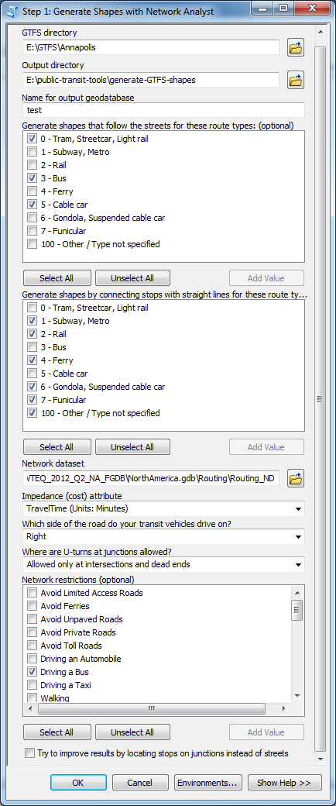
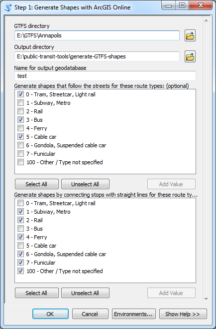
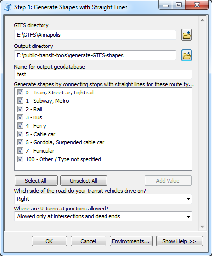
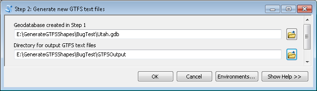

#Generate GTFS Shapes User's Guide

Created by Melinda Morang, Esri  
Contact: <mmorang@esri.com>

Copyright 2016 Esri  
Licensed under the Apache License, Version 2.0 (the "License"); you may not use this file except in compliance with the License.  You may obtain a copy of the License at <http://www.apache.org/licenses/LICENSE-2.0>.  Unless required by applicable law or agreed to in writing, software distributed under the License is distributed on an "AS IS" BASIS, WITHOUT WARRANTIES OR CONDITIONS OF ANY KIND, either express or implied.  See the License for the specific language governing permissions and limitations under the License.

##What this tool does
The optional GTFS shapes.txt file contains the actual on-street paths taken by transit vehicles in your system.  A good shapes.txt file is important in order for GTFS-based routing apps to display transit routes correctly on the map.  Read more about the shapes.txt file in the [GTFS reference doc](https://developers.google.com/transit/gtfs/reference).

The Generate GTFS Shapes toolbox produces a shapes.txt file for your GTFS dataset.  You give the tool a valid, existing GTFS dataset, and the tool creates a new shape.txt file and updates the shape_id field in trips.txt and the shape_dist_traveled field in stop_times.txt.  Step 1 of the tool creates a feature class with good estimates for the on-street paths used in your transit system.  You can edit this feature class using your own knowledge in order to ensure that the correct paths are truly represented.  Then, you can use Step 2 to of the tool to update your GTFS files to include this shape information.

Generate GTFS Shapes is targeted primarily toward transit agencies seeking to improve their GTFS datasets.

##Software requirements
* ArcGIS 10.2.1 or higher with a Desktop Basic (ArcView) license, or ArcGIS Pro 1.2 or higher. (To run the ArcGIS Online version of Step 1, you will need ArcGIS 10.3 or higher or ArcGIS Pro.)
* Network Analyst extension. (You can run a limited version of the tool without the Network Analyst extension.)

##Data requirements
- A valid GTFS dataset.
- If you want to generate on-street route shapes (as opposed to straight lines connecting stops), you will need either a Network Analyst extension and a network dataset or an ArcGIS Online account with routing privileges and sufficient credits for your analysis.

##Getting started
- Download the tool and save it anywhere on your computer.
- Unzip the file you downloaded.  The unzipped package contains a .tbx toolbox file, a folder of python scripts needed to run the toolbox, and a copy of this user's guide.
- No installation is necessary.  You can run the tools from ArcCatalog, ArcMap, or ArcGIS Pro.  In any of those products, just navigate to the folder containing the .tbx file, and it should show up as a toolbox with tools you can run.  You can also add the tool to ArcToolbox to make it easier to find later.
- *Warning: If you wish to move the toolbox to a different location on your computer, make sure you move the entire package (the .tbx file, the scripts folder, and the user's guide) together so that the toolbox does not become disconnected from the scripts.*

##Workflow
This tool has three steps:  

1. Create a reasonable estimate of your transit shapes by running one of the following tools:
    - [*Step 1: Generate Shapes with Network Analyst*](#GenerateShapesNA)
    - [*Step 1: Generate Shapes with ArcGIS Online*](#GenerateShapesAGOL)
    - [*Step 1: Generate Shapes with Straight Lines*](#GenerateShapesStraight).
2. Make whatever edits you need to make to your transit shape feature class using the editing tools in ArcMap or ArcGIS Pro.
3. Run the tool called [*Step 2: Generate new GTFS text files*](#GenerateNewGTFSTextFiles) to generate a shapes.txt file and add the appropriate  shape-related fields to your trips.txt and stop_times.txt files.

##Running *Step 1: Generate Shapes with Network Analyst*

*Step 1: Generate Shapes with Network Analyst* uses your GTFS schedule information and the Network Analyst Route solver to produce a feature class showing the most probable geographic paths taken by transit vehicles in your system.

This step will take some time to run for large transit systems.  Smaller transit systems should only take a few minutes, but larger systems may take a significant amount of time.

To run this tool, you must have a good network dataset of streets that covers the area served by your transit agency.  If you do not have the Network Analyst extension and an adequate network dataset, you can generate shapes that follow the streets by using the [*Step 1: Generate Shapes with ArcGIS Online*](#GenerateShapesAGOL) tool, or you can generate simple straight-line estimates for your route shapes with the [*Step 1: Generate Shapes with Straight Lines*](#GenerateShapesStraight) version of this tool.

###Inputs
* **GTFS directory**:  The folder containing your (unzipped) GTFS .txt files.
* **Output directory**: The folder where your output geodatabase will be written.
* **Name for output geodatabase**: The name of your output geodatabase, which will be created when the tool runs.  The geodatabase must not currently exist.
* **Generate shapes that follow the streets for these route types (optional)**: This tool creates a best guess for the geographic routes traveled by transit vehicles in your system.  However, some modes of transit, like subways, do not travel on the street network since they have their own underground tracks.  In this box, you should select which modes of transit should use the street network to generate shapes.
* **Generate shapes by connecting stops with straight lines for these route types (optional)**: For modes that don't travel along streets, you can choose to create shapes by drawing straight lines between connected transit stops.
* **Network dataset**: An ArcGIS network dataset that covers the area served by your transit system. The network dataset does NOT need to contain transit information.
* **Impedance (cost) attribute**: The network dataset cost attribute that will be used to compute the likely routes of transit vehicles through your system.  In general, you should choose an attribute that makes sense for buses.
* **Which side of the road do your transit vehicles drive on?**: This determines which side of the vehicle stops should fall on.
* **Where are U-turns at junctions allowed?**: Choose U-turn settings that make sense for your transit system.
* **Network restrictions (optional)**: Choose any restrictions from your network dataset that make sense for your transit vehicles.
* **Try to improve results by location stops on junctions instead of streets**: Normally your transit stops will snap to the closest non-restricted street feature in your network, and the Network Analyst Route solver will find an optimal route visiting those locations.  However, sometimes the GTFS stop locations fall closer to a side street than to the main road where your transit route actually travels, so the Route solver creates transit shapes that enter side streets and make U-turns or travel around blocks.  You might be able to improve results by snapping your stops to the closest network junction instead of to the closest street location. You should try the street method first, and if you are unhappy with the results, try the junction method.

###Outputs
A file geodatabase with the name and location you specified will be created and will contain the following files:
* **Shapes**: A lines feature class with your route shapes. You can edit these shapes before you use them to create a shapes.txt file.
* **Stops_wShapeIDs**: A feature class of your GTFS stops, including the shape_id field so you can match them up with the shape they go to.  In cases where the same GTFS stop gets visited by multiple shapes, the Stops_wShapeIDs feature class will contain multiple copies of that stop, one for each shape it is associated with.
* **SQLDbase.sql**: A SQL database of your GTFS data.  You shouldn't need to look at this for anything, but don't delete it because it is necessary for running Step 2.

##Running *Step 1: Generate Shapes with ArcGIS Online*

*Step 1: Generate Shapes with ArcGIS Online* uses your GTFS schedule information and the ArcGIS Online route service to produce a feature class showing the most probable geographic paths taken by transit vehicles in your system.

Warning: This version of Step 1 requires ArcGIS 10.3 or higher or ArcGIS Pro.

ArcGIS Online's route service is available for most parts of the world. If you are uncertain whether the route service covers the geographic location served by your transit system, check the [ArcGIS Online Network Dataset Coverage map](http://www.arcgis.com/home/webmap/viewer.html?webmap=b7a893e8e1e04311bd925ea25cb8d7c7).

To use this tool, you must be [signed in to an ArcGIS Online account] (http://desktop.arcgis.com/en/arcmap/latest/map/web-maps-and-services/signing-into-arcgis-online-in-arcgis-for-desktop.htm) with routing privileges and sufficient credits.  Talk to your organization's ArcGIS Online administrator if you need help checking or setting up your account.  This tool will generate one ArcGIS Online route per shape in your GTFS data.  So, if your transit system has 100 unique shapes, the tool will solve 100 routes using ArcGIS Online.  As of this writing, "Simple Routes" cost 0.04 credits each, so the total number of credits incurred by the tool would be 0.4. Please refer to the [ArcGIS Online Service Credits Overview page](http://www.esri.com/software/arcgis/arcgisonline/credits) for more detailed and up-to-date information.  The number of shapes to be generated will be at minimum equal to the number of unique route_id values in your routes.txt file.  Most datasets have more shapes than routes because routes can include trips with different sequences of stops.

Note: If your transit lines have a large number of stops, it may not be possible to generate an on-street route shape using ArcGIS Online because the ArcGIS Online route service limits the total number of stops allowed per route (150 as of this writing - check the [route service documentation](http://resources.arcgis.com/en/help/arcgis-rest-api/#/Route_service_with_synchronous_execution/02r300000036000000/) for the latest information).  Shapes that exceed the stop limit will be estimated by connecting the stops with straight lines, and the tool will show a warning telling you which shape_id values have encountered this problem.

This tool will take some time to run for large transit systems.  Smaller transit systems should only take a few minutes, but larger systems may take a significant amount of time.

Note: If you don't or can't use ArcGIS Online, you can instead generate shapes that follow the streets by using the [*Step 1: Generate Shapes with Network Analyst*](#GenerateShapesNA) tool, or you can generate simple straight-line estimates for your route shapes with the [*Step 1: Generate Shapes with Straight Lines*](#GenerateShapesStraight) version of this tool.

###Inputs
* **GTFS directory**:  The folder containing your (unzipped) GTFS .txt files.
* **Output directory**: The folder where your output geodatabase will be written.
* **Name for output geodatabase**: The name of your output geodatabase, which will be created when the tool runs.  The geodatabase must not currently exist.
* **Generate shapes that follow the streets for these route types (optional)**: This tool creates a best guess for the geographic routes traveled by transit vehicles in your system.  However, some modes of transit, like subways, do not travel on the street network since they have their own underground tracks.  In this box, you should select which modes of transit should use the street network to generate shapes.
* **Generate shapes by connecting stops with straight lines for these route types (optional)**: For modes that don't travel along streets, you can choose to create shapes by drawing straight lines between connected transit stops.

###Outputs
A file geodatabase with the name and location you specified will be created and will contain the following files:
* **Shapes**: A lines feature class with your route shapes. You can edit these shapes before you use them to create a shapes.txt file.
* **Stops_wShapeIDs**: A feature class of your GTFS stops, including the shape_id field so you can match them up with the shape they go to.  In cases where the same GTFS stop gets visited by multiple shapes, the Stops_wShapeIDs feature class will contain multiple copies of that stop, one for each shape it is associated with.
* **SQLDbase.sql**: A SQL database of your GTFS data.  You shouldn't need to look at this for anything, but don't delete it because it is necessary for running Step 2.

##Running *Step 1: Generate Shapes with Straight Lines*

This version of Step 1 does not use a streets network to estimate your route shapes.  It generates shapes by drawing a straight line between connected stops instead of tracing the pattern of the streets.  You should only use this version of Step 1 if you do not have the Network Analyst extension or the ability to use ArcGIS Online, or wish to simply generate straight-line estimates for your route shapes.

###Inputs
* **GTFS directory**:  The folder containing your (unzipped) GTFS .txt files.  The tool uses the .txt files directly, so you need not turn them into shapefiles or process them in any way.
* **Output directory**: The folder where your output geodatabase will be written.
* **Name for output geodatabase: The name of your output geodatabase, which will be created when the tool runs.  The geodatabase must not currently exist.
* **Generate shapes by connecting stops with straight lines for these route types**: Straight-line shapes will be created for these modes.
* **Which side of the road do your transit vehicles drive on?**: This determines which side of the vehicle stops should fall on.
* **Where are U-turns at junctions allowed?**: Choose U-turn settings that make sense for your transit system.

###Outputs
A file geodatabase with the name and location you specified will be created and will contain the following files:
* **Shapes**: A lines feature class with your route shapes. You can edit these shapes before you use them to create a shapes.txt file.
* **Stops_wShapeIDs**: A feature class of your GTFS stops, including the shape_id field so you can match them up with the shape they go to.  In cases where the same GTFS stop gets visited by multiple shapes, the Stops_wShapeIDs feature class will contain multiple copies of that stop, one for each shape it is associated with.
* **SQLDbase.sql**: A SQL database of your GTFS data.  You shouldn't need to look at this for anything, but don't delete it because it is necessary for running Step 2.

##Editing your Shapes
Before using Step 2 to generate your shapes.txt file, you should examine your shapes in ArcMap and make any necessary edits.  You can use the ArcMap editing tools to edit your shapes.  Your workflow will be something like this:
* Start an editing session
* Add basemaps and/or your network dataset street data to your map so you can see the shapes and stops in context.
* Look at each shape individually to verify that it is correct.
* Use the editing tools, such as the Reshape Feature Tool and the Edit Vertices Tool, to correct any problems.
* Save your edits
* Stop the editing session

For detailed information on editing in ArcMap, read about editing in the [ArcGIS Help] (http://desktop.arcgis.com/en/desktop/latest/manage-data/editing/what-is-editing-.htm).

###Tips for editing
* To view and edit one shape at a time, open the Shapes feature class properties in ArcMap and go to the Definition Query tab.  You can create a definition query such as "shape_id = 2" to display only the shape for shape_id 2.  All others will be hidden.  You can do the same thing with the Stops_wShapeIDs feature class to see only the stops associated with that shape.

###Common Shape problems and how to fix them
* The stop is actually along the main road, but the stop location in the data fell slightly closer to a side road.  Consequently, the stop snapped to the side road, and the bus had to turn into the side road to visit the stop and then make a U-turn to return to the main road.  You can edit these out easily using the Reshape Features Tool.

* The bus took a completely different route than it should have because the network dataset isn't well connected or the network restrictions prevented the bus from taking the correct streets.  Sometimes, if a route couldn't be found on the streets at all, a straight-line shape might have been generated.  You will have to manually edit the whole line to the correct shape.

* Although the stop should be on the right side of the road, the GTFS stop lat/lon location or the network dataset street location is slightly off, putting the stop on the wrong (left) side of the road.  This means that the bus had to make a U-turn to reach the stop, so the shape doubled back on itself.  Alternatively, the bus might have had to travel around the block in a big loop to turn around and visit the stop.  These situations are sometimes hard to identify because you can't see the areas where the shape line overlaps itself (see picture).  Once you identify them, however, it's fairly easy to use the Reshape Features Tool to edit them out.  Sometimes, the bus legitimately travels the same road in both directions.  When the lines overlap exactly, it causes problems in Step 2 of the tool.  The best way to handle this situation is to use the Edit Vertices Tool to slightly separate the lines going in either direction so that they no longer overlap.

* If you ran Step 1 with the "Try to improve results by locating stops on junctions instead of streets" box checked True, you will probably see fewer small side-road diversions, but you might see some larger unexpected results in areas with very long street features.  The nearest network junction might actually fall on a completely different street than the one the stop is closest to, so the transit vehicle will take a large detour or a different route completely.  The figure to the right illustrates an example.  The two circled stops were far from the street's junction, and they located on dead ends far off the main road, causing a large route diversion.  You might be able to edit these out using the Reshape Features Tool, or you might have to completely redraw the route by hand. 

###If your shapes have widespread problems
* If you have a very large number of shapes where your vehicles have made small detours into side roads or have doubled back on themselves, try re-running Step 1 with the "Try to improve results by locating stops on junctions instead of streets" box checked True.  Stops will be snapped to the nearest network junction instead of the closest street edge, which might improve results.
* Another cause of widespread problems could be your network dataset.  Compare your network dataset's street locations to a basemap and see if the locations seem accurate.  If they are significantly offset from the street locations in the basemap, consider using a better network dataset.
* If you are still unable to produce good results, you should consider editing your GTFS stop locations to place them closer to the correct positions on the streets. The [Edit GTFS Stop Locations](http://www.arcgis.com/home/item.html?id=1f4cb2aac0e7499db98f46cd83beb2bd) tool can help you generate a corrected GTFS stops.txt file for your dataset.

##Running *Step 2: Generate new GTFS text files*

*Step 2: Generate new GTFS text files* creates a shapes.txt file based on the feature classes you created and edited.  It also creates or updates the shape_id field trips.txt and the shape_dist_travled field in stop_times.txt.  This tool does not overwrite any of your existing GTFS data.  You can review the new files before deleting the originals.

This tool will run very quickly for small GTFS datasets, but it may take significantly longer for larger ones.

###Inputs
* **Geodatabase created in Step 1**:  The file geodatabase that was created when you ran Step 1 of this tool.  It must contain the Shapes feature class as well as Stops_wShapeIDs and SQLDbase.sql.
* **Directory for output GTFS text files**: Designate an output directory where the new GTFS files will be written. 

###Outputs
* **shapes_new.txt**: The GTFS shapes.txt file generated from your Shapes feature class.
* **trips_new.txt**:  A copy of your original trips.txt file with the shape_id field added or modified to match the new shapes.txt file.
* **stop_times_new.txt**:  A copy of your original stop_times.txt file with the shape_dist_traveled field added or modified to match the new shapes.txt file.

  After reviewing your new GTFS files, remove the "_new" suffix from the filenames and replace the originals.

##Troubleshooting & potential pitfalls
* **The tool takes forever to run**: This tool does take a long time to run for large GTFS datasets, and both Step 1 and Step 2 should give you regular progress updates.  If everything is running correctly, the following conditions will cause the tool to take longer to run:
  - Very large transit datasets with a large number of shapes will take longer to process.
  - The tool will run slower if you are writing to and from a network drive.
  - The ArcGIS Online version of Step 1 will likely run slower than the Network Analyst version using local data.
* **I got a warning message saying "Warning! For some Shapes, the order of the measured shape_dist_traveled for vertices along the shape does not match the correct sequence of the vertices. This likely indicates a problem with the geometry of your shapes.  Your new shapes.txt file will be generated, and the shapes may look correct, but the shape_dist_traveled value may be incorrect. Please review and fix your shape geometry, then run this tool again.  See the user's guide for more information."**: This warning occurs during shapes.txt generation and usually means that part of your shape doubles back on itself.  The tool tries to find the distance along the line that each shape vertex occurs in order to add this value to the shape_dist_traveled field in shapes.txt.  However, if the shape line doubles back on itself, the vertex might actually land at more than one point along the line.  The tool simply finds the first location along the line and ignores the rest, which means that sometimes the correct order of the shape vertices will not match the order in the shape_dist_traveled field.  Examine the shapes in question and look for places where the buses erroneously made U-turns or turned into side roads. More information about this problem can be found in the [*Common Shape problems and how to fix them* section](#ShapeProblems) of this document.
* **I got a warning message saying "Warning! For some Shapes, the order of the measured shape_dist_traveled for stops along the shape does not match the correct sequence of the stops. This likely indicates a problem with the geometry of your shapes.  The shape_dist_traveled field will be added to your stop_times.txt file and populated, but the values may be incorrect. Please review and fix your shape geometry, then run this tool again.  See the user's guide for more information."**:  Similar to the problem above, if the shapes double back on themselves, a transit stop might be equidistant to more than one point on the shape, and the correct sequence of stops might not match the order of your shape_dist_traveled values.  This could indicate an underlying geometry problems in your shapes.  It could also occur when a transit shape legitimately traverses the same road in both directions.
* **I got a warning message saying "Warning! Some shapes had no geometry or 0 length. These shapes were written to shapes.txt, but all shape_dist_traveled values for the shape will have a value of 0.0."**: This occurs if one of the shapes in your Shapes feature class has 0 length or no geometry.  This could occur if the transit line has only two stops, both of which are in the same location.  This is probably an error in the GTFS data.

