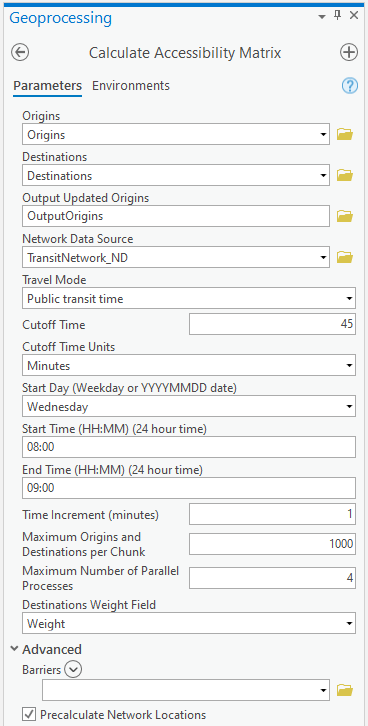
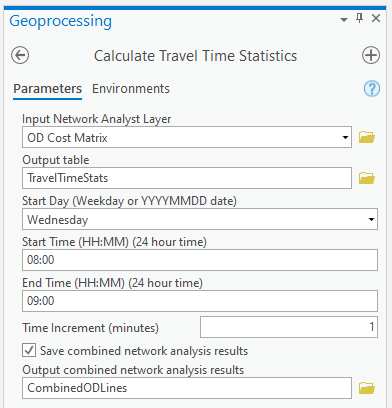
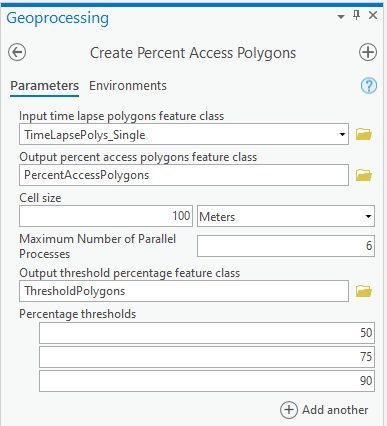

# Transit Network Analysis Tools User's Guide

Created by Melinda Morang, Esri

Contributors:
David Wasserman, Fehr & Peers

Copyright 2021 Esri  
Licensed under the Apache License, Version 2.0 (the "License"); you may not use this file except in compliance with the License.  You may obtain a copy of the License at <http://www.apache.org/licenses/LICENSE-2.0>.  Unless required by applicable law or agreed to in writing, software distributed under the License is distributed on an "AS IS" BASIS, WITHOUT WARRANTIES OR CONDITIONS OF ANY KIND, either express or implied.  See the License for the specific language governing permissions and limitations under the License.

## What are the Transit Network Analysis Tools?
The *Transit Network Analysis Tools* are a set of tools for performing transit-specific network analysis. They are intended to supplement the ArcGIS Network Analyst extension by accounting for the time-dependent nature of public transit and to assist with analyses commonly needed by those working with public transit.  For example, the tools provided here can help you perform accessibility calculations and show how the area reachable by transit changes throughout the day.

The *Transit Network Analysis Tools* must be used with a transit-enabled network dataset created either using [these tools available in ArcGIS Pro](https://pro.arcgis.com/en/pro-app/help/analysis/networks/network-analysis-with-public-transit-data.htm).

The *Transit Network Analysis Tools* download includes the "Transit Network Analysis Tools.pyt" toolbox. You can add this to ArcToolbox or simply access it in the folder tree in the Catalog pane.  The download also includes several associated files in the same folder as the .pyt file.  Keep these files together in the same folder.

The tools included are:
- [Calculate Accessibility Matrix](#AccessibilityMatrix)
- [Calculate Travel Time Statistics](#Stats)
- [Create Percent Access Polygons](#PercentAccess)
- [Prepare Time Lapse Polygons](#TimeLapse)

## Software requirements
* ArcGIS Pro 2.8 or higher. A Desktop Basic license is sufficient.
  * Note: The tools have not been tested on versions of ArcGIS Pro prior to 2.8 and may not work properly. Upgrading to the latest version of ArcGIS Pro is always recommended.
* Network Analyst extension.

## Data requirements
* A transit-enabled network dataset created either using [these tools available in ArcGIS Pro](https://pro.arcgis.com/en/pro-app/help/analysis/networks/network-analysis-with-public-transit-data.htm).

## Calculate Accessibility Matrix
We often want to analyze "accessibility" in a city, how much access people or places have to certain types of facilities or opportunities.  For example, we might want to know how many jobs people in different neighborhoods of a city have access to within a reasonable commute time.  The *Calculate Accessibility Matrix* tool can help you calculate some measures of accessibility.  Given a set of origins and destinations, this tool counts the number and percentage of destinations reachable from each origin by transit and walking within a travel time limit.  The number of reachable destinations can be weighted based on a field, such as the number of jobs available at each destination. 

The results of analyses performed using your GTFS-enabled network dataset can vary greatly depending upon the time of day used as the start time for your analysis.  An analysis run at 8:00 AM might have a very different solution than one run at 8:01 AM.  A given origin might have access to a given destination at 8:00 AM but not at 8:01 AM if, by starting at 8:01 AM, the traveler has just missed the bus.

The *Calculate Accessibility Matrix* tool attempts to account for the dynamic nature of transit schedules by solving an Origin-Destination Cost Matrix analysis for multiple times of day and summarizing the results.  The user specifies a time window, and the tool will run the analysis for each minute within the time window.  In addition to counting the total number of destinations reachable at least once during the time window, the tool output also shows the number of destinations reachable at least 10%, 20%, ...90% of start times during the time window.  More detail on the tool output is available below.

The tool parallelizes the OD Cost Matrix solves across multiple processors on your computer for maximum efficiency.

There is no specific set-up required to run the tool, as the origins, destinations, and all relevant settings can be set in the tool's UI.  However, your origins and destinations must be point feature classes.  If, for example, you are using census blocks as destinations, please first calculate the centroids of the census block polygons to use as input to the tool.  You can use the [Feature to Point](https://pro.arcgis.com/en/pro-app/latest/tool-reference/data-management/feature-to-point.htm) tool to do this.

### Inputs
* **Origins**: A point or polygon feature class representing the locations you want to calculate accessibility measures for.  For example, your origins might be census blocks, parcels, or specific locations of concern.  Note that when polygons are used as origins and destinations, the centroids of the polygons will be used in the network analysis calculation. Keep in mind that the centroid of a polygon is only a good representation of that polygon if the polygon is small with respect to the distance a traveler can walk in a short period of time. It is not appropriate, for example, to use census tracts since tracts are typically very large on a pedestrian scale.
* **Destinations**: A point or polygon feature class representing the destinations your origins will travel to.  For example, if you want to measure your origins' level of accessibility to jobs, your Destinations could be the locations of employment centers.
* **Output Updated Origins**: Output path. Your input origins will be copied to this location, and the output fields will be added.
* **Network Data Source**: The network dataset or service URL to use for the calculation. You should use a transit-enabled network dataset created with [these tools available in ArcGIS Pro](https://pro.arcgis.com/en/pro-app/help/analysis/networks/network-analysis-with-public-transit-data.htm) or an ArcGIS Enterprise service created from such a network. Technically, however, the tool will work with any network dataset that has at least one time-based travel mode.
* **Travel Mode**: The name of a time-based [travel mode](https://pro.arcgis.com/en/pro-app/latest/help/analysis/networks/travel-modes.htm) on the network dataset you wish to use to calculate the OD Cost Matrix. Typically you should choose a travel mode modeling travel by public transit.
* **Cutoff Time**: The maximum travel time allowed in your analysis. For example, if you want to analyze the number of jobs reachable within a 30-minute commute from your origins, set the Cutoff Time to 30, and set the Cutoff Time Units to Minutes.
* **Cutoff Time Units**: The units of time in which to interpret the Cutoff Time.
* **Start Day (Weekday or YYYYMMDD date)**: Day of the week or YYYYMMDD date for the first start time of your analysis.  [Learn when to use a generic weekday or a specific date.](#Dates)
* **Start Time (HH:MM) (24 hour time)**: The lower end of the time window you wish to analyze.  Must be in HH:MM format (24-hour time).  For example, 2 AM is 02:00, and 2 PM is 14:00.
* **End Day (Weekday or YYYYMMDD date)**: If you're using a generic weekday for Start Day, you must use the same day for End Day.  If you want to run an analysis spanning multiple days, choose specific YYYYMMDD dates for both Start Day and End Day.
* **End Time (HH:MM) (24 hour time)**: The upper end of the time window you wish to analyze.  Must be in HH:MM format (24-hour time).  The End Time is inclusive, meaning that an analysis will be performed for the time of day you enter here.
* **Time Increment (minutes)**: Increment the OD Cost Matrix's time of day by this amount between solves.  For example, for a Time Increment of 1 minute, the OD Cost Matrix will be solved for 10:00, 10:01, 10:02, etc.  A Time Increment of 2 minutes would calculate the OD Cost Matrix for 10:00, 10:02, 10:04, etc.
* **Maximum Origins and Destinations per Chunk**: In order to solve large OD Cost Matrix problems efficiently, the tool can split up large numbers of inputs into chunks and solve the chunks in parallel across multiple cores of your computer. This parameter specifies the maximum number of origins and destinations that should be allowed in a single chunk. The optimal number depends on your computing resources. Larger chunks take longer to solve and require more memory, but there is some overhead associated with having more chunks.
* **Maximum Number of Parallel Processes**: In order to solve large OD Cost Matrix problems efficiently, the tool solves the OD Cost Matrix for different start times in parallel across multiple cores of your machine. If the number of origins and destinations are large, it may also break them up into chunks and solve them in parallel as well. This parameter designates the number of parallel processes that can safely be used. You should select a number less than or equal to the number of virtual cores or processors your computer has.
* **Destinations Weight Field**:  Optionally, choose a field from your Destinations table that will be used as a weight.  For example, if your destinations represent employment centers, the weight field could be the number of jobs available at each point. Only integer and double fields can be used for the weight field.  If you do not choose a weight field, each destination will be counted as 1.
* **Barriers**: Optionally, choose layers with point, line, or polygon barriers to use in the OD Cost Matrix analysis.
* **Precalculate Network Locations**: When doing an OD Cost Matrix analysis, the input origin and destination points must be ["located" on the network dataset](https://pro.arcgis.com/en/pro-app/latest/help/analysis/networks/locating-analysis-inputs.htm). Because the tool parallelizes the OD Cost Matrix across multiple processes, using the same origins and destinations many times, it saves time to calculate the network locations in advance rather than repeating this calculation in every parallel process. The only time you should uncheck this parameter is if you have already calculated the network locations of your input origins and destinations for the network dataset and travel mode you are using, and you simply wish to re-use these.

Advanced users with specific analysis needs can modify additional OD Cost Matrix analysis properties in the CalculateAccessibilityMatrix_OD_config.py file. Note that you may need to close and re-open ArcGIS Pro in order for those changes to be used when the tool runs.

### Calculate Accessibility Matrix tool output fields

The output Origins table contains the following fields:
- *TotalDests*
- *PercDests*
- *DsAL10Perc*, *DsAL20Perc*, ..., *DsAL90Perc*
- *PsAL10Perc*, *PsAL20Perc*, ..., *PsAL90Perc*

These fields are explained fully below.

**TotalDests**: The total number of destinations reachable by this origin within the time limit at least once during the time window.

For example, if Origin 1 can reach Destination A within 30 minutes at any time of day but can only reach Destination B within 30 minutes if the travel starts at exactly 10:03 AM, Destination A and Destination B still each contribute equally to TotalDests.  Both are considered "reachable" even though one is arguably more easily reached than the other.

If you did not use a weight field, each reachable destination adds 1 to TotalDests, so Destination A and Destination B would sum to contribute 2.  Or, if you *did* use a weight field, each reachable destination will contribute the numerical value in the weight field.  If Destination A has 200 jobs and Destination B has 300 jobs, they would sum together to contribute 500 to TotalDests.

**PercDests**: The percentage of all destinations reachable by this origin within the time limit.  This is TotalDests divided by the total weighted number of destinations that were included in the analysis.

**DsAL10Perc**, **DsAL20Perc**, ..., **DsAL90Perc**: These fields represent the total number of destinations reachable by this origin within the time limit at least x% of start times within the time window, where 'x' is the number in the field name (10, 20, ..., 90).  Together, these fields allow you to understand the *frequency* of access the origins have to destinations.

For example, suppose you ran your analysis with a time window of 8:00 to 8:59 with 1-minute increments, so the OD Cost Matrix was calculated for 60 different start times.  Suppose Destination A is right next to Origin 1 and is consequently easily reachable in a short amount of time.  It doesn't matter what time you start traveling from Origin 1; you can always get to Destination A.  Origin 1 can reach Destination A within the time limit for all 60 start times analyzed, or 100% of start times.  Consequently, Destination A's weight contributes to the totals reported in *DsAL10Perc*, *DsAL20Perc*, all the way up to *DsAL90Perc* because 100% is greater than 10%, 20%, ..., 90%.

Suppose that Destination B is farther away and can only be reached from Origin 1 by taking a bus that doesn't run very often.  A traveler starting at Origin 1 only has a few opportunities to reach Destination B within the travel time limit.  Let's say that Destination B was only reached within the time limit for 9 of the 60 start times, or 15% of start times.  Destination B's weight will only contribute to the total in *DsAL10Perc* because 15% is greater than 10%, but it is not greater than 20% (or 30%, 40%, ..., 90%).

So, for our weighted example above, for Origin 1, the *DsAL10Perc* field will have a value of 500 because it includes the 200 jobs from Destination A and the 300 jobs from Destination B.  However, the *DsAL20Perc*, *DsAL30Perc*, etc. fields will all have a value of 200 (from Destination A) because Destination B is not reachable often enough to contribute its jobs to these higher percentage fields.

If you care about a bare minimum of access, use the *TotalDests* field.  If you care about quality of access, compare the value of *TotalDests* with, say, *DsAL90Perc*, and note that the total number of destinations reachable more than 90% of the time is much lower.

**PsAL10Perc**, **PsAL20Perc**, ..., **PsAL90Perc**:  These are companion fields to *DsAL10Perc*, *DsAL20Perc*, etc. and have the same relationship that *PercDests* does to *TotalDests*.  For example, *PsAL10Perc* is *DsAL10Perc* divided by the total weighted number of destinations that were included in the analysis.

### Tool performance
This tool performs a large number of calculations and post-processes a large amount of output data, so it can often take a very long time to run and use substantial computational resources. Larger numbers of origins and destinations and large time windows will make the tool run more slowly. Expect the tool to take several hours to run for a dense analysis of a metropolitan area (example: counting the number of jobs accessible to every census block centroid in a city).

When performing the OD Cost Matrix calculation, the tool chunks up the problem and parallelizes it, utilizing multiple cores on your machine. It writes the intermediate output to disk in a scratch folder. When all the OD Cost Matrix calculations are finished, it reads in these intermediate output and post-processes them. These processes require both sufficient memory resources and free disk space. The required memory resources are hard to estimate, but if you are running this tool for a large problem and have concerns about memory, it would be best to close all other applications so the tool doesn't have to compete for resources with other programs. The intermediate outputs saved in the scratch folder can be on the order of several gigabytes of data. They are deleted when the tool finishes. 

## Calculate Travel Time Statistics
The time it takes to travel between one location and other by public transit varies throughout the day depending on the transit schedule.  This tool calculates some simple statistics about the total transit travel time between locations over a time window and writes the output to a table.

For each origin-destination pair in an OD Cost Matrix layer or each route in a Route layer, the tool calculates:
- Minimum travel time
- Maximum travel time
- Mean travel time

You can also choose to save a feature class containing the combined network analysis output for the entire time window. 

Note: Unlike the other tools in this toolbox, this tool has not been overhauled and optimized to run in parallel in ArcGIS Pro. If you are using this tool and performance is a concern for you, please leave a note in our GitHub repo or on the Esri Community forums.

Running this tool involves two steps:

1. Prepare an OD Cost Matrix or Route layer in the map
2. Run the *Calculate Travel Time Statistics* tool

### 1. Prepare an OD Cost Matrix or Route layer in the map

All Network Analyst layers, such as an Origin-Destination Cost Matrix and Route analysis layer, must reference a network data source. To run this tool, you must create and configure an Origin-Destination Cost Matrix or Route analysis layer referencing a transit-enabled network dataset created using [these tools available in ArcGIS Pro](https://pro.arcgis.com/en/pro-app/help/analysis/networks/network-analysis-with-public-transit-data.htm).

Learn how to create and configure an [Origin-Destination Cost Matrix](https://pro.arcgis.com/en/pro-app/help/analysis/networks/od-cost-matrix-tutorial.htm) or [Route analysis](https://pro.arcgis.com/en/pro-app/help/analysis/networks/route-tutorial.htm) layer in ArcGIS Pro.

Learn how to configure [Origin-Destination Cost Matrix](https://pro.arcgis.com/en/pro-app/help/analysis/networks/od-cost-matrix-analysis-layer.htm#ESRI_SECTION1_D36A18B15D704F0DBA9B4C766A4A2719) or [Route](https://pro.arcgis.com/en/pro-app/help/analysis/networks/route-analysis-layer.htm#ESRI_SECTION1_D36A18B15D704F0DBA9B4C766A4A2719) properties in ArcGIS Pro.

The *Calculate Travel Time Statistics* tool does not use the geometry of the solved network analysis layers when calculating statistics.  To improve tool performance, set the Output Shape Type setting to "None".

You can also save your Origin-Destination Cost Matrix analysis layer to a layer file to use as input for the tool.  This is useful if you want to run this tool in a standalone python script. [Learn how to save a Network Analyst layer to a layer file in ArcGIS Pro.](https://pro.arcgis.com/en/pro-app/tool-reference/data-management/save-to-layer-file.htm)

### 2. Run the *Calculate Travel Time Statistics* tool
Once your network analysis layer is prepared, run the *Calculate Travel Time Statistics* tool to solve the layer for a range of start times over a time window.  The tool will calculate statistics about the travel time across the time window and save the results to a table and optionally save the combined network analysis output for each time slice to a feature class.

#### Inputs
* **Input Network Analyst Layer**: A ready-to-solve Origin-Destination Cost Matrix or Route layer in your map or saved as a layer file (see previous section on how to set this up).
* **Output table**: A geodatabase table that will be the output of this tool, which will contain the travel time statistics.
* **Start Day (Weekday or YYYYMMDD date)**: Day of the week or YYYYMMDD date for the first start time of your analysis.  [Learn when to use a generic weekday or a specific date.](#Dates)
* **Start Time (HH:MM) (24 hour time)**: The lower end of the time window you wish to analyze.  Must be in HH:MM format (24-hour time).  For example, 2 AM is 02:00, and 2 PM is 14:00.
* **End Day (Weekday or YYYYMMDD date)**: If you're using a generic weekday for Start Day, you must use the same day for End Day.  If you want to run an analysis spanning multiple days, choose specific YYYYMMDD dates for both Start Day and End Day.
* **End Time (HH:MM) (24 hour time)**: The upper end of the time window you wish to analyze.  Must be in HH:MM format (24-hour time).  The End Time is inclusive, meaning that a network analysis result will be included for the time of day you enter here.
* **Time Increment (minutes)**: Increment the network analysis layer's time of day by this amount between solves.  For example, for a Time Increment of 1 minute, the output would include results for 10:00, 10:01, 10:02, etc.  A Time Increment of 2 minutes would generate results for 10:00, 10:02, 10:04, etc.
* **Save combined network analysis results**: You can choose whether to save the network analysis layer's output sublayer (Lines for OD Cost Matrix, Routes for Route) for each time slice into a single combined feature class. Using this option slows the tool's performance.
* **Output combined network analysis results**: If you have chosen to save the combined network analysis results, specify the path to an output feature class to store the results.  The output must be a feature class in a geodatabase, not a shapefile.

#### Outputs
The resulting geodatabase table will contain one row per origin-destination pair (for an OD Cost Matrix layer) or route name (for a Route layer) in the solved network analysis layer.  The OriginID and DestinationID or the route Name fields are included for reference.  The following summary statistics fields are included:
- **Min_[transit travel time impedance attribute name]**: The minimum travel time during the time window
- **Max_[transit travel time impedance attribute name]**: The maximum travel time during the time window
- **Mean_[transit travel time impedance attribute name]**: The mean travel time during the time window

The **NumTimes** field in the output table indicates the number of iterations that were used to calculate the statistics for this route or origin-destination pair.  In general, this number should be equivalent to the total number if time of day iterations; however it could be less if the route or origin-destination pair was not included in the output for a particular time of day.  This is an indication that you should review your network analysis layer configuration and consider carefully whether the resulting statistics are reliable.

If your input is an OD Cost Matrix layer, use caution when setting a default cutoff or the number of destinations to find, as these parameters may cause the output of the *Calculate Travel Time Statistics* to be inaccurate. Suppose your OD Cost Matrix layer uses a default cutoff of 30 minutes. At some times of day, the travel time between an origin and a destination may exceed 30 minutes, so the travel time between this origin and destination will not be reported. These cases will not be included in the statistics calculated in the output of this tool.  In this case, the minimum travel time value should be correct, but the maximum and mean may not.

Suppose your OD Cost Matrix layer uses a "Destinations To Find" count of 5. This means that the travel time for only the 5 closest destinations to each origin will be reported in the OD Cost Matrix output.  Because the travel time between each origin and destination changes throughout the day, the closest destinations may be different at different times of day, so the statistics reported for each origin-destination pair in the output of this tool may be inaccurate.  For example, for Origin 1, Destination 3 might be one of the five closest destinations at 8:00, but at 8:01, it is not.  Destination 7 is closer.  Consequently, the calculated statistics will include the travel time from Origin 1 to Destination 3 at 8:00 but not 8:01, and it will include the travel time from Origin 1 to Destination 7 at 8:01 but not 8:00.  Because of this confusion, using the "Destinations To Find" setting with this tool is not recommended.

If you have chosen to save the combined network analysis results an output feature class will be created.  This feature class will contain all the rows from the network analysis layer's output sublayer for each time slice in your time window with an additional **TimeOfDay** field indicating the time slice that produced the row.  This table could get very large, particularly for OD Cost Matrix.

#### Tool performance
Network analysis layers with large numbers of input features (origins, destinations, stops, etc.) may take a long time to solve, and since this tool solves the analysis once per start time within the time limit, this tool could take a very long time to complete.

Note that when this tool runs, if the input OD Cost Matrix layer and the network it references are in the map, these layers might re-draw over and over again, which impacts tool performance.  Before running the tool, turn off the layers in the map to prevent the re-draw behavior.

The tool will run slower if you have chosen to save the combined network analysis results.

Note: Unlike the other tools in this toolbox, this tool has not been overhauled and optimized to run in parallel in ArcGIS Pro. If you are using this tool and performance is a concern for you, please leave a note in our GitHub repo or on the Esri Community forums.

## Create Percent Access Polygons
We often want to analyze "accessibility" in a city, how much access people or places have to certain types of facilities or opportunities. For example, we might want to know how many jobs people in different neighborhoods of a city have access to within a reasonable commute time.  To do this type of analysis, we often want to create a service area (transitshed or isochrone) representing the area reachable by transit from a given facility within a travel time limit; we consider the area within this service area polygon to be accessible to the facility.

Unfortunately, the results of analyses performed using your transit-enabled network dataset can vary greatly depending upon the time of day used as the start time for your analysis. An analysis run at 8:00 AM might have a very different solution than one run at 8:01 AM.  The area reachable by transit at 8:01 AM could be considerably smaller if the traveler has just missed a bus.  A demonstration of this time dependency can be seen in [this video](https://youtu.be/tTSd6qJlans).  Consequently, a single Service Area analysis in ArcGIS is not a good representation of the area reachable by transit and is not adequate for studies of accessibility.

The *Create Percent Access Polygons* tool helps you create "typical access polygons" that better represent the area reachable by transit across a time window.  The tool attempts to account for the dynamic nature of transit schedules by overlaying service area polygons from multiple times of day and summarizing the results in terms of the number or percentage of the input polygons that cover an area.  Areas covered by a larger percentage of input polygons were reached at more start times and are consequently more frequently accessible to travelers.

The tool output will show you the percentage of times any given area was reached, and you can also choose to summarize these results for different percentage thresholds.  For example, you can find out what area can be reached at least 75% of start times.

The input to the *Create Percent Access Polygons* is a polygon feature class created using the [*Prepare Time Lapse Polygons* tool](#TimeLapse).

The tool parallelizes the calculations across multiple processors on your computer for maximum efficiency.

### Inputs
* **Input time lapse polygons feature class**: A polygon feature class created using the [*Prepare Time Lapse Polygons* tool](#TimeLapse) that you wish to summarize.
* **Output percent access polygons feature class**: The main output feature class of the tool.  This output is a raw raster-like polygon feature class showing the number and percentage of time each area covered by your time lapse polygons was reached, intended primarily for visualization.  The individual polygons are dissolved so that all areas reached the same number of times for a unique combination of FacilityID, FromBreak, and ToBreak are combined into one multipart polygon.  The output feature class must be in a geodatabase; it cannot be a shapefile.
* **Cell Size**: This tool rasterizes the input polygons, essentially turning the study area into little squares.  Choose a size for these squares.  The cell size refers to the width or length of the cell, not the area.  Your cell size choice should relate to how pedestrians travel in the real world. You could base your cell size choice on the size of your city blocks or parcels or the distance a pedestrian can walk in less than a minute. Smaller cells are more accurate but take longer to process, and really tiny cells are probably not analytically meaningful.
* **Maximum Number of Parallel Processes**: For maximum efficiency, this tool performs calculations in parallel across multiple cores of your machine. This parameter designates the number of parallel processes that can safely be used. You should select a number less than or equal to the number of virtual cores or processors your computer has. Note that if you are only processing a single input facility/from break/to break combination, there is nothing to parallelize, so you will get no advantage from increasing the number of processes.
* **Output threshold percentage feature class** This is an optional output you can choose to produce that further summarizes the output percent access polygons feature class.  If you specify one or more percentage thresholds, this output contains polygons showing the area reached at least as often as your designated percentage thresholds. There will be a separate feature for each percentage threshold for each unique combination of FacilityID, FromBreak, and ToBreak in the input data.
* **Percentage Thresholds**: You can choose to summarize the tool's raw output for different percentage thresholds.  For example, you can find out what area can be reached at least 75% of start times by setting 75 as one of your percentage thresholds.  More explanation of tool outputs is given below.

### Outputs
In the output percent access polygons feature class, the "Join_Count" field refers to the raw number of time lapse polygons that overlapped this area, or the total number of times this area was reached during the time window.  The "Percent" field refers to the percentage of total times the area was reached.

In the output threshold percentage feature class, the "Percent" field refers to the threshold.  The polygon represents the area reachable at least that percentage of start times.

In both outputs, the time lapse polygon FacilityID, Name, FromBreak, and ToBreak fields are preserved for informational purposes.

Note that if your input time lapse polygons contain multiple facilities or multiple FromBreak and ToBreak combinations, the outputs may contain multiple overlapping features that may be visually confusing in the map.  You can use a definition query to display only a subset of these features at a time. [Learn how to set up a definition query in ArcGIS Pro.](https://pro.arcgis.com/en/pro-app/help/mapping/layer-properties/definition-query.htm)

### Tool performance
The following conditions will cause longer run times for the tool:
- Large numbers of unique FacilityID, FromBreak, and ToBreak combinations
- Smaller cell sizes
- Larger input polygon extents (large area covered)

The tool parallelizes the calculations across multiple processors on your computer for maximum efficiency. You will get the best performance on a tool with many cores, a fast CPU, and a solid-state hard disk.

## Prepare Time Lapse Polygons
The results of analyses performed using your transit-enabled network dataset can vary greatly depending upon the time of day used as the start time for your analysis.  An analysis run at 8:00 AM might have a very different solution than one run at 8:01 AM if the traveler has just missed the bus.

A demonstration of this time dependency can be seen in [this video](https://youtu.be/tTSd6qJlans).  The video is a time lapse showing the area reachable within 15 minutes of travel time by walking and public transit from a point in Atlanta. Because the available transit service changes throughout the day, the area reachable changes significantly depending on the time of day you leave on your journey. For this video, I incremented the start time in one-minute intervals for each minute between 10:00 AM and 11:00 AM on a typical weekday and put the results in a time lapse.

The *Prepare Time Lapse Polygons* tool will help you to make a video like this of your own. Or, you can use the results as input to the [*Create Percent Access Polygons*](#PercentAccess) tool for a more quantitative analysis.

The tool parallelizes the Service Area solves across multiple processors on your computer for maximum efficiency.

### Inputs
* **Facilities**: A feature class or layer of points you want to use as the starting or ending locations for your Service Area polygons.
* **Output Time Lapse Polygons**: Output feature class created by the tool.
* **Network Data Source**: The network dataset or service URL to use for the calculation. You should use a transit-enabled network dataset created with the [tools available natively in ArcGIS Pro](https://pro.arcgis.com/en/pro-app/help/analysis/networks/network-analysis-with-public-transit-data.htm) or an ArcGIS Enterprise service created from such a network. Technically, however, the tool will work with any network dataset that has at least one time-based travel mode.
* **Travel Mode**: The name of a time-based [travel mode](https://pro.arcgis.com/en/pro-app/latest/help/analysis/networks/travel-modes.htm) on the network dataset you wish to use to calculate the Service Areas. Typically you should choose a travel mode modeling travel by public transit.
* **Cutoff Times**: One or more travel time limits for the Service Area calculation. For example, if you want to create Service Area polygons showing the area reachable within 45 minutes of travel time, set the Cutoff Times to 45, and set the Cutoff Time Units to Minutes. You can enter more than one value.
* **Cutoff Time Units**: The units of time in which to interpret the Cutoff Times.
* **Start Day (Weekday or YYYYMMDD date)**: Day of the week or YYYYMMDD date for the first start time of your analysis.  [Learn when to use a generic weekday or a specific date.](#Dates)
* **Start Time (HH:MM) (24 hour time)**: The lower end of the time window you wish to analyze.  Must be in HH:MM format (24-hour time).  For example, 2 AM is 02:00, and 2 PM is 14:00.
* **End Day (Weekday or YYYYMMDD date)**: If you're using a generic weekday for Start Day, you must use the same day for End Day.  If you want to run an analysis spanning multiple days, choose specific YYYYMMDD dates for both Start Day and End Day.
* **End Time (HH:MM) (24 hour time)**: The upper end of the time window you wish to analyze.  Must be in HH:MM format (24-hour time).  The End Time is inclusive, meaning that a Service Area polygon will be included in the results for the time of day you enter here.
* **Time Increment (minutes)**: Increment the Service Area's time of day by this amount between solves.  For example, for a Time Increment of 1 minute, the results may include a Service Area polygon for 10:00, 10:01, 10:02, etc.  A Time Increment of 2 minutes would generate Service Area polygons for 10:00, 10:02, 10:04, etc.
* **Travel Direction**: Indicates whether the direction of travel for the Service Area should be away from the facilities or toward the facilities. When traveling away from facilities, the times of day are interpreted as the time at which the traveler leaves the facility. When traveling toward facilities, the times of day are interpreted as the time at which the traveler arrives at the facility.
* **Geometry At Cutoff**: Indicates how geometry will be handled when there are multiple cutoffs.You can choose to create concentric service area polygons as disks or rings. This parameter is irrelevant and hidden if you have only one cutoff.
  * Rings: The polygons extend between the nearest cutoff values only. They do not include the area of smaller breaks. For example, if you specify cutoffs of 30 and 45 minutes, you will get one polygon representing the area reachable within 0 and 30 minutes and another polygon with the area representing the additional area reachable between 30 and 45 minutes.
  * Disks: The polygons extend from the facility to the cutoff. For example, if you specify cutoffs of 30 and 45 minutes, you will get one polygon representing the area reachable within 0 and 30 minutes and another polygon representing the area reachable within 0 and 45 minutes.
* **Geometry At Overlap**: Indicates how geometry will be handled when multiple Service Areas from different facilities overlap one another. This parameter is irrelevant if you have only one facility.
  * Overlap: An individual polygon is created for each facility. The polygons can overlap each other.
  * Dissolve: The Service Area polygons of multiple facilities that have the same cutoff values are merged into one polygon. If the polygons of a given break value don't touch, they are nonetheless merged into one multipart polygon.
  * Split: This option creates individual polygons that are closest for each facility. The polygons do not overlap each other and may not extend to the full cutoff.
* **Maximum Number of Parallel Processes**: For maximum efficiency, this tool solves the Service Area for different start times in parallel across multiple cores of your machine. This parameter designates the number of parallel processes that can safely be used. You should select a number less than or equal to the number of virtual cores or processors your computer has.
* **Barriers**: Optionally, choose layers with point, line, or polygon barriers to use in the Service Area analysis.
* **Precalculate Network Locations**: When doing a Service Area analysis, the input facilities must be ["located" on the network dataset](https://pro.arcgis.com/en/pro-app/latest/help/analysis/networks/locating-analysis-inputs.htm). Because the tool parallelizes the Service Area across multiple processes, using the same facilities many times, it saves time to calculate the network locations in advance rather than repeating this calculation in every parallel process. The only time you should uncheck this parameter is if you have already calculated the network locations of your input facilities for the network dataset and travel mode you are using, and you simply wish to re-use these.

Advanced users with specific analysis needs can modify additional Service Area analysis properties in the CreateTimeLapsePolygons_SA_config.py file. Note that you may need to close and re-open ArcGIS Pro in order for those changes to be used when the tool runs.

### Outputs
The resulting polygons feature class will contain one row per Service Area per time of day solved when running the tool.  The feature class will contain a field called TimeOfDay indicating the traveler's start time.

If you used a generic weekday instead of a specific date, the date portion of the TimeOfDay field will show dates in 1899 or 1900.  This is "correct", in that these are special reserved dates used by ArcGIS Network Analyst to indicate generic weekdays.

You can use this output to create a time lapse video. [Learn how to create an animation in ArcGIS Pro.](https://pro.arcgis.com/en/pro-app/help/mapping/animation/animate-through-time.htm)

You can also use this output as input to the [*Create Percent Access Polygons*](#PercentAccess) tool.

## When to use a specific date or a generic weekday in your analysis

Many of the tools in this toolbox ask you to specify a day or specific date for the analysis. In general, you can choose either a generic weekday, such as Wednesday, or a specific date, such as Wednesday, May 22, 2019. However, depending on the configuration of your public transit data, you might not be able to use a generic weekday. This section will help you determine whether you can use generic weekdays or whether you will need to use specific dates.

If you created your network dataset from GTFS public transit data, the calendar.txt and calendar_dates.txt files are the most relevant for this determination.  If the GTFS dataset has only the calendar_dates.txt file and not the calendar.txt file, the dataset does not define regularly-occurring service; all service is defined explicitly for specific dates. In this case, you cannot use generic weekdays in your analysis. You must use a specific date.  If the GTFS dataset has only the calendar.txt or if it has both files, you have the option to use a specific date, and you may be able to use a generic weekday.

Inside the calendar.txt file, you should see date ranges shown in the start_date and end_date fields. These fields indicate the range of dates when the GTFS data is valid. If you use a specific date in your analysis, it must fall within this date range. Check whether there are any non-overlapping date ranges, rows where the date range does not overlap at all with the date range of another row. Sometimes this happens when data from multiple agencies has been merged into one file or when the agency has included service for multiple seasons, such as fall and winter, in the same file. If there are any non-overlapping date ranges, you should use a specific date in your analysis instead of a generic weekday. A generic weekday includes service without regard for the date ranges, so in this situation, service from these non-overlapping date ranges would all be included in the same analysis. In the example of an agency that has included separate fall and winter service in the same dataset, the fall service and the winter service would both be included in your analysis, leading to effectively double counting the available service.

Inside the calendar.txt file, the weekday fields (monday, tuesday, etc.) define the days of the week when specific transit service runs. The service runs on that weekday if the value is 1 and does not run on that weekday if the value is 0. If all the weekday fields are populated only with 0 for all rows, it is likely that the agency is using the calendar_dates.txt file to define specific dates when service is running, so you will need to use a specific date in your analysis instead of a generic weekday. If this dataset does not have a calendar_dates.txt file, the GTFS dataset is likely invalid, since it effectively has no service.

The same principles apply if you created your network dataset from some other, non-GTFS public transit source data.

## Questions or problems?
Search for answers and post questions in the [Esri Community forums](https://community.esri.com/t5/public-transit-questions/bd-p/public-transit-questions).